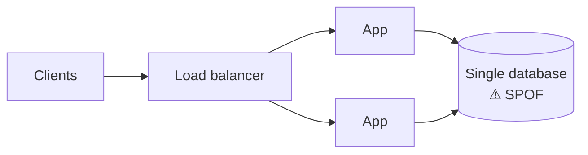

Many capable engineers underperform in system design interviews not because they lack knowledge, but because they fall into predictable traps. Recognizing these traps in advance is one of the highest-leverage things you can do.

## Trap 1: Solving the wrong problem

The prompt “design a chat app” could mean one-to-one messaging, large group chats, a customer-support widget or a live-stream comment feed. Each has a different architecture. Candidates who skip scoping end up designing something the interviewer did not ask for.

**Avoid it:** Spend the first few minutes agreeing on the core features and scale, and confirm your understanding before drawing anything.

## Trap 2: The buzzword architecture

Some candidates draw a diagram packed with every technology they know — Kubernetes, Kafka, Redis, Elasticsearch, GraphQL — without explaining why each is needed. This invites probing questions that expose shallow understanding.

**Avoid it:** Add a component only when a requirement demands it, and justify it in one sentence: “We need a queue here because video transcoding takes minutes and we cannot block the upload request.”

## Trap 3: Ignoring the numbers

Without estimates, you cannot decide whether a single database suffices or whether you need sharding. Some candidates skip estimation entirely; others spend ten minutes on precise arithmetic.

**Avoid it:** Do quick, rounded estimates for the quantities that drive design decisions — requests per second, storage growth, bandwidth — and use them to justify choices.

## Trap 4: Single points of failure

A design with one database, one cache node or one load balancer will fail when that component fails.

**Avoid it:** After drawing your high-level design, walk through each component and ask, “What happens if this dies?” Add replication, failover or redundancy where needed.

## Trap 5: Hand-waving the hard part

Every problem has one or two genuinely difficult components: generating unique short URLs without collisions, matching riders to nearby drivers, ordering messages in a group chat. Candidates who say “and then we store it in a database” for the hard part miss the main opportunity to show depth.

**Avoid it:** Identify the hardest part early and plan to spend your deep-dive time there.

## Trap 6: Defending instead of discussing

When an interviewer challenges a decision, some candidates dig in. The interviewer may be testing whether you can adapt to new constraints.

**Avoid it:** Treat challenges as new requirements. “Good point — if we need stronger consistency here, I'd switch to synchronous replication for this table and accept the higher write latency.”

## Trap 7: Running out of time

Candidates sometimes spend so long on one area that they never present a complete design.

**Avoid it:** Aim to have a complete, if simple, end-to-end design by roughly the halfway mark. A finished simple design beats an unfinished sophisticated one.

<Callout type="tip">
After every practice session, write down which trap you fell into. Most people have one or two recurring habits; fixing those produces rapid improvement.
</Callout>

<KeyTakeaways>
- Scope the problem before designing so you solve the problem that was asked.
- Add components only when requirements justify them.
- Use rounded estimates to drive decisions such as sharding and caching.
- Check every component for single points of failure.
- Spend your depth on the genuinely hard part, adapt to challenges, and finish an end-to-end design by mid-interview.
</KeyTakeaways>
