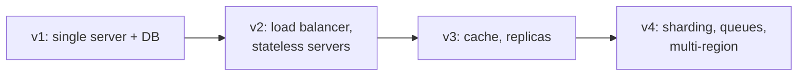

Two candidates with the same technical knowledge can receive very different evaluations depending on how they run the conversation. This lesson collects the habits that consistently help — and the ones that consistently hurt.

## Do: clarify before designing

Start by restating the problem and asking questions that change the design. Good questions have answers that would push you toward different architectures:

- Who are the users and roughly how many are there?
- Which features are in scope for this discussion?
- Is the system read-heavy or write-heavy?
- What latency and availability do users expect?
- Is it acceptable to lose or show stale data?

Avoid questions that do not affect the design, such as the exact color of a button. Write down the agreed requirements so both of you can refer to them later.

## Do: think out loud and structure the conversation

Interviewers cannot give credit for reasoning they cannot hear. Narrate your thinking: “We have far more reads than writes, so I want to put a cache in front of the database. The risk is stale reads, which seems acceptable for view counts.”

Signpost where you are: “I have the high-level design. Next I'd like to go deeper on the data model, unless you'd prefer to focus elsewhere.” This shows you are driving the interview while respecting the interviewer's priorities.

## Do: start simple, then evolve

Begin with a design that works for the core use case, then scale it to meet the requirements. Evolving a design shows you understand *why* each component is added. Jumping straight to a dozen microservices suggests you are reciting rather than reasoning.

## Do: discuss trade-offs explicitly

For every significant decision, name at least one alternative and why you did not choose it. “I'm choosing a wide-column store because our access pattern is simple key lookups at very high write volume. A relational database would give us joins and transactions, but we don't need them here.”

## Don't: rush into details

Designing the database schema before you know the features, or debating serialization formats before you have a high-level architecture, wastes time and signals poor prioritization.

## Don't: ignore the interviewer

Hints are gifts. If the interviewer asks “what happens if this server goes down?”, they are pointing you at something important. Acknowledge it and address it rather than defending your design.

## Don't: name-drop without understanding

Saying “we'll use Kafka” is fine only if you can explain what you need from it: durable, partitioned, ordered logs with consumer groups. Interviewers often probe technology choices; vague answers hurt more than choosing a generic “message queue.”

## Don't: go silent or give up

If you get stuck, say what you are considering. Partial reasoning earns more credit than silence. If a component is outside your expertise, acknowledge that and reason from first principles.

<Callout type="warning">
A common failure mode is the “perfect design” trap: refusing to commit until every detail is solved. Commit to a reasonable choice, state its limits, and move on. You can revisit it during deep dives.
</Callout>

<KeyTakeaways>
- Ask clarifying questions whose answers change the design, and record the agreed scope.
- Think out loud, signpost your progress, and let the interviewer steer focus.
- Start with a simple working design and evolve it to meet the requirements.
- Make trade-offs explicit; never name-drop technology you cannot explain.
- Treat hints as guidance, and keep reasoning out loud when stuck.
</KeyTakeaways>
