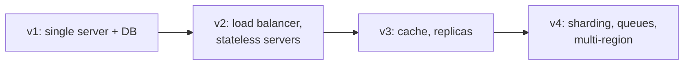

Two candidates with the same technical knowledge can receive very different evaluations depending on how they run the conversation. This lesson collects the habits that consistently help — and the ones that consistently hurt.

## Do: clarify before designing

Start by restating the problem and asking questions that change the design. Good questions have answers that would push you toward different architectures:

- Who are the users and roughly how many are there?
- Which features are in scope for this discussion?
- Is the system read-heavy or write-heavy?
- What latency and availability do users expect?
- Is it acceptable to lose or show stale data?

Avoid questions that do not affect the design, such as the exact color of a button. Write down the agreed requirements so both of you can refer to them later.

| Weak question | Why it is weak | Stronger version |
| --- | --- | --- |
| "Should I use Kafka?" | Asks for permission instead of a requirement | "Can users tolerate a few seconds of delay before a post appears in followers' feeds?" |
| "How many servers do we have?" | Hardware is an output of the design, not an input | "Roughly how many daily active users should we plan for?" |
| "Do we need a database?" | Every system does | "Do we need to support editing messages, or are they immutable?" |

## Do: think out loud and structure the conversation

Interviewers cannot give credit for reasoning they cannot hear. Narrate your thinking: "We have far more reads than writes, so I want to put a cache in front of the database. The risk is stale reads, which seems acceptable for view counts."

Signpost where you are: "I have the high-level design. Next I'd like to go deeper on the data model, unless you'd prefer to focus elsewhere." This shows you are driving the interview while respecting the interviewer's priorities.

## Do: start simple, then evolve

Begin with a design that works for the core use case, then scale it to meet the requirements. Evolving a design shows you understand *why* each component is added. Jumping straight to a dozen microservices suggests you are reciting rather than reasoning.

## Do: discuss trade-offs explicitly

For every significant decision, name at least one alternative and why you did not choose it. "I'm choosing a wide-column store because our access pattern is simple key lookups at very high write volume. A relational database would give us joins and transactions, but we don't need them here."

A useful template is: **"I chose X over Y because of requirement Z; the cost is W, which is acceptable because…"** It forces you to tie each decision to a requirement and to acknowledge its price.

## Do: use the numbers you estimated

Estimates are only valuable if they change decisions. Refer back to them: "We estimated 12,000 writes per second at peak; a single PostgreSQL primary would struggle with that, so I'll partition the messages table by conversation ID."

## Don't: rush into details

Designing the database schema before you know the features, or debating serialization formats before you have a high-level architecture, wastes time and signals poor prioritization.

## Don't: ignore the interviewer

Hints are gifts. If the interviewer asks "what happens if this server goes down?", they are pointing you at something important. Acknowledge it and address it rather than defending your design.

## Don't: name-drop without understanding

Saying "we'll use Kafka" is fine only if you can explain what you need from it: durable, partitioned, ordered logs with consumer groups. Interviewers often probe technology choices; vague answers hurt more than choosing a generic "message queue."

## Don't: go silent or give up

If you get stuck, say what you are considering. Partial reasoning earns more credit than silence. If a component is outside your expertise, acknowledge that and reason from first principles.

## Two ways to answer the same question

The interviewer asks: *"How would you store the messages in a chat app?"*

<TabGroup>
<Tab label="Weak answer">

"I'd use Cassandra because it scales."

This names a technology without connecting it to requirements, gives no data model, and leaves the interviewer to drag out the reasoning.

</Tab>
<Tab label="Strong answer">

"Messages are written once, never updated, and almost always read as 'the latest N messages of one conversation'. So I want a store that partitions by conversation ID and keeps messages sorted by time within a partition. A wide-column store like Cassandra fits: partition key `conversation_id`, clustering key `message_id` descending, where the message ID is time-sortable. The trade-off is weaker support for ad-hoc queries, such as searching across all conversations — I'd serve that from a separate search index."

</Tab>
</TabGroup>

<Ponder question="The interviewer says, 'Your design has a single cache cluster in front of the database. What happens if the whole cluster restarts?' What should you discuss?">
A cold cache means every request hits the database at once — a **thundering herd** that may overload it. Good responses include warming the cache before sending traffic, request coalescing (only one request per key goes to the database while others wait), rate-limiting database access, replicating the cache so a full restart is rare, and making sure the database is sized to survive a period of low hit ratio.
</Ponder>

<Callout type="warning">
A common failure mode is the "perfect design" trap: refusing to commit until every detail is solved. Commit to a reasonable choice, state its limits, and move on. You can revisit it during deep dives.
</Callout>

## A quick checklist

Before the interview ends, check that you have:

- stated functional and non-functional requirements and what is out of scope,
- shown at least one estimate that influenced a decision,
- defined the API and main data entities,
- walked through a read path and a write path end to end,
- removed obvious single points of failure,
- gone deep on at least one hard component,
- summarized the key trade-offs and what you would do next.

<KeyTakeaways>
- Ask clarifying questions whose answers change the design, and record the agreed scope.
- Think out loud, signpost your progress, and let the interviewer steer focus.
- Start with a simple working design and evolve it, using your estimates to justify each step.
- Tie every decision to a requirement and name its cost; never name-drop technology you cannot explain.
- Treat hints as guidance, keep reasoning out loud when stuck, and run through a closing checklist.
</KeyTakeaways>
