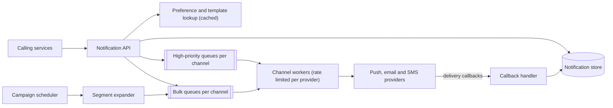

Reading about interview technique only goes so far. This lesson walks through a complete 45-minute mock interview — "design a notification service" — with the candidate's reasoning at each step and the interviewer's view of what went well or poorly. Read it once straight through, then try the same prompt yourself before rereading the commentary.

## Minute 0–6: scoping

> **Interviewer:** Design a notification service that other teams at our company can use.
>
> **Candidate:** Let me make sure I understand the scope. Other teams — say, the orders team or the social team — call our service to notify users. Which channels should we support: push notifications, email, SMS, in-app?
>
> **Interviewer:** Push, email and SMS. In-app is out of scope.
>
> **Candidate:** Are notifications mostly one user at a time, like "your order shipped", or also bulk campaigns to millions of users?
>
> **Interviewer:** Both.
>
> **Candidate:** Do users control their preferences — for example, no marketing email, or quiet hours at night?
>
> **Interviewer:** Yes, preferences and quiet hours matter.
>
> **Candidate:** And for guarantees: is it acceptable to occasionally send a notification twice, or to delay one, or to lose one?
>
> **Interviewer:** Losing security codes or order updates is bad. Duplicates are annoying but tolerable. Marketing can be delayed.

The candidate writes down:

| Functional | Non-functional |
| --- | --- |
| Send to one user or a segment via push, email or SMS | Never lose transactional notifications |
| Respect preferences, opt-outs, quiet hours | Minimize duplicates |
| Templates with variables | Security codes delivered within seconds |
| Scheduled campaigns | Campaigns may be throttled or delayed |
| Delivery status per notification | Survive third-party provider outages |

**Commentary.** Strong start: every question changes the design (channels, bulk, preferences, guarantees). The candidate captured priorities — security codes are urgent, campaigns are not — which will drive a priority design later.

## Minute 6–10: estimation

> **Candidate:** Let me assume 200 million users. Transactional notifications average 5 per user per day — 1 billion a day, about 12,000 per second. Campaigns can target 100 million users at once; if we want a campaign delivered within an hour, that is about 28,000 per second on top. So we design for roughly 50,000 sends per second at peak.
>
> Each notification record is small — maybe 1 KB with status history — so 1 billion a day is about 1 TB per day. We might keep 30 days of status: 30 TB.
>
> The real constraint is the providers. SMS and push providers impose per-account rate limits, so we will need queues and throttling rather than calling providers directly from the API.

**Commentary.** Quick, rounded and — importantly — concluded with a design consequence ("queues and throttling"). The interviewer did not need precise numbers; they needed to see the candidate use them.

## Minute 10–15: API and data model

```http
POST /v1/notifications
  { userId, template, variables, channels?, priority, idempotencyKey }
  -> { notificationId }
POST /v1/campaigns
  { segmentId, template, sendAt, channels, priority: "bulk" } -> { campaignId }
GET  /v1/notifications/{id}        -> { status per channel }
PUT  /v1/users/{id}/preferences    { channels, categories, quietHours }
```

| Entity | Store | Key |
| --- | --- | --- |
| Notification and per-channel status | Wide-column store | notification_id; secondary by user_id |
| Preferences | Key-value store plus cache | user_id |
| Templates | Relational database plus cache | template_id, version |
| Device tokens, emails, phone numbers | Key-value store | user_id |

> **Candidate:** The idempotency key lets calling services retry safely — if the orders service times out and retries, we return the same notification instead of sending twice.

**Commentary.** The idempotency key directly addresses the "minimize duplicates" requirement. Choosing stores from access patterns (lookups by ID and by user) is exactly what interviewers want.

## Minute 15–25: high-level design



> **Candidate:** The API validates the request, checks preferences and quiet hours, renders the template, stores the notification and enqueues one message per channel. Security codes and order updates go to high-priority queues; campaigns go to bulk queues. Workers pull from high-priority queues first and apply per-provider rate limits. Providers call us back with delivery status, which we record.
>
> Campaigns are handled by a scheduler that expands a segment into users in batches and enqueues them into the bulk queues, so a 100-million-user campaign never floods the high-priority path.

**Commentary.** A complete end-to-end design by minute 25, with the priority requirement handled structurally (separate queues) rather than as an afterthought. The interviewer now chooses the deep dive.

## Minute 25–38: deep dives

> **Interviewer:** What happens if the SMS provider goes down for 20 minutes?
>
> **Candidate:** Messages stay in the SMS queue — nothing is lost because we only delete a message after the provider accepts it. Workers see failures, back off exponentially with jitter, and a circuit breaker stops hammering the provider. For security codes, we could fail over to a second SMS provider; routing by provider health is a reasonable addition. When the provider recovers, we drain the backlog, high priority first. We should also expire stale security codes — sending a login code 20 minutes late is useless, so those messages carry a deadline and are dropped (and the calling service notified) if it passes.
>
> **Interviewer:** How do you avoid sending duplicates when a worker crashes after the provider accepted the message but before the worker acknowledged the queue?
>
> **Candidate:** The message is redelivered to another worker. Before sending, workers check the notification's per-channel status; if it is already "sent", they skip it. There is still a tiny window — the crash between the provider call and the status write — where a duplicate is possible. Passing our notification ID as an idempotency key to providers that support it closes that window; for those that do not, we accept rare duplicates, which the requirements allow.

**Commentary.** Excellent: the candidate distinguished what the design guarantees from what it only makes rare, and tied the answer back to the stated requirements. The "stale security codes" point shows product thinking beyond infrastructure.

## Minute 38–45: defending the design

> **Candidate:** To summarize against the requirements: transactional notifications are never lost because they are stored and queued before we acknowledge the caller, and deleted from queues only after providers accept them. Duplicates are minimized with idempotency keys at our API and, where possible, at providers. Urgent messages are isolated from campaigns by priority queues and reserved worker capacity. Provider outages cause delays, not loss, with failover for critical traffic.
>
> What breaks first at ten times the scale is provider rate limits, not our servers — we would negotiate higher limits and add providers. I would monitor queue depth and oldest-message age per channel and priority, provider error rates, and end-to-end latency for security codes.

**Commentary.** A clean close that maps each requirement to a mechanism, names the real bottleneck and mentions monitoring. This is what "defend" looks like.

## How this interview would be scored

| Area | Assessment |
| --- | --- |
| Problem exploration | Strong — every question shaped the design; priorities captured early |
| Estimation | Good — rounded, fast, tied to a decision |
| Design | Strong — complete by the halfway mark, priority isolation built in |
| Depth | Strong — failure handling, duplicate windows, deadlines for stale codes |
| Communication | Strong — signposted, summarized, tied back to requirements |

## Common ways the same interview goes wrong

- Drawing boxes at minute 2 without asking about bulk campaigns — and later discovering that campaigns flood the security-code path.
- Calling providers synchronously from the API, so a provider outage fails every caller.
- Claiming "exactly-once delivery" without explaining how, then being unable to answer the crash question.
- Spending 15 minutes on template rendering, which is the easiest part.

<Ponder question="The candidate chose to drop security codes that miss their deadline instead of sending them late. Why is that a better choice than 'never drop anything'?">
A login or verification code is only useful for a few minutes; delivering it after it has expired confuses users, wastes provider capacity during a backlog and delays fresher codes behind it. Dropping it and telling the calling service lets that service show "please request a new code". Guarantees should follow the value of the message — never lose order confirmations, but do not deliver time-sensitive messages after they have lost their meaning.
</Ponder>

<Callout type="tip">
Practice this exact prompt with a friend playing the interviewer. Ask them to interrupt with the two deep-dive questions above, and compare your answers with the transcript.
</Callout>

<KeyTakeaways>
- Scope with questions whose answers change the design, and record priorities as well as features.
- Keep estimates rough and always end with the design consequence they imply.
- Have a complete end-to-end design by the halfway point, with key requirements handled structurally.
- In deep dives, distinguish what the design guarantees from what it makes rare, and tie answers to the requirements.
- Close by mapping each requirement to a mechanism, naming the first bottleneck at scale and the metrics you would watch.
</KeyTakeaways>
