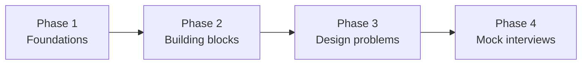

"How long do I need to prepare?" has no universal answer. It depends on your experience with distributed systems, the level you are targeting and how much time you can commit each week. This lesson helps you estimate your own timeline and plan it.

## Assess your starting point

Be honest about where you are:

- **Beginner** — you have built applications but rarely thought about scaling, replication or caching beyond a single server.
- **Intermediate** — you have worked with caches, queues or replicated databases and understand most terminology, but you have not designed large systems end to end.
- **Experienced** — you have designed or operated large-scale systems and mainly need practice presenting designs under time pressure.

A quick self-test: without looking anything up, can you explain (1) why a cache can serve stale data and two ways to limit it, (2) the difference between synchronous and asynchronous replication, and (3) how consistent hashing reduces data movement when a node is added? Three confident answers suggest you are at least intermediate.

## Suggested timelines

| Starting point | Target level | Typical preparation |
| --- | --- | --- |
| Beginner | Mid-level | 8–12 weeks at 5–7 hours per week |
| Intermediate | Senior | 4–8 weeks at 5–7 hours per week |
| Experienced | Senior / staff | 2–4 weeks, focused on practice and mock interviews |

These are rough guides. Consistency matters more than total hours: an hour a day for six weeks beats two frantic weekends.

## A phased plan

**Phase 1 — Foundations (about 15% of your time).** Learn the interview format, the SCALED framework, the non-functional characteristics and estimation. These give you a shared vocabulary for everything else.

**Phase 2 — Building blocks (about 35%).** Study each component: what it guarantees, how it scales, how it fails. Take the chapter quizzes; aim for at least 80% before moving on.

**Phase 3 — Design problems (about 35%).** For each problem, first attempt it on your own for 30–40 minutes, then read the lesson and note differences. Cover a variety of problem types: read-heavy feeds, write-heavy logging, real-time messaging, geospatial search, large-file storage and strongly consistent payments.

**Phase 4 — Mock interviews (about 15%).** Practice full 45-minute sessions with a peer, alternating roles. Being the interviewer is surprisingly educational — you will notice the traps other candidates fall into.

## A sample six-week schedule

For an intermediate engineer targeting a senior role, with about an hour on weekdays and two hours at weekends:

| Week | Focus | Output |
| --- | --- | --- |
| 1 | Interview format, SCALED, consistency and failure models, non-functional characteristics, estimation | Estimation cheat sheet in your own words |
| 2 | DNS, load balancers, databases, key-value store, CDN | Pattern notebook entries for each block |
| 3 | Sequencer, monitoring, cache, messaging queue, pub-sub, rate limiter | Chapter quizzes at 80% or more |
| 4 | Blob store, search, logging, scheduler, sharded counters; first three design problems | Your own diagrams before reading each solution |
| 5 | Six more design problems across different families | A list of the hard part in each problem |
| 6 | Four mock interviews, AI-era designs, outage lessons, primer review | Notes on recurring mistakes |

## How to study one design problem

A disciplined routine turns each problem into lasting skill rather than a memorized diagram:

1. **Attempt (35 minutes).** Set a timer, open a blank whiteboard and go through SCALED out loud.
2. **Compare (20 minutes).** Read the lesson. List what you missed, what you did differently and whether your alternative is also valid.
3. **Extract (10 minutes).** Add new patterns to your notebook with when to use them and what they cost.
4. **Revisit (one week later).** Redo the problem from scratch in 25 minutes without notes.

<Ponder question="Why is redoing a problem a week later more valuable than reading two new solutions in the same time?">
Recall under time pressure is exactly what the interview tests. Reading gives a feeling of familiarity that fades quickly; reconstructing a design from memory after a gap forces you to rebuild the reasoning, strengthens long-term retention and exposes the parts you only thought you understood.
</Ponder>

## Signs that you are ready

- You can produce a complete design for an unfamiliar problem within 25 minutes.
- You can explain the trade-offs of every component you draw.
- You consistently score 80% or higher on chapter quizzes.
- You can handle follow-up questions about failures, hotspots and scaling without losing your structure.

<Callout type="tip">
Spaced repetition works well for system design concepts. Revisit chapter quizzes a week after you first take them — retaking them after a gap strengthens long-term recall far more than rereading.
</Callout>

## Avoiding burnout

Long preparation periods are demanding. Schedule rest days, mix reading with active practice, and track progress visibly — completing chapters in this course gives a clear sense of momentum. If you have an interview date, work backwards from it and leave the final few days for light review rather than new material. The night before, review your pattern notebook and the estimation cheat sheet, then stop.

<KeyTakeaways>
- Preparation time depends on your starting experience, target level and weekly commitment.
- Consistent practice beats cramming.
- Follow a phased plan: foundations, building blocks, design problems, then mock interviews.
- Study each design problem by attempting, comparing, extracting patterns and revisiting a week later.
- You are ready when you can design unfamiliar systems in about 25 minutes and defend every trade-off.
</KeyTakeaways>
