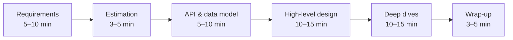

A system design interview is a 45–60 minute conversation in which you design a large-scale system — say, a URL shortener or a chat service — together with an interviewer. Unlike a coding interview, there is no single correct answer and no test suite. The interviewer is evaluating *how you think*: how you clarify ambiguity, structure a solution, reason about trade-offs and respond to new constraints.

## What interviewers look for

Most companies assess candidates along similar dimensions:

| Signal | What it looks like |
| --- | --- |
| **Problem exploration** | Asking clarifying questions, identifying core use cases, agreeing on scope. |
| **Technical design** | A coherent high-level architecture with sensible components and data flow. |
| **Depth** | Diving into one or two hard areas — data model, scaling, consistency — with real detail. |
| **Trade-off reasoning** | Explaining why you chose one approach over another and what it costs. |
| **Communication** | Driving the conversation, checking in, and adapting to hints. |

The expected depth scales with seniority. A mid-level engineer is expected to produce a working design with reasonable choices. A senior engineer should proactively identify bottlenecks and failure modes. A staff-level candidate is expected to reason about organizational and operational concerns too — migrations, cost, multi-region strategy.

## A typical interview timeline

Time management is part of the evaluation. Candidates who spend 25 minutes on requirements, or who jump into database schemas before agreeing on scope, often run out of time before showing depth.

## Building your preparation plan

Effective preparation combines three activities:

1. **Learn the building blocks.** You cannot design a system if you do not know what a message queue guarantees or when a cache causes inconsistency. Part II of this course covers these in depth.
2. **Practice complete designs.** Work through a variety of problems — read-heavy, write-heavy, real-time, geospatial, storage-heavy. Each teaches different patterns.
3. **Rehearse out loud.** Designing in your head is very different from explaining while drawing. Practice with a peer or record yourself, keeping to the time budget.

<Callout type="interview">
Keep a personal “pattern notebook.” Every time a design uses a technique — fan-out on write, consistent hashing, idempotency keys — write down when it applies and what it costs. Before an interview, reviewing your notebook is far more effective than rereading full solutions.
</Callout>

## Setting up for the day

- **Know your tools.** Many interviews use a shared whiteboard tool. Practice drawing boxes and arrows quickly in it.
- **Prepare an opening.** Have a standard way to start: restate the problem, then list clarifying questions.
- **Bring real experience.** When relevant, mention systems you have built or operated. Concrete stories about incidents or migrations are strong signals of seniority.
- **Stay calm with ambiguity.** Vague prompts are deliberate. Your job is to turn ambiguity into a clear plan.

<KeyTakeaways>
- Interviewers evaluate problem exploration, design, depth, trade-off reasoning and communication.
- Expectations grow with seniority, from a working design to proactive failure analysis and operational concerns.
- Manage time deliberately across requirements, estimation, design and deep dives.
- Prepare by learning building blocks, practicing varied problems and rehearsing out loud.
</KeyTakeaways>
