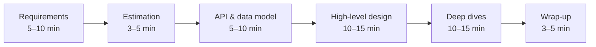

A system design interview is a 45–60 minute conversation in which you design a large-scale system — say, a URL shortener or a chat service — together with an interviewer. Unlike a coding interview, there is no single correct answer and no test suite. The interviewer is evaluating *how you think*: how you clarify ambiguity, structure a solution, reason about trade-offs and respond to new constraints.

## Why companies run design interviews

Coding interviews measure whether you can implement an algorithm correctly. They say little about whether you can decide *what* to build and *how the pieces fit together* — which is most of what senior engineers do. A design interview simulates a design review: an open-ended problem, incomplete information, a colleague asking hard questions, and a need to commit to decisions. Companies use it to calibrate the level at which they hire you, so it often matters more for your final offer than the coding rounds do.

## What interviewers look for

Most companies assess candidates along similar dimensions:

| Signal | What it looks like |
| --- | --- |
| **Problem exploration** | Asking clarifying questions, identifying core use cases, agreeing on scope. |
| **Technical design** | A coherent high-level architecture with sensible components and data flow. |
| **Depth** | Diving into one or two hard areas — data model, scaling, consistency — with real detail. |
| **Trade-off reasoning** | Explaining why you chose one approach over another and what it costs. |
| **Communication** | Driving the conversation, checking in, and adapting to hints. |

## Expectations by level

The expected depth scales with seniority. The same prompt — "design a news feed" — is graded differently depending on the role.

| Level | What a strong answer shows |
| --- | --- |
| Entry / mid-level | A working end-to-end design with reasonable components. Correct use of load balancers, caches and databases. Some trade-offs discussed when prompted. |
| Senior | Drives the interview. Proactively finds bottlenecks, hotspots and single points of failure. Chooses between fan-out on write and on read with numbers to back it up. |
| Staff and above | Everything above, plus operational and organizational thinking: migrations from an existing system, multi-region strategy, cost, observability, team ownership and how the design evolves over years. |

<Callout type="note">
Interviewers are usually told to look for the *highest* level you consistently demonstrate. A single brilliant deep dive does not outweigh a design that never handles failures; consistent solid reasoning across the whole session does.
</Callout>

## A typical interview timeline

Time management is part of the evaluation. Candidates who spend 25 minutes on requirements, or who jump into database schemas before agreeing on scope, often run out of time before showing depth.

## Building your preparation plan

Effective preparation combines three activities:

1. **Learn the building blocks.** You cannot design a system if you do not know what a message queue guarantees or when a cache causes inconsistency. Part II of this course covers these in depth.
2. **Practice complete designs.** Work through a variety of problems — read-heavy, write-heavy, real-time, geospatial, storage-heavy. Each teaches different patterns.
3. **Rehearse out loud.** Designing in your head is very different from explaining while drawing. Practice with a peer or record yourself, keeping to the time budget.

### Cover the problem families

Most interview prompts fall into a handful of families. Practicing one problem from each gives you patterns that transfer.

| Family | Example prompts | Core patterns |
| --- | --- | --- |
| Read-heavy content | News feed, Twitter timeline, Instagram | Caching, fan-out, CDNs, denormalization |
| Write-heavy ingestion | Metrics, logging, click analytics | Queues, batching, time-series and columnar storage |
| Real-time | Chat, live comments, multiplayer | WebSockets, presence, pub-sub, ordering |
| Geospatial | Uber, Yelp, Maps | Geohashes, quadtrees, location updates |
| Large objects | YouTube, Dropbox | Blob storage, chunking, transcoding, CDNs |
| Strong consistency | Payments, booking, inventory | Transactions, idempotency, locking, sagas |
| Infrastructure | Rate limiter, key-value store, scheduler | Partitioning, replication, consensus |

<Callout type="interview">
Keep a personal "pattern notebook." Every time a design uses a technique — fan-out on write, consistent hashing, idempotency keys — write down when it applies and what it costs. Before an interview, reviewing your notebook is far more effective than rereading full solutions.
</Callout>

## Setting up for the day

- **Know your tools.** Many interviews use a shared whiteboard tool. Practice drawing boxes and arrows quickly in it, and keep a consistent visual language: clients on the left, storage on the right, asynchronous flows as dashed lines.
- **Prepare an opening.** Have a standard way to start: restate the problem, then list clarifying questions.
- **Bring real experience.** When relevant, mention systems you have built or operated. Concrete stories about incidents or migrations are strong signals of seniority.
- **Stay calm with ambiguity.** Vague prompts are deliberate. Your job is to turn ambiguity into a clear plan.

### A sample opening

> "Let me restate the problem to make sure I understand it: we are designing a service where users post short messages and see a timeline of posts from accounts they follow. Before I design anything, I'd like to ask a few questions about scope and scale, then I'll do a quick estimate, define the API, sketch a high-level design, and we can pick one or two areas to go deep on. Does that plan work for you?"

This takes thirty seconds and tells the interviewer that you have a structure, that you will not rush, and that you welcome their steering.

<Ponder question="An interviewer says, 'Just assume whatever scale you like.' Is that an invitation to skip estimation?">
No. It is an invitation to *choose* the scale and state it. Pick realistic numbers ("let's assume 50 million daily active users, each reading 20 posts a day"), write them down, and derive requests per second and storage from them. The design decisions that follow — whether you need sharding, how much to cache — are only credible when they follow from numbers you committed to.
</Ponder>

## After the interview

Write down, within an hour, what you were asked, what you drew and where you struggled. Over several interviews these notes reveal patterns — perhaps you always rush estimation or never discuss monitoring — that are far more useful than any generic advice.

<KeyTakeaways>
- A design interview simulates a design review; it strongly influences the level at which you are hired.
- Interviewers evaluate problem exploration, design, depth, trade-off reasoning and communication.
- Expectations grow with seniority, from a working design to proactive failure analysis and operational concerns.
- Practice at least one problem from each family: read-heavy, write-heavy, real-time, geospatial, large objects, strong consistency and infrastructure.
- Manage time deliberately, open with a clear plan, and review your performance after each interview.
</KeyTakeaways>
