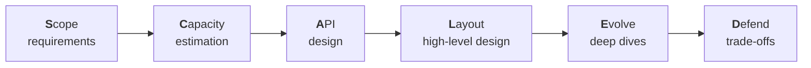

A framework gives you a reliable path through any design question, so you spend your energy on the problem rather than on deciding what to do next. Throughout this course we use **SCALED**, a six-step approach that fits comfortably into a 45-minute interview.



## S — Scope the requirements

Agree on what you are building.

- **Functional requirements:** the core features. For a URL shortener: create a short link, redirect to the original URL, optionally set an expiry.
- **Non-functional requirements:** scale, latency, availability, consistency and durability. For example: 100 million new links per month, redirects under 50 ms, 99.99% availability.
- **Out of scope:** explicitly park features you will not cover, such as analytics dashboards.

## C — Capacity estimation

Estimate the quantities that drive the design: requests per second for reads and writes, storage growth over several years, bandwidth and memory for caching. Round aggressively; the goal is the order of magnitude. The results tell you whether one database will do, how much to cache, and where the bottlenecks will be.

## A — API design

Define the interface between clients and the system. Listing endpoints clarifies the data flow and surfaces details such as pagination and authentication.

```text
POST /v1/links        { longUrl, expiresAt? }  -> { shortCode }
GET  /{shortCode}                               -> 302 Location: longUrl
```

Alongside the API, sketch the **data model**: the main entities, their key fields and how they are accessed. Access patterns, not entity relationships alone, should drive your storage choice.

## L — Layout the high-level design

Draw the major components and the path of each core request: clients, load balancers, services, caches, databases, queues and external dependencies. Walk through one read and one write end to end. Keep it simple — this is the baseline you will refine.

## E — Evolve through deep dives

Pick the one or two hardest or most interesting parts and go deep. Typical topics include how to shard data and avoid hotspots, how to generate unique IDs, how to keep caches consistent, how to handle real-time delivery, and how to process work asynchronously. Let the interviewer's interests guide the choice.

## D — Defend and discuss trade-offs

Close by evaluating your design against the non-functional requirements. Identify single points of failure, bottlenecks and failure scenarios, and explain the trade-offs you made — consistency versus availability, cost versus latency, simplicity versus flexibility. Mention what you would add with more time: monitoring, security, multi-region deployment.

<Callout type="interview">
You do not need to announce each letter of SCALED, but briefly stating your plan at the start — “I'll clarify requirements, do a quick estimate, define the API, sketch the design, then go deep” — reassures the interviewer that you have a structure.
</Callout>

## Time budget

| Step | Suggested time |
| --- | --- |
| Scope | 5–8 minutes |
| Capacity | 3–5 minutes |
| API and data model | 5–7 minutes |
| Layout | 10–12 minutes |
| Evolve | 10–15 minutes |
| Defend | 3–5 minutes |

The framework is a guide, not a script. If the interviewer wants to skip estimation or dive into one area immediately, adapt.

<KeyTakeaways>
- SCALED stands for Scope, Capacity, API, Layout, Evolve and Defend.
- Scope functional and non-functional requirements, and state what is out of scope.
- Use rounded capacity estimates to justify design decisions.
- Define the API and data model before drawing the architecture.
- Spend deep-dive time on the hardest parts, then evaluate the design and its trade-offs.
</KeyTakeaways>
