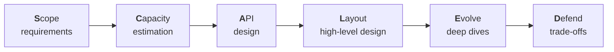
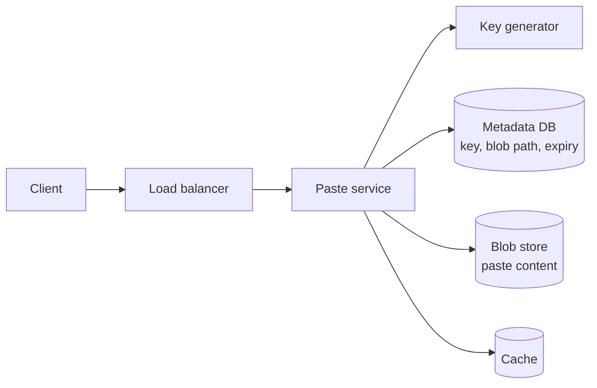

A framework gives you a reliable path through any design question, so you spend your energy on the problem rather than on deciding what to do next. Throughout this course we use **SCALED**, a six-step approach that fits comfortably into a 45-minute interview.



## S — Scope the requirements

Agree on what you are building.

- **Functional requirements:** the core features. For a URL shortener: create a short link, redirect to the original URL, optionally set an expiry.
- **Non-functional requirements:** scale, latency, availability, consistency and durability. For example: 100 million new links per month, redirects under 50 ms, 99.99% availability.
- **Out of scope:** explicitly park features you will not cover, such as analytics dashboards.

Aim for three to five functional requirements. More than that and you will not have time to design them all; fewer and the problem is too thin to show depth.

## C — Capacity estimation

Estimate the quantities that drive the design: requests per second for reads and writes, storage growth over several years, bandwidth and memory for caching. Round aggressively; the goal is the order of magnitude. The results tell you whether one database will do, how much to cache, and where the bottlenecks will be.

## A — API design

Define the interface between clients and the system. Listing endpoints clarifies the data flow and surfaces details such as pagination and authentication.

```text
POST /v1/links        { longUrl, expiresAt? }  -> { shortCode }
GET  /{shortCode}                               -> 302 Location: longUrl
```

Alongside the API, sketch the **data model**: the main entities, their key fields and how they are accessed. Access patterns, not entity relationships alone, should drive your storage choice.

## L — Layout the high-level design

Draw the major components and the path of each core request: clients, load balancers, services, caches, databases, queues and external dependencies. Walk through one read and one write end to end. Keep it simple — this is the baseline you will refine.

## E — Evolve through deep dives

Pick the one or two hardest or most interesting parts and go deep. Typical topics include how to shard data and avoid hotspots, how to generate unique IDs, how to keep caches consistent, how to handle real-time delivery, and how to process work asynchronously. Let the interviewer's interests guide the choice.

## D — Defend and discuss trade-offs

Close by evaluating your design against the non-functional requirements. Identify single points of failure, bottlenecks and failure scenarios, and explain the trade-offs you made — consistency versus availability, cost versus latency, simplicity versus flexibility. Mention what you would add with more time: monitoring, security, multi-region deployment.

<Callout type="interview">
You do not need to announce each letter of SCALED, but briefly stating your plan at the start — "I'll clarify requirements, do a quick estimate, define the API, sketch the design, then go deep" — reassures the interviewer that you have a structure.
</Callout>

## SCALED in action: a text-sharing service

To see how the steps connect, here is a compressed walkthrough of "design Pastebin", a service where users paste text and share a link to it.

**Scope.** Users create a paste (up to 1 MB of text) and receive a URL; anyone with the URL can read it; pastes can expire. Non-functional: reads far outnumber writes, reads should take under 100 ms, pastes must not be lost before expiry. Out of scope: accounts, syntax highlighting, search.

**Capacity.** Assume 1 million new pastes a day and a 10:1 read-to-write ratio.

- Writes: 1,000,000 ÷ 86,400 ≈ **12 per second**; reads ≈ **120 per second** (peaks maybe 5× higher).
- Storage: average paste 10 KB → 10 GB per day → about **3.6 TB per year**, plus metadata.
- The numbers say: writes are trivial, storage is the main concern, and content is immutable — ideal for a blob store and a cache.

**API.**

```text
POST /v1/pastes   { content, expiresIn? }  -> { key, url }
GET  /v1/pastes/{key}                       -> { content, createdAt, expiresAt }
```

**Layout.**



A write takes a unique key, stores content in the blob store and metadata in a database. A read checks the cache, then metadata, then fetches the blob.

**Evolve.** The interesting parts are key generation (reuse the URL shortener's pre-generated key approach), cleaning up expired pastes (a background job scanning an expiry index, plus a check on read so expired pastes are never served) and caching popular pastes at a CDN.

**Defend.** Metadata is small and replicated; blobs are replicated by the blob store; the cache is optional for correctness. The main trade-off is eventual consistency between blob and metadata writes — handled by writing the blob first and the metadata last, so a reader never sees metadata pointing to a missing blob.

<Ponder question="In the walkthrough, why write the blob before the metadata rather than the other way round?">
The metadata row is what makes a paste visible. If metadata were written first and the blob write then failed, readers could find a key that points to nothing. Writing the blob first means a failure leaves only an orphaned blob, invisible to users, which a periodic garbage-collection job can remove. Ordering writes so that the "commit point" comes last is a common technique when two stores cannot share a transaction.
</Ponder>

## Time budget

| Step | Suggested time |
| --- | --- |
| Scope | 5–8 minutes |
| Capacity | 3–5 minutes |
| API and data model | 5–7 minutes |
| Layout | 10–12 minutes |
| Evolve | 10–15 minutes |
| Defend | 3–5 minutes |

The framework is a guide, not a script. If the interviewer wants to skip estimation or dive into one area immediately, adapt.

## Common mistakes at each step

| Step | Mistake | Fix |
| --- | --- | --- |
| Scope | Listing ten features | Pick the three to five that define the product |
| Capacity | Precise arithmetic | Round to powers of ten and move on |
| API | Omitting pagination or idempotency | Add cursors for lists and keys for retried writes |
| Layout | Drawing every microservice | Start with the minimum; add components when needed |
| Evolve | Deep-diving into an easy part | Choose the component most likely to break at scale |
| Defend | Claiming the design has no weaknesses | Name the biggest risk and how you would monitor it |

<KeyTakeaways>
- SCALED stands for Scope, Capacity, API, Layout, Evolve and Defend.
- Scope three to five functional requirements plus non-functional targets, and state what is out of scope.
- Use rounded capacity estimates to justify design decisions.
- Define the API and data model before drawing the architecture, then walk through a read and a write.
- Spend deep-dive time on the hardest parts, then evaluate the design honestly, including its weaknesses.
</KeyTakeaways>
