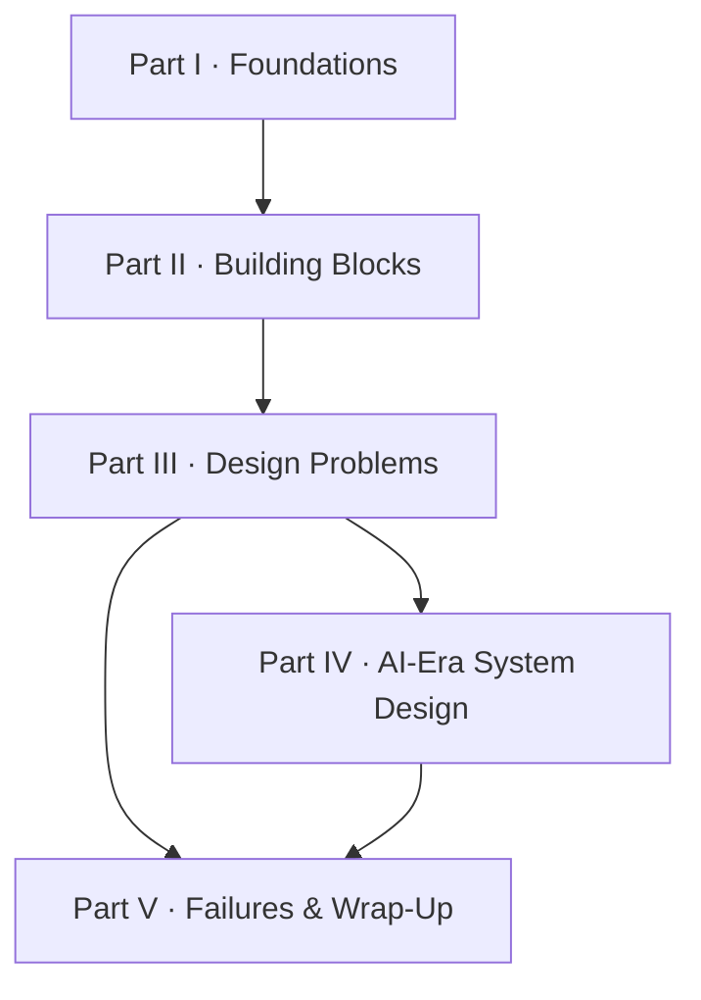
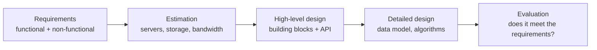

This course is designed to be read in order, but it is also a reference you can return to. Understanding its structure will help you decide where to spend your time.

## The five parts

### Part I — Foundations

The first part sets the stage. You will learn how system design interviews are run and evaluated, and you will meet the **SCALED** framework used throughout the course. We then cover the conceptual toolkit you need before touching any component: abstractions such as remote procedure calls, the spectrum of consistency models, the kinds of failures distributed systems experience, and the non-functional characteristics — availability, reliability, scalability, maintainability and fault tolerance — by which every design is judged. Finally, you will practice back-of-the-envelope estimation.

### Part II — Building Blocks

Large systems are assembled from a surprisingly small set of reusable components. Each chapter in this part designs one building block from scratch:

| Category | Building blocks |
| --- | --- |
| Networking and traffic | Domain name system, load balancers, content delivery network, rate limiter |
| Storage | Databases, key-value store, blob store, distributed cache |
| Coordination | Sequencer (unique IDs), distributed task scheduler, sharded counters |
| Communication | Distributed messaging queue, publish-subscribe |
| Observability | Distributed monitoring (server and client side), distributed logging |
| Retrieval | Distributed search |

Designing the building blocks themselves means you will understand not just *what* they do but *how* they behave under load and failure — knowledge you will lean on in every design problem. When the YouTube design says "store videos in a blob store and serve them through a CDN", you will already know how both work inside.

### Part III — Design Problems

Here you apply everything to complete products: a video platform, a question-and-answer site, a maps service, a proximity service, ride-hailing, microblogging, a newsfeed, photo sharing, a URL shortener, a web crawler, a messaging app, typeahead suggestions, collaborative editing, a code deployment system, a payment system, an online judge and several shorter case studies. Each design follows the same structure, so by the end the process becomes second nature.

### Part IV — AI-Era System Design

Modern products increasingly embed machine learning and large language models. This part covers how AI has changed system design and interviews, and walks through designs for an LLM chat service, data infrastructure for machine learning, a customer-support bot that uses retrieval-augmented generation, and an AI code assistant.

### Part V — Failures and Wrap-Up

We finish by studying real public outages and what they teach about designing for failure, then summarize the course. An appendix collects primer lessons on patterns and trade-offs — consistent hashing, CAP and PACELC, proxies, real-time communication, indexes — that are ideal for quick revision.

## Lesson anatomy

Most lessons follow the same shape:

1. **A motivating problem** — why this topic matters and what goes wrong without it.
2. **Core ideas with diagrams** — static architecture diagrams, plus step-by-step slides for flows such as "what happens when a user posts a message".
3. **Trade-offs and variations** — tables comparing alternatives, and callouts for interview tips and pitfalls.
4. **Points to ponder** — questions with hidden answers to test your reasoning before moving on.
5. **Key takeaways and a quiz** — a summary and a few questions to lock in the lesson.

Design problems are split across several lessons — requirements, high-level design, detailed design and evaluation — mirroring how you would present them in an interview.

## Study plans

| Time available | Suggested path |
| --- | --- |
| One week | Part I (skim estimation), building blocks you are least confident in, then four design problems: URL shortener, newsfeed, messaging app and ride-hailing. |
| Four weeks | Part I fully, all of Part II at one chapter per day, then two design problems per day for the rest. |
| Eight weeks or more | Everything in order, plus redoing each design problem from a blank page a week after reading it. |

<Callout type="tip" title="Suggested paths">
**Short on time?** Read Part I, the building blocks you are least familiar with, and at least six design problems.
**Thorough preparation?** Go front to back and retake chapter quizzes until you score at least 80%.
</Callout>

<Ponder question="Why does the course teach building blocks before full design problems, rather than the other way round?">
Design problems are mostly compositions of building blocks. If you already understand how a cache evicts, how a queue delivers, and how a key-value store replicates, a design problem becomes a matter of choosing and connecting components and justifying the choices. Without that foundation, designs turn into memorized diagrams that break down as soon as an interviewer asks "what happens if this fails?".
</Ponder>

## Tracking your progress

The sidebar shows every chapter with a completion count. Mark lessons complete as you finish them; your best quiz scores are stored with your account. Chapter quizzes are marked complete as soon as you submit them, so you can always see which topics still need review. A final assessment at the end of the appendix covers the whole course.

<KeyTakeaways>
- The course has five parts: foundations, building blocks, design problems, AI-era systems, and failures and wrap-up.
- Building blocks are designed from scratch so you understand their behavior, not just their purpose.
- Design problems share a consistent structure: requirements, estimation, high-level design, detailed design and evaluation.
- Lessons combine diagrams, slides, callouts, points to ponder, key takeaways and quizzes.
- Choose a study plan that fits your timeline, and use the sidebar and quizzes to track progress.
</KeyTakeaways>
