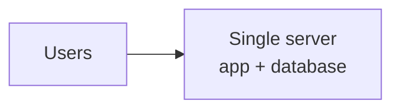
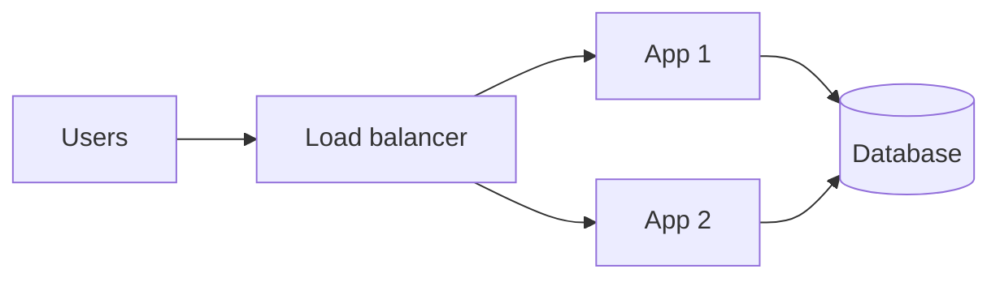
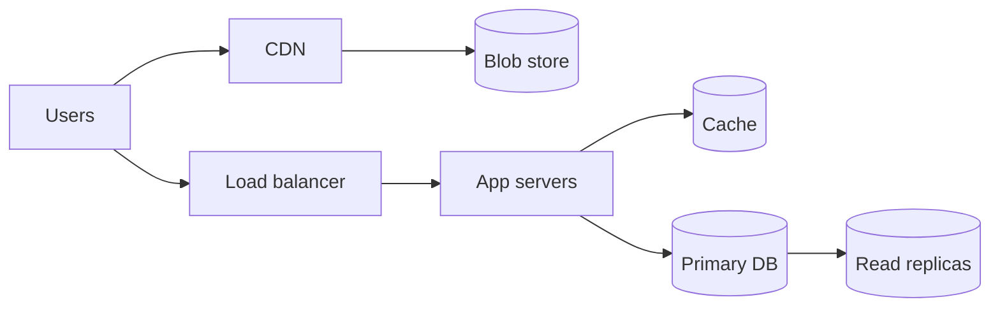
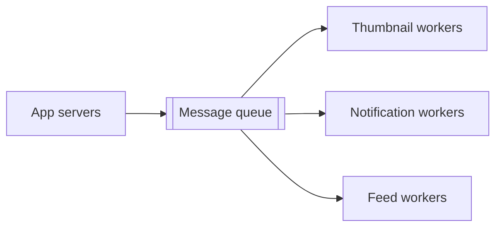
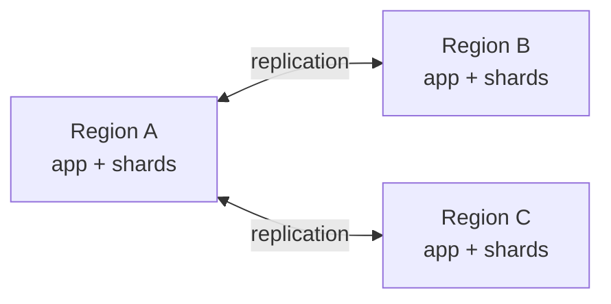
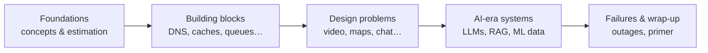

Every popular product you use — a video platform, a ride-hailing app, a chat service — is built from the same small set of ideas. Requests are spread across many machines, data is copied and split across databases, slow work is pushed onto queues, and hot data lives in caches close to the user. **System design** is the craft of choosing and combining those ideas so a product stays fast, correct and affordable as it grows from a thousand users to a billion.

This course teaches that craft from first principles. You will not memorize diagrams. Instead, you will learn *why* each component exists, what problem it solves, what it costs, and how to reason about the trade-offs when you put components together.

## What is system design?

System design is the process of defining the **components** of a system, the **interfaces** between them and the **data** that flows through them, so that the system meets a set of requirements. Some requirements are about behavior: "a user can upload a video", "a rider can request a trip". Others are about qualities: "the home page loads in under 200 milliseconds", "no confirmed payment is ever lost", "the service survives the loss of a data center".

The first kind is easy to satisfy on a single machine. The second kind is where system design earns its keep. As soon as traffic, data volume or availability targets exceed what one computer can offer, you must split the work across many computers — and that introduces networks that drop messages, clocks that disagree, disks that fail and partial failures in which some machines work while others do not.

## A system's growth in five steps

The easiest way to see why design matters is to follow a product as it grows. Imagine a photo-sharing app.

<Slides title="From one server to a distributed system">
<Slide caption="1. Day one: a single server runs the web app and the database. Simple and cheap, but any failure takes everything down.">

</Slide>
<Slide caption="2. Traffic grows: separate the database, and put several stateless app servers behind a load balancer.">

</Slide>
<Slide caption="3. Reads dominate: add a cache and read replicas, and move photos to a blob store served through a CDN.">

</Slide>
<Slide caption="4. Slow work appears: thumbnails, notifications and feeds are pushed onto queues and handled by workers.">

</Slide>
<Slide caption="5. Global scale: data is sharded across many database nodes and replicated across regions for latency and resilience.">

</Slide>
</Slides>

Each step solves one problem and introduces new ones. A load balancer removes the single app server as a point of failure, but now sessions cannot live in server memory. A cache speeds up reads but can serve stale data. Replicas scale reads but lag behind the primary. Sharding scales writes but makes cross-user queries hard. This course is about recognizing those consequences before they surprise you.

## Who this course is for

- **Software engineers** preparing for system design interviews at any level, from new graduate to staff.
- **Backend and full-stack developers** who want to understand the infrastructure their code runs on.
- **Engineering managers and tech leads** who review designs and need a shared vocabulary with their teams.
- **Curious learners** who have wondered how large-scale services actually work behind the scenes.

You should be comfortable with basic programming concepts and have a rough idea of what a web server and a database are. Everything else is built up step by step.

## What you will learn

The course is organized as a journey from fundamentals to full designs:

1. **Foundations** — how interviews work, consistency and failure models, the non-functional properties every system is judged by, and quick estimation techniques.
2. **Building blocks** — the reusable components nearly every large system relies on: DNS, load balancers, databases, key-value stores, CDNs, ID generators, monitoring, caches, queues, pub-sub, rate limiters, blob stores, search, logging, schedulers and sharded counters.
3. **Design problems** — end-to-end designs for well-known product categories, each built with the same repeatable framework.
4. **AI-era systems** — how large language models and machine-learning pipelines change the way we design systems.
5. **Failures and wrap-up** — what real outages teach us, plus a primer you can revisit before an interview.

## How lessons work

Each lesson is short enough to finish in one sitting. You will find:

- **Illustrations** — architecture diagrams and step-by-step slide decks that walk through how a request flows through a system.
- **Callouts** — notes, tips and interview advice highlighted in the text.
- **Points to ponder** — questions that make you stop and think before revealing the answer.
- **Key takeaways** — a short summary at the end of every lesson.
- **Quizzes** — a few questions after every lesson and a longer quiz at the end of each chapter. Your best score is saved so you can come back and improve it.

<Ponder question="In step 2 of the growth story, why must app servers become stateless before a load balancer can spread traffic across them?">
If a server keeps a user's session in its own memory, the next request from that user must reach the same server, or the session is lost. Moving session state to a shared store (a cache or database) or into a signed token lets any server handle any request, so the load balancer can route freely and a failed server loses nothing.
</Ponder>

<Callout type="tip" title="Learn actively">
Before reading a design lesson, spend five minutes sketching your own solution. Comparing your attempt with the lesson is the fastest way to find gaps in your understanding.
</Callout>

## How to use this course

If you are preparing for an interview in the next few weeks, read Part I, skim the building blocks you already know, and spend most of your time on the design problems. If you have more time, go through the course in order — later lessons assume you understand the building blocks and refer back to them often.

Mark each lesson complete as you go. Your progress is saved to your account, and the **Continue** button always takes you back to where you left off.

<KeyTakeaways>
- System design defines components, interfaces and data flows so that a system meets both functional and quality requirements.
- Growth forces a system from one server to load-balanced, cached, queued, sharded and replicated components — and each step brings new trade-offs.
- The course moves from foundations to building blocks, then to complete designs, AI-era systems and lessons from real failures.
- Every lesson ends with a quiz; points to ponder and chapter quizzes help you consolidate what you learned.
- Actively attempting designs before reading the solution is the most effective way to learn.
</KeyTakeaways>
