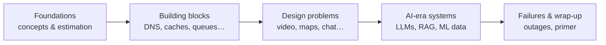

Every popular product you use — a video platform, a ride-hailing app, a chat service — is built from the same small set of ideas. Requests are spread across many machines, data is copied and split across databases, slow work is pushed onto queues, and hot data lives in caches close to the user. **System design** is the craft of choosing and combining those ideas so a product stays fast, correct and affordable as it grows from a thousand users to a billion.

This course teaches that craft from first principles. You will not memorize diagrams. Instead, you will learn *why* each component exists, what problem it solves, what it costs, and how to reason about the trade-offs when you put components together.

## Who this course is for

- **Software engineers** preparing for system design interviews at any level, from new graduate to staff.
- **Backend and full-stack developers** who want to understand the infrastructure their code runs on.
- **Engineering managers and tech leads** who review designs and need a shared vocabulary with their teams.
- **Curious learners** who have wondered how large-scale services actually work behind the scenes.

You should be comfortable with basic programming concepts and have a rough idea of what a web server and a database are. Everything else is built up step by step.

## What you will learn

The course is organized as a journey from fundamentals to full designs:

1. **Foundations** — how interviews work, consistency and failure models, the non-functional properties every system is judged by, and quick estimation techniques.
2. **Building blocks** — the reusable components nearly every large system relies on: DNS, load balancers, databases, key-value stores, CDNs, ID generators, monitoring, caches, queues, pub-sub, rate limiters, blob stores, search, logging, schedulers and sharded counters.
3. **Design problems** — end-to-end designs for well-known product categories, each built with the same repeatable framework.
4. **AI-era systems** — how large language models and machine-learning pipelines change the way we design systems.
5. **Failures and wrap-up** — what real outages teach us, plus a primer you can revisit before an interview.

## How lessons work

Each lesson is short enough to finish in one sitting. You will find:

- **Illustrations** — architecture diagrams and step-by-step slide decks that walk through how a request flows through a system.
- **Callouts** — notes, tips and interview advice highlighted in the margin of the text.
- **Key takeaways** — a short summary at the end of every lesson.
- **Quizzes** — a few questions after every lesson and a longer quiz at the end of each chapter. Your best score is saved so you can come back and improve it.

<Callout type="tip" title="Learn actively">
Before reading a design lesson, spend five minutes sketching your own solution. Comparing your attempt with the lesson is the fastest way to find gaps in your understanding.
</Callout>

## How to use this course

If you are preparing for an interview in the next few weeks, read Part I, skim the building blocks you already know, and spend most of your time on the design problems. If you have more time, go through the course in order — later lessons assume you understand the building blocks and refer back to them often.

Mark each lesson complete as you go. Your progress is saved to your account, and the **Continue** button always takes you back to where you left off.

<KeyTakeaways>
- System design is about choosing and combining a small set of components, and understanding the trade-offs between them.
- The course moves from foundations to building blocks, then to complete designs, AI-era systems and lessons from real failures.
- Every lesson ends with a quiz; chapter quizzes help you consolidate what you learned.
- Actively attempting designs before reading the solution is the most effective way to learn.
</KeyTakeaways>
