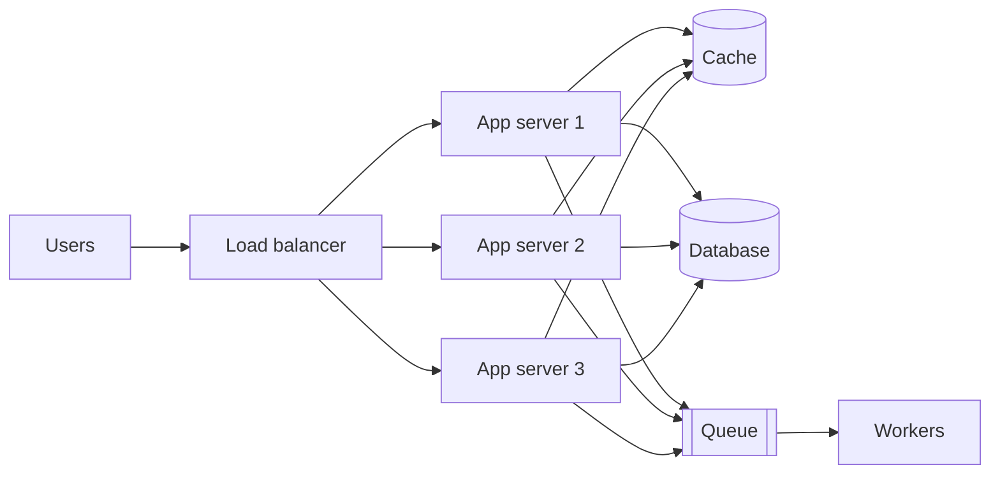

It is tempting to think of system design as a topic reserved for architects and principal engineers. In practice, every engineer makes design decisions every week: where to store a new piece of data, whether to call another service synchronously, how to retry a failed request, what to cache and for how long. Each of these small choices shapes how a system behaves under load and when things go wrong. Learning system design gives you a vocabulary and a set of mental models for making those choices deliberately.

## Code runs on systems, not on laptops

On your laptop, a function call takes nanoseconds, the disk never fills up and the network never drops a packet. In production, your code runs on hundreds of machines connected by an unreliable network. Requests arrive in bursts, dependencies slow down, disks fail and deployments happen in the middle of peak traffic.

Even a "simple" web application quickly looks like the diagram above. Knowing how each piece behaves — and how it fails — is what separates code that works in a demo from code that works at 3 a.m. on the busiest day of the year.

| On a laptop | In production |
| --- | --- |
| One process, one clock | Hundreds of processes whose clocks drift apart |
| Function calls always return | Network calls can hang, fail, or succeed without you knowing |
| One user at a time | Thousands of concurrent requests racing for the same rows |
| Restarting fixes things | Restarts happen mid-request and must not corrupt data |
| Data fits in memory | Data is split across many machines and regions |

## A small decision with large consequences

Consider a checkout service that calls a payment provider. A developer adds a simple rule: *if the call times out, retry up to three times*. It looks harmless. Now imagine the payment provider slows down during a sale:

1. Each slow call times out and is retried, so the provider receives up to **four times** its normal traffic exactly when it is weakest.
2. The extra load slows it further, causing more timeouts and more retries — a **retry storm**.
3. Some "timed-out" calls actually succeeded, so without an **idempotency key** customers are charged twice.

A designer who knows the vocabulary would have used exponential backoff with jitter, a retry budget, a circuit breaker and idempotency keys from the start. None of these are advanced; they are simply what you learn to reach for once you have studied how distributed systems fail.

<Ponder question="The retry storm made things worse. What single mechanism would stop a client from hammering a dependency that is clearly failing?">
A **circuit breaker**. After a threshold of failures, it "opens" and fails calls immediately without contacting the dependency, then periodically lets a trial request through to test recovery. This removes load from the struggling service and gives it room to recover, while the caller can fall back to a degraded behavior.
</Ponder>

## Benefits beyond interviews

System design interviews are a strong motivation, but the skills pay off throughout your career:

- **Better everyday decisions.** You will recognize when a feature needs a queue instead of a synchronous call, or when a cache will cause stale reads that users will notice.
- **Faster debugging.** When latency spikes, you will know to check connection pools, cache hit ratios and hot partitions rather than guessing.
- **Clearer communication.** Design reviews go faster when everyone shares terms such as *idempotency*, *back-pressure* and *eventual consistency*.
- **Cost awareness.** Understanding the price of storage, bandwidth and compute helps you avoid designs that are elegant but unaffordable.
- **Career growth.** Senior roles are defined less by how much code you write and more by the quality of the technical decisions you drive.

<Callout type="note">
You do not need to have built a planet-scale system to reason about one. The same principles apply at every scale — only the numbers change.
</Callout>

## Design is about trade-offs

There is rarely a single correct design. A system that is strongly consistent may be slower or less available during network partitions. A system that caches aggressively is fast but may serve stale data. A system with many microservices scales teams well but adds operational complexity.

| You gain… | …and usually pay with |
| --- | --- |
| Strong consistency | Higher latency, lower availability during partitions |
| Aggressive caching | Stale reads, invalidation complexity |
| Microservices | Network hops, distributed debugging, operational overhead |
| Replication across regions | Cost, replication lag, conflict handling |
| Denormalized data | Faster reads, but more expensive and error-prone writes |

Good designers make these trade-offs explicit. They start from requirements — how many users, how much data, what latency is acceptable, what happens if data is lost — and choose the **simplest design that meets them**. Over-engineering is as real a failure as under-engineering: a three-person startup does not need a multi-region, event-sourced architecture on day one. Throughout this course, every design decision is presented together with its alternatives and costs, so you learn to reason rather than recite.

## How companies use design skills

Most technology companies hold a **design review** before significant work begins. An engineer writes a short document — the problem, requirements, proposed architecture, alternatives considered, risks and rollout plan — and peers challenge it. The questions asked in those reviews are the same ones asked in interviews: *What happens when this component fails? How does this scale to ten times the traffic? Why not use the existing queue?* Practicing system design prepares you to write those documents and to answer those questions confidently.

## The skills you will build

By the end of the course you will be able to:

1. Turn a vague product idea into concrete functional and non-functional requirements.
2. Estimate traffic, storage and bandwidth to size a system.
3. Choose appropriate building blocks and explain why.
4. Identify bottlenecks and single points of failure, and remove them.
5. Communicate a design clearly, at the right level of detail, within a time limit.

<KeyTakeaways>
- Every engineer makes design decisions; system design makes them deliberate and informed.
- Production systems run on unreliable networks and machines, so understanding failure modes is essential.
- Small choices, such as naive retries, can cause large failures such as retry storms and duplicate charges.
- The skills help with debugging, communication, cost control, design reviews and career growth — not just interviews.
- Good design makes trade-offs explicit and chooses the simplest design that meets the requirements.
</KeyTakeaways>
