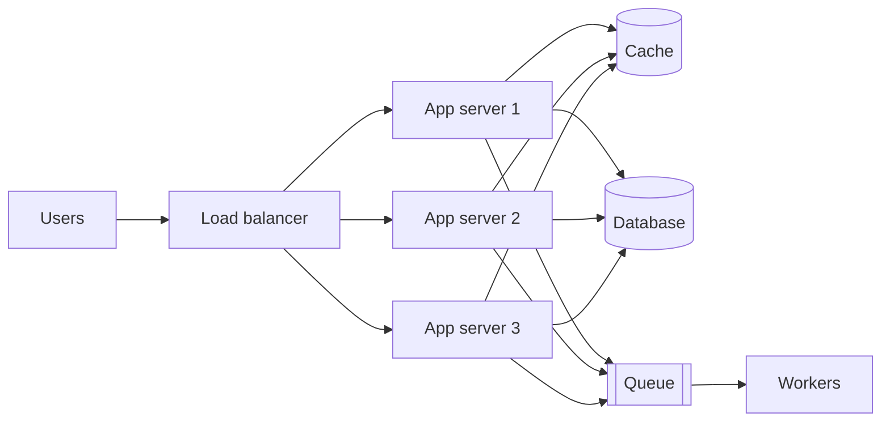

It is tempting to think of system design as a topic reserved for architects and principal engineers. In practice, every engineer makes design decisions every week: where to store a new piece of data, whether to call another service synchronously, how to retry a failed request, what to cache and for how long. Each of these small choices shapes how a system behaves under load and when things go wrong. Learning system design gives you a vocabulary and a set of mental models for making those choices deliberately.

## Code runs on systems, not on laptops

On your laptop, a function call takes nanoseconds, the disk never fills up and the network never drops a packet. In production, your code runs on hundreds of machines connected by an unreliable network. Requests arrive in bursts, dependencies slow down, disks fail and deployments happen in the middle of peak traffic.

Even a “simple” web application quickly looks like the diagram above. Knowing how each piece behaves — and how it fails — is what separates code that works in a demo from code that works at 3 a.m. on the busiest day of the year.

## Benefits beyond interviews

System design interviews are a strong motivation, but the skills pay off throughout your career:

- **Better everyday decisions.** You will recognize when a feature needs a queue instead of a synchronous call, or when a cache will cause stale reads that users will notice.
- **Faster debugging.** When latency spikes, you will know to check connection pools, cache hit ratios and hot partitions rather than guessing.
- **Clearer communication.** Design reviews go faster when everyone shares terms such as *idempotency*, *back-pressure* and *eventual consistency*.
- **Cost awareness.** Understanding the price of storage, bandwidth and compute helps you avoid designs that are elegant but unaffordable.
- **Career growth.** Senior roles are defined less by how much code you write and more by the quality of the technical decisions you drive.

<Callout type="note">
You do not need to have built a planet-scale system to reason about one. The same principles apply at every scale — only the numbers change.
</Callout>

## Design is about trade-offs

There is rarely a single correct design. A system that is strongly consistent may be slower or less available during network partitions. A system that caches aggressively is fast but may serve stale data. A system with many microservices scales teams well but adds operational complexity.

Good designers make these trade-offs explicit. They start from requirements — how many users, how much data, what latency is acceptable, what happens if data is lost — and choose the simplest design that meets them. Throughout this course, every design decision is presented together with its alternatives and costs, so you learn to reason rather than recite.

## The skills you will build

By the end of the course you will be able to:

1. Turn a vague product idea into concrete functional and non-functional requirements.
2. Estimate traffic, storage and bandwidth to size a system.
3. Choose appropriate building blocks and explain why.
4. Identify bottlenecks and single points of failure, and remove them.
5. Communicate a design clearly, at the right level of detail, within a time limit.

<KeyTakeaways>
- Every engineer makes design decisions; system design makes them deliberate and informed.
- Production systems run on unreliable networks and machines, so understanding failure modes is essential.
- The skills help with debugging, communication, cost control and career growth — not just interviews.
- Good design is about making trade-offs explicit and choosing the simplest design that meets the requirements.
</KeyTakeaways>
