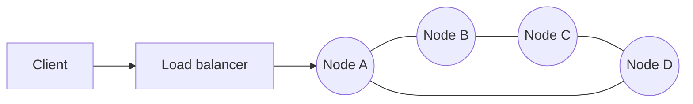
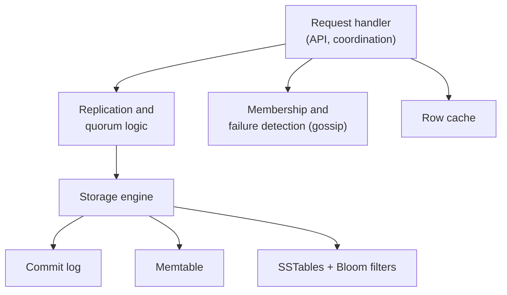
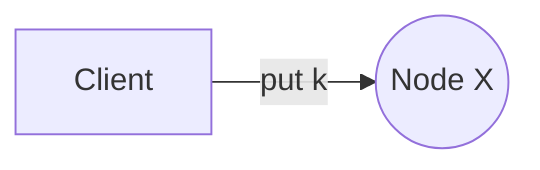
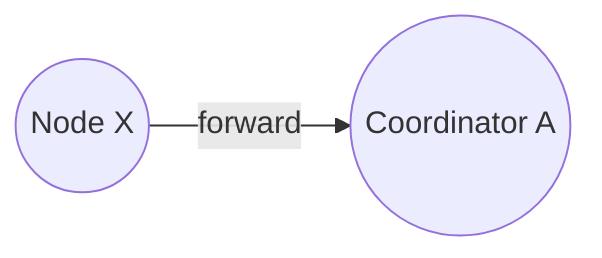
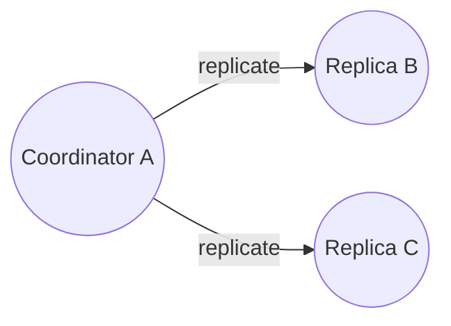
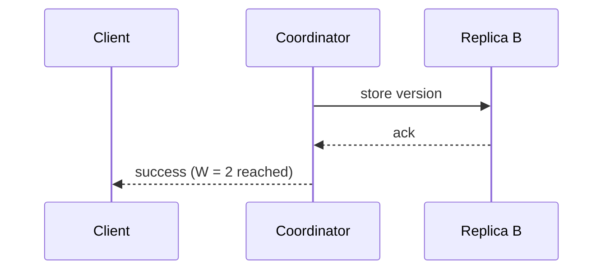
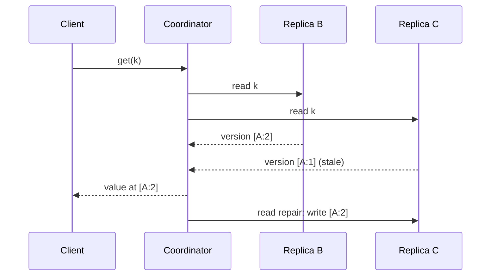

With the requirements in place, let's define the API and walk through how requests flow through a cluster of peer nodes and how each node stores data.

## API

```text
get(key)                 -> list of (value, context)
put(key, context, value) -> ack
delete(key, context)     -> ack
```

Three details stand out:

- `get` may return **several values**. If replicas diverged because of concurrent writes, the store returns all conflicting versions and lets the client (or a configured policy) reconcile them.
- `context` is opaque metadata — in our design, a **vector clock** — that the client passes back on the next `put`. It tells the store which version the client was updating, so the store can tell whether the new write supersedes or conflicts with existing versions.
- Every call can carry per-request options, such as the consistency level (`R` or `W`) and a timeout.

Over HTTP, the same API might look like this:

```http
GET  /v1/kv/cart:42
     -> 200 [{ "value": "...", "context": "a1b2..." }]
PUT  /v1/kv/cart:42   { "value": "...", "context": "a1b2..." }   ?w=2
     -> 204
```

## A decentralized, peer-to-peer architecture

A central master that assigns keys to nodes would be a bottleneck and a single point of failure. Instead, every node has the same responsibilities:

- Store a portion of the key space.
- Accept client requests and act as **coordinator** for any key.
- Replicate data to peers.
- Participate in membership and failure detection.



Because all nodes are equivalent, the cluster scales by adding nodes and survives the loss of any node.

## Inside a node



Each node runs the same software: a request handler that can coordinate any request, the replication logic, a gossip module that tracks cluster membership, and a pluggable storage engine.

## Request flow

<Slides title="Serving a put request">
<Slide caption="1. The client sends put(key) to any node, directly or via a load balancer.">



</Slide>
<Slide caption="2. Node X hashes the key and forwards the request to the key's coordinator, the first node responsible for it.">



</Slide>
<Slide caption="3. The coordinator stores the value with a new version and sends it to the other replicas.">



</Slide>
<Slide caption="4. Once W replicas (including itself) acknowledge, the coordinator replies to the client.">



</Slide>
</Slides>

A `get` works similarly: the coordinator asks the `N` replicas (or just `R` of them, with the rest queried in the background), waits for `R` responses, compares their versions, returns the newest — or all concurrent versions — and repairs any stale replicas it noticed.



### Client-driven versus server-driven coordination

| | Via load balancer (server-driven) | Partition-aware client (client-driven) |
| --- | --- | --- |
| Hops | Client → any node → coordinator | Client → coordinator |
| Client complexity | Minimal | Library must track membership and the ring |
| Latency | One extra hop in the worst case | Lowest |
| Typical use | Simple or third-party clients | High-performance internal services |

### Taming tail latency

With several replicas per request, the slowest replica can dominate latency. Two techniques help:

- **Wait for R, not N.** The coordinator returns as soon as the quickest `R` replicas answer.
- **Hedged requests.** If a replica has not answered within, say, its p95 latency, send the same request to another replica and use whichever answers first. This adds a few percent of extra load but sharply cuts the p99.

## Storage on each node

Each node persists data with a pluggable **storage engine**. Write-optimized engines based on log-structured merge trees suit the "always writable" goal:

1. **Commit log.** Every write is appended to a sequential log on disk and fsynced (or synced in small batches) for durability.
2. **Memtable.** The write is inserted into a sorted in-memory structure, from which recent reads are served.
3. **SSTables.** When the memtable fills, it is flushed to an immutable sorted file on disk; the corresponding commit-log segment can then be discarded.
4. **Compaction.** Background jobs merge SSTables, drop overwritten values and expired **tombstones** (markers that record deletes), and keep the number of files a read must check small.
5. **Bloom filters.** Each SSTable carries a compact probabilistic filter that answers "definitely not here" for most absent keys, so reads skip files that cannot contain the key.

A memory **row cache** of hot keys keeps frequent reads off disk entirely.

<Callout type="note" title="Why deletes need tombstones">
In a replicated store, simply removing a key from one replica would let anti-entropy "resurrect" it from another replica that still holds the old value. Instead, a delete writes a tombstone version that replicates like any other write and is garbage-collected only after it has certainly reached every replica.
</Callout>

## The components ahead

The core design raises questions that the following lessons answer:

- **Which node is responsible for which keys?** Consistent hashing with virtual nodes.
- **How many copies, and where?** A replication factor `N`, placed on distinct physical nodes and data centers.
- **How do we detect conflicting writes?** Vector clocks.
- **How strong is consistency?** Tunable quorums `R` and `W`.
- **What happens when nodes fail?** Sloppy quorums, hinted handoff, Merkle-tree anti-entropy and gossip-based failure detection.

<Ponder question="Why is a write-optimized LSM engine a better fit for this store than a B-tree, given the 'always writable' goal?">
LSM engines turn every write into a sequential append (commit log) plus an in-memory insert, so write latency stays low and predictable even under heavy load, and there are no in-place page updates or page splits. That keeps nodes accepting writes quickly during bursts and while hinted handoff and anti-entropy add extra write traffic. The cost — reads may consult several SSTables — is mitigated by Bloom filters, compaction and the row cache.
</Ponder>

<KeyTakeaways>
- The API is get, put and delete, with an opaque context carrying version information and per-request consistency options.
- get may return multiple conflicting versions for the client to reconcile.
- All nodes are peers; any node can coordinate requests, avoiding a single point of failure.
- A coordinator writes locally, replicates to other replicas and acknowledges after W successes; reads wait for R and repair stale replicas.
- Hedged requests and waiting for R rather than N reduce tail latency.
- An LSM storage engine with a commit log, memtable, SSTables, Bloom filters and tombstones keeps writes fast and durable.
</KeyTakeaways>
