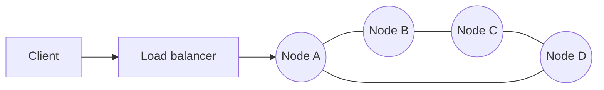
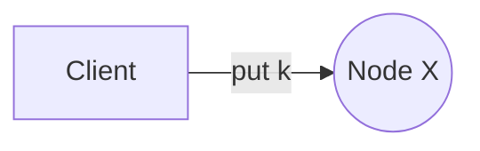
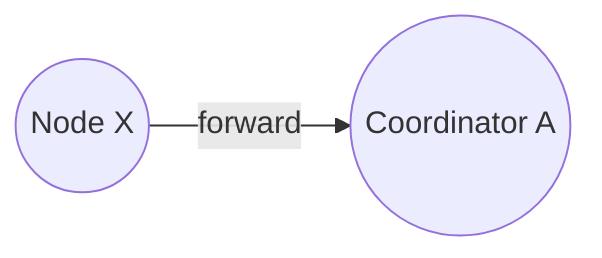
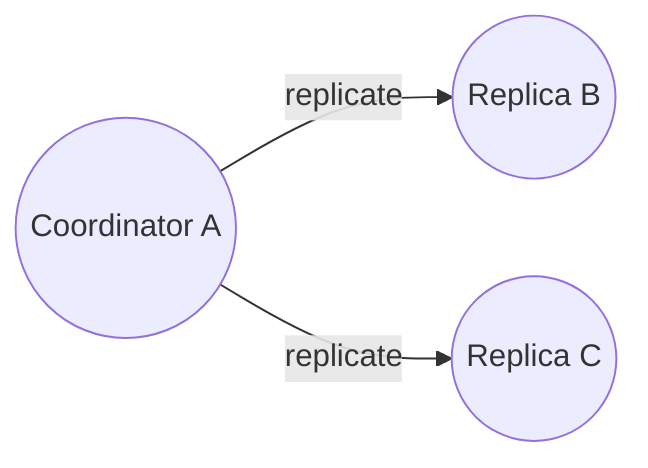
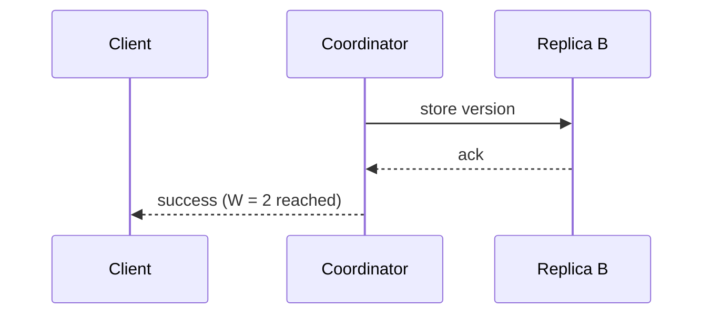

With the requirements in place, let's define the API and walk through how requests flow through a cluster of peer nodes.

## API

```text
get(key)                 -> list of (value, context)
put(key, context, value) -> ack
```

Two details stand out:

- `get` may return **several values**. If replicas diverged because of concurrent writes, the store returns all conflicting versions and lets the client (or a configured policy) reconcile them.
- `context` is opaque metadata — in our design, a **vector clock** — that the client passes back on the next `put`. It tells the store which version the client was updating, so the store can tell whether the new write supersedes or conflicts with existing versions.

## A decentralized, peer-to-peer architecture

A central master that assigns keys to nodes would be a bottleneck and a single point of failure. Instead, every node has the same responsibilities:

- Store a portion of the key space.
- Accept client requests and act as **coordinator** for any key.
- Replicate data to peers.
- Participate in membership and failure detection.



Because all nodes are equivalent, the cluster scales by adding nodes and survives the loss of any node.

## Request flow

<Slides title="Serving a put request">
<Slide caption="1. The client sends put(key) to any node, directly or via a load balancer.">



</Slide>
<Slide caption="2. Node X hashes the key and forwards the request to the key's coordinator, the first node responsible for it.">



</Slide>
<Slide caption="3. The coordinator stores the value with a new version and sends it to the other replicas.">



</Slide>
<Slide caption="4. Once W replicas (including itself) acknowledge, the coordinator replies to the client.">



</Slide>
</Slides>

Clients can also use a **partition-aware client library** that knows the cluster layout and sends requests directly to the coordinator, saving a hop.

## Storage on each node

Each node persists data with a pluggable **storage engine**. Write-optimized engines based on log-structured merge trees suit the “always writable” goal: writes are appended to a commit log and an in-memory table, then flushed to sorted files that are compacted in the background. A memory cache of hot keys keeps reads fast.

## The components ahead

The core design raises questions that the following lessons answer:

- **Which node is responsible for which keys?** Consistent hashing with virtual nodes.
- **How many copies, and where?** A replication factor `N`, placed on distinct physical nodes and data centers.
- **How do we detect conflicting writes?** Vector clocks.
- **How strong is consistency?** Tunable quorums `R` and `W`.
- **What happens when nodes fail?** Sloppy quorums, hinted handoff, Merkle-tree anti-entropy and gossip-based failure detection.

<KeyTakeaways>
- The API is get and put, with an opaque context carrying version information.
- get may return multiple conflicting versions for the client to reconcile.
- All nodes are peers; any node can coordinate requests, avoiding a single point of failure.
- A coordinator writes locally, replicates to other replicas and acknowledges after W successes.
- Write-optimized storage engines and in-memory caches keep per-node latency low.
</KeyTakeaways>
