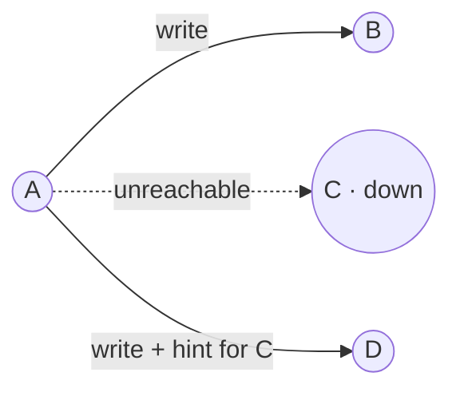
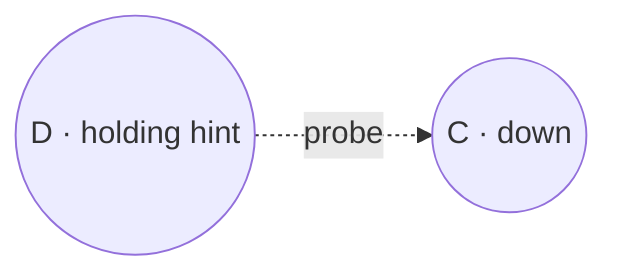
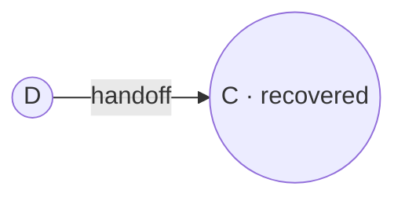
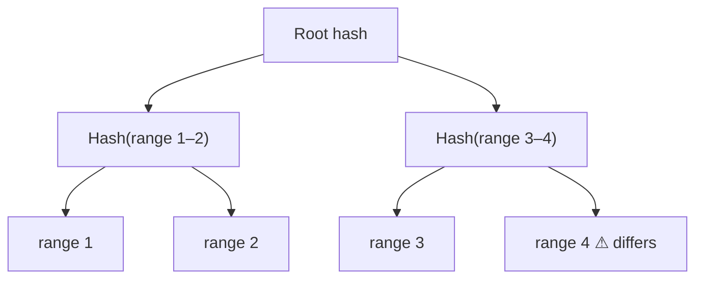
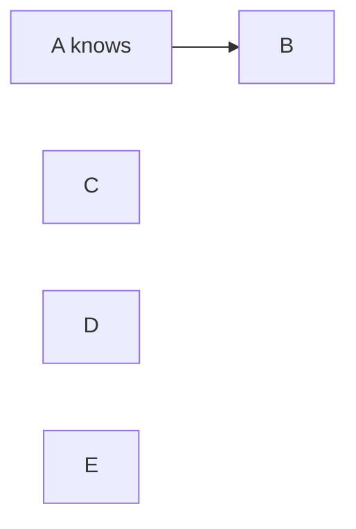
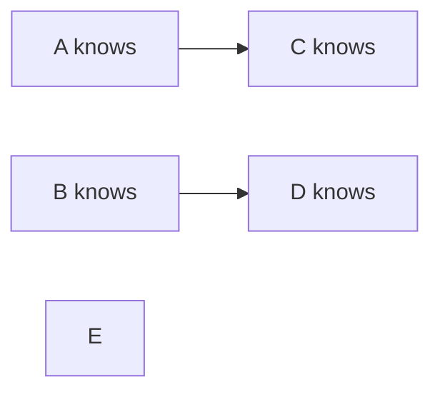
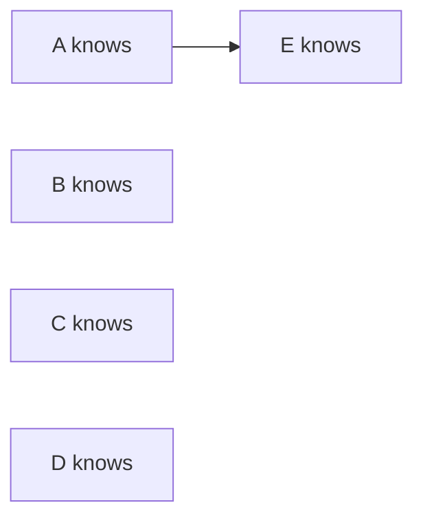

In a cluster of hundreds of nodes, failures are routine. Some are **temporary** — a node reboots or a network link flaps — and some are **permanent** — a disk dies. The key-value store must keep serving requests through both, and it must detect failures without a central authority.

## Handling temporary failures: sloppy quorums and hinted handoff

A strict quorum requires `W` acknowledgments from the key's designated replicas. If one of them is down, strict quorums reduce write availability. Our store instead uses a **sloppy quorum**: the write goes to the first `W` **healthy** nodes in the preference list, even if some are not the key's usual replicas.

<Slides title="Hinted handoff">
<Slide caption="1. Replica C is unreachable, so the coordinator writes to the next healthy node, D, with a hint that the data belongs to C.">

</Slide>
<Slide caption="2. D stores the data in a separate local area and periodically checks whether C has recovered.">

</Slide>
<Slide caption="3. When C recovers, D hands the data off to C and deletes its temporary copy.">

</Slide>
</Slides>

Hinted handoff keeps the store writable during short outages. The trade-off is consistency: with sloppy quorums, `R + W > N` no longer guarantees that a read sees the latest write, because the write may be on a node outside the read set. Hints are also bounded — a node stores hints for a limited time (for example, three hours) so that a long outage does not fill its disk; after that, anti-entropy must repair the returning node.

## Handling permanent failures: anti-entropy with Merkle trees

If a node is gone for good, or hints are lost, replicas drift apart. **Anti-entropy** is a background process that compares replicas and repairs differences. Comparing every key would be expensive, so replicas use **Merkle trees**: hash trees where each leaf is the hash of a range of keys and each parent is the hash of its children.

Two replicas first compare root hashes. If they match, the data is identical. If not, they compare children and descend only into subtrees that differ, quickly locating the out-of-sync key ranges while transferring very little data.

How little? Suppose a range holds 1 billion keys and the tree has 2¹⁵ ≈ 32,000 leaves, each covering about 30,000 keys. If one key differs, the replicas exchange about 15 levels × 2 hashes, then only the one leaf range of 30,000 keys — instead of 1 billion keys. Building the trees costs a full read of the data, so anti-entropy is scheduled regularly (for example weekly) and throttled, and trees are built per key range so that a membership change invalidates only a few trees.

The store also performs **read repair**: when a read returns different versions from different replicas, the coordinator writes the newest version back to the stale replicas. Read repair fixes hot keys quickly; Merkle-tree anti-entropy catches cold keys that are rarely read.

| Mechanism | Triggered by | Fixes | Cost |
| --- | --- | --- | --- |
| Hinted handoff | A replica being briefly unreachable during a write | Writes missed during short outages | Temporary storage on stand-in nodes |
| Read repair | A read that sees divergent versions | Frequently read keys | A little extra write traffic on reads |
| Merkle-tree anti-entropy | A schedule | Everything, including cold data | Periodic full scans to build trees |

## Failure detection with gossip

How does each node know which peers are alive? A central monitor would be a single point of failure, and having every node ping every other node does not scale — with 1,000 nodes, that is a million heartbeats per interval. Instead, nodes use a **gossip protocol**:

1. Each node keeps a membership list with a heartbeat counter per node.
2. Periodically, each node increments its own counter and exchanges its list with a few random peers.
3. Peers merge lists, keeping the highest counter for each node.
4. If a node's counter has not increased for a while, it is **suspected** dead.

<Slides title="Gossip spreads information exponentially">
<Slide caption="1. Round 1: node A learns that node F has joined, and tells one random peer.">

</Slide>
<Slide caption="2. Round 2: A and B each tell another random peer. Four nodes now know.">

</Slide>
<Slide caption="3. Round 3: the rest learn. With N nodes, information reaches everyone in about log2(N) rounds.">

</Slide>
</Slides>

Information spreads through the cluster exponentially fast, like rumors, so all nodes converge on the same view within a few rounds: about 10 rounds for 1,000 nodes. Gossip also propagates membership changes, such as new nodes joining the ring and their token positions.

Rather than a fixed timeout, many implementations use an **adaptive (phi accrual) failure detector**: each node tracks the typical interval between heartbeats from each peer and computes a suspicion level that rises the longer a heartbeat is overdue relative to that history. Peers on a normally jittery link are not declared dead too eagerly.

Note the distinction between **suspecting** a node and **removing** it. A suspected node is temporarily routed around (triggering hinted handoff); removing a node from the ring, which triggers data movement, is an explicit administrative action or happens only after a much longer outage.

<Callout type="interview">
When discussing a highly available store, cover both failure types: **temporary** (sloppy quorum and hinted handoff) and **permanent** (Merkle-tree anti-entropy), plus how failures are **detected** (gossip). This is a complete fault-tolerance story.
</Callout>

## Evaluating the design

| Requirement | How the design meets it |
| --- | --- |
| Scalability | Consistent hashing with virtual nodes; adding a node moves about 1/N of the data, spread across the cluster |
| Availability | Peer nodes, sloppy quorums and hinted handoff keep reads and writes working during failures |
| Low latency | LSM storage, row cache, waiting for R/W rather than N, hedged requests |
| Durability | Commit log plus N replicas across failure domains |
| Tunable consistency | Per-request R and W, local or global quorums, vector clocks for conflicts |
| Heterogeneity | More virtual nodes for bigger machines |
| Decentralization | No master; gossip for membership and failure detection |

The main weakness is that the store offers **eventual consistency with conflict detection** rather than linearizability. That is the right trade-off for carts, sessions and preferences, and the wrong one for money or uniqueness constraints.

## Summary of techniques

| Problem | Technique | Benefit |
| --- | --- | --- |
| Partitioning | Consistent hashing | Incremental scalability |
| High write availability | Vector clocks, reconciliation on read | Always writable |
| Temporary failures | Sloppy quorum, hinted handoff | Availability during outages |
| Permanent failures | Merkle-tree anti-entropy | Replicas converge efficiently |
| Membership and detection | Gossip protocol | Decentralized, scalable |

<Ponder question="A node is down for two days, longer than the hint window. When it returns, what happens to reads of keys it owns, and how does it catch up?">
Its hints have expired, so it is missing two days of writes. Until it catches up, reads with `R ≥ 2` still return the latest version from other replicas and read-repair the returning node key by key. The node should be repaired with a full Merkle-tree anti-entropy run before it serves `R = 1` reads (or it may return stale data); if it has been gone long enough, it may be faster to wipe it and re-bootstrap it as a new node.
</Ponder>

<KeyTakeaways>
- Sloppy quorums write to the first W healthy nodes, and hinted handoff returns data to its owner after recovery; hints expire after a bounded time.
- Sloppy quorums improve availability but weaken the R + W > N guarantee.
- Merkle trees let replicas find and repair differences while exchanging minimal data; read repair fixes hot keys quickly.
- Gossip spreads heartbeats and membership in about log2(N) rounds, and adaptive detectors reduce false suspicions.
- The design meets its scalability, availability and latency goals by accepting eventual consistency with conflict detection.
</KeyTakeaways>
