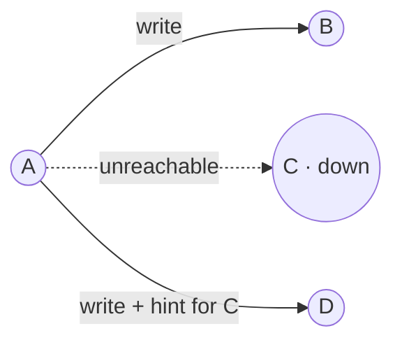
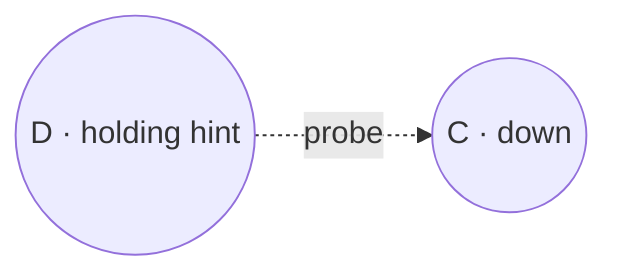
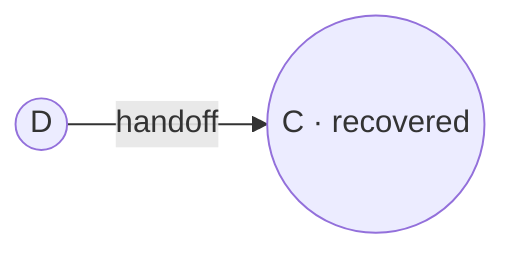
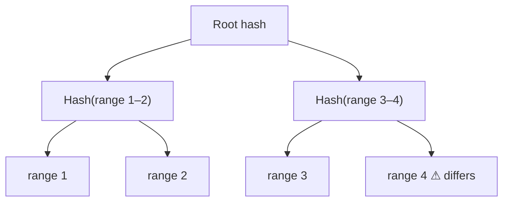

In a cluster of hundreds of nodes, failures are routine. Some are **temporary** — a node reboots or a network link flaps — and some are **permanent** — a disk dies. The key-value store must keep serving requests through both, and it must detect failures without a central authority.

## Handling temporary failures: sloppy quorums and hinted handoff

A strict quorum requires `W` acknowledgments from the key's designated replicas. If one of them is down, strict quorums reduce write availability. Our store instead uses a **sloppy quorum**: the write goes to the first `W` **healthy** nodes in the preference list, even if some are not the key's usual replicas.

<Slides title="Hinted handoff">
<Slide caption="1. Replica C is unreachable, so the coordinator writes to the next healthy node, D, with a hint that the data belongs to C.">

</Slide>
<Slide caption="2. D stores the data in a separate local area and periodically checks whether C has recovered.">

</Slide>
<Slide caption="3. When C recovers, D hands the data off to C and deletes its temporary copy.">

</Slide>
</Slides>

Hinted handoff keeps the store writable during short outages. The trade-off is consistency: with sloppy quorums, `R + W > N` no longer guarantees that a read sees the latest write, because the write may be on a node outside the read set.

## Handling permanent failures: anti-entropy with Merkle trees

If a node is gone for good, or hints are lost, replicas drift apart. **Anti-entropy** is a background process that compares replicas and repairs differences. Comparing every key would be expensive, so replicas use **Merkle trees**: hash trees where each leaf is the hash of a range of keys and each parent is the hash of its children.

Two replicas first compare root hashes. If they match, the data is identical. If not, they compare children and descend only into subtrees that differ, quickly locating the out-of-sync key ranges while transferring very little data.

The store also performs **read repair**: when a read returns different versions from different replicas, the coordinator writes the newest version back to the stale replicas.

## Failure detection with gossip

How does each node know which peers are alive? A central monitor would be a single point of failure, and having every node ping every other node does not scale. Instead, nodes use a **gossip protocol**:

1. Each node keeps a membership list with a heartbeat counter per node.
2. Periodically, each node increments its own counter and exchanges its list with a few random peers.
3. Peers merge lists, keeping the highest counter for each node.
4. If a node's counter has not increased for a while, it is **suspected** dead.

Information spreads through the cluster exponentially fast, like rumors, so all nodes converge on the same view within a few rounds. Gossip also propagates membership changes, such as new nodes joining the ring.

<Callout type="interview">
When discussing a highly available store, cover both failure types: **temporary** (sloppy quorum and hinted handoff) and **permanent** (Merkle-tree anti-entropy), plus how failures are **detected** (gossip). This is a complete fault-tolerance story.
</Callout>

## Summary of techniques

| Problem | Technique | Benefit |
| --- | --- | --- |
| Partitioning | Consistent hashing | Incremental scalability |
| High write availability | Vector clocks, reconciliation on read | Always writable |
| Temporary failures | Sloppy quorum, hinted handoff | Availability during outages |
| Permanent failures | Merkle-tree anti-entropy | Replicas converge efficiently |
| Membership and detection | Gossip protocol | Decentralized, scalable |

<KeyTakeaways>
- Sloppy quorums write to the first W healthy nodes, and hinted handoff returns data to its owner after recovery.
- Sloppy quorums improve availability but weaken the R + W > N guarantee.
- Merkle trees let replicas find and repair differences while exchanging minimal data.
- Read repair fixes stale replicas discovered during reads.
- Gossip spreads heartbeats and membership decentrally, enabling scalable failure detection.
</KeyTakeaways>
