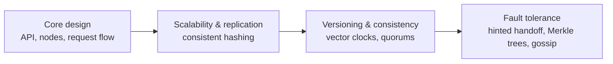

A **key-value store** is a distributed hash table: it stores values under unique keys and supports two core operations, `put(key, value)` and `get(key)`. Its simplicity is its strength. Because the store does not need to understand values or support complex queries, it can partition and replicate data across thousands of machines, delivering low latency and very high availability.

Key-value stores back shopping carts, session stores, user preferences, feature flags, leaderboards and the metadata layers of many larger systems. In this chapter we design one from scratch, following the SCALED approach. The design is inspired by the family of highly available stores that descend from Amazon's Dynamo paper, which powers systems such as Cassandra and Riak.

## Where key-value stores fit

| Use case | Key | Value | Why a key-value store |
| --- | --- | --- | --- |
| Shopping cart | `cart:{userId}` | List of items | Must accept writes even during failures; simple access by user |
| Session store | `session:{token}` | User ID, expiry, flags | Very high read rate, short-lived data |
| User preferences | `prefs:{userId}` | Settings document | Read on every page load; rarely updated |
| Product metadata cache | `product:{id}` | Serialized product | Low latency, easy horizontal scaling |
| URL shortener | `{shortKey}` | Long URL | Billions of tiny records, single-key lookups |

Not every key-value store makes the same trade-offs. **AP stores** such as the one we design here favor availability and accept temporary divergence. **CP stores** such as etcd or ZooKeeper use consensus to keep a small amount of critical data (configuration, leader election, locks) strictly consistent, at the cost of availability during partitions and limited scale. In-memory stores such as Redis favor raw speed. The requirements decide which you need.

## Requirements

### Functional requirements

- `put(key, value)` stores a value, overwriting any existing one.
- `get(key)` returns the value associated with a key.
- Keys are small (up to a few hundred bytes); values are typically under 1 MB.
- Optionally, `delete(key)` and a time to live after which keys expire.

### Non-functional requirements

- **Scalability** — handle billions of keys and millions of requests per second by adding nodes, without downtime.
- **Availability** — keep accepting reads and writes even when nodes or network links fail; the store should be "always writable."
- **Low latency** — single-digit millisecond reads and writes at the 99th percentile.
- **Durability** — acknowledged writes must survive node failures.
- **Tunable consistency** — let applications choose between stronger consistency and higher availability per request.
- **Heterogeneity** — nodes with more capacity should be able to hold more data.
- **Decentralization** — no single node or master whose failure stops the system.

<Callout type="note">
Favoring availability means accepting that replicas can temporarily diverge. The design must therefore detect and resolve conflicting versions — a central theme of this chapter.
</Callout>

## Why not a single node?

A single-server hash table is fast and simple, but it is limited by one machine's memory and disk, and it is a single point of failure. We need to **partition** data across nodes for scale and **replicate** it for availability and durability. These two needs drive the rest of the design.

## Why not a relational database?

A sharded relational database could store key-value pairs, but it would bring features we do not need (joins, multi-row transactions, a query planner) and trade-offs we do not want: single-leader replication makes writes unavailable during leader failover, and resharding is typically manual. A purpose-built store can make every node equal, keep writes available, and rebalance automatically.

## Capacity snapshot

To ground the design, assume:

- 10 billion keys with an average value of 10 KB → about **100 TB** of data.
- Replication factor 3 → **300 TB** stored.
- 1 million requests per second at peak, 70% reads.

```text
Nodes by storage:   300 TB / 4 TB usable per node     ≈ 75 nodes
Plus 30% headroom for growth and rebalancing         ≈ 100 nodes
Requests per node:  1,000,000 / 100                   = 10,000 req/s
Bandwidth per node: 10,000 × 10 KB                    ≈ 100 MB/s (≈ 0.8 Gbps)
```

Ten thousand requests per second per node is comfortable for a server with SSDs and an in-memory cache, and 0.8 Gbps fits easily within a 10 Gbps network card. The numbers tell us that storage, not request rate, determines the cluster size — and that the design must make adding nodes cheap.

## Chapter roadmap



1. **Core design** — the API, node roles, storage engine and how requests flow.
2. **Scalability and replication** — partitioning with consistent hashing and virtual nodes, and replicating to multiple nodes and data centers.
3. **Versioning and tunable consistency** — tracking concurrent versions with vector clocks and configuring quorums.
4. **Fault tolerance and failure detection** — surviving temporary and permanent failures, detecting them without a central coordinator, and evaluating the design.

<Ponder question="The estimate shows storage drives the node count. How would the design change if values averaged 100 bytes instead of 10 KB?">
Data would shrink to about 1 TB (3 TB replicated), which fits on a handful of nodes — but 1 million requests per second would then need more nodes for **throughput** than for storage, and much of the data could live in memory. The bottleneck shifts from disk capacity to CPU and network per request, favoring an in-memory design, request batching and efficient per-request overhead.
</Ponder>

<KeyTakeaways>
- A key-value store offers simple get and put operations, which makes it easy to scale and replicate.
- AP stores favor availability and divergence; CP stores use consensus for small, critical data.
- Requirements emphasize scalability, high availability, low latency, durability, tunable consistency and decentralization.
- Partitioning provides scale; replication provides availability and durability.
- Capacity estimates show whether storage or throughput drives the cluster size.
- Favoring availability means replicas may diverge, so versioning and conflict resolution are essential.
</KeyTakeaways>
