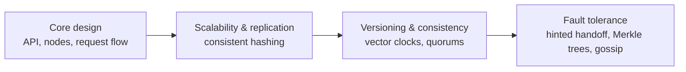

A **key-value store** is a distributed hash table: it stores values under unique keys and supports two core operations, `put(key, value)` and `get(key)`. Its simplicity is its strength. Because the store does not need to understand values or support complex queries, it can partition and replicate data across thousands of machines, delivering low latency and very high availability.

Key-value stores back shopping carts, session stores, user preferences, feature flags, leaderboards and the metadata layers of many larger systems. In this chapter we design one from scratch, following the SCALED approach.

## Requirements

### Functional requirements

- `put(key, value)` stores a value, overwriting any existing one.
- `get(key)` returns the value associated with a key.
- Keys are small (up to a few hundred bytes); values are typically under 1 MB.

### Non-functional requirements

- **Scalability** — handle billions of keys and millions of requests per second by adding nodes, without downtime.
- **Availability** — keep accepting reads and writes even when nodes or network links fail; the store should be “always writable.”
- **Low latency** — single-digit millisecond reads and writes at the 99th percentile.
- **Durability** — acknowledged writes must survive node failures.
- **Tunable consistency** — let applications choose between stronger consistency and higher availability per request.
- **Heterogeneity** — nodes with more capacity should be able to hold more data.

<Callout type="note">
Favoring availability means accepting that replicas can temporarily diverge. The design must therefore detect and resolve conflicting versions — a central theme of this chapter.
</Callout>

## Why not a single node?

A single-server hash table is fast and simple, but it is limited by one machine's memory and disk, and it is a single point of failure. We need to **partition** data across nodes for scale and **replicate** it for availability and durability. These two needs drive the rest of the design.

## Chapter roadmap

1. **Core design** — the API, node roles and how a request flows.
2. **Scalability and replication** — partitioning with consistent hashing and virtual nodes, and replicating to multiple nodes.
3. **Versioning and tunable consistency** — tracking concurrent versions with vector clocks and configuring quorums.
4. **Fault tolerance and failure detection** — surviving temporary and permanent failures and detecting them without a central coordinator.

## Capacity snapshot

To ground the design, assume 10 billion keys with an average of 10 KB per value: about 100 TB of data. With three replicas, that is 300 TB. If each node stores 4 TB, we need roughly 75 nodes, plus headroom — so on the order of 100 nodes. At 1 million requests per second, each node handles about 10,000 requests per second, which is comfortable for a server with SSDs and an in-memory cache.

<KeyTakeaways>
- A key-value store offers simple get and put operations, which makes it easy to scale and replicate.
- Requirements emphasize scalability, high availability, low latency, durability and tunable consistency.
- Partitioning provides scale; replication provides availability and durability.
- Favoring availability means replicas may diverge, so versioning and conflict resolution are essential.
</KeyTakeaways>
