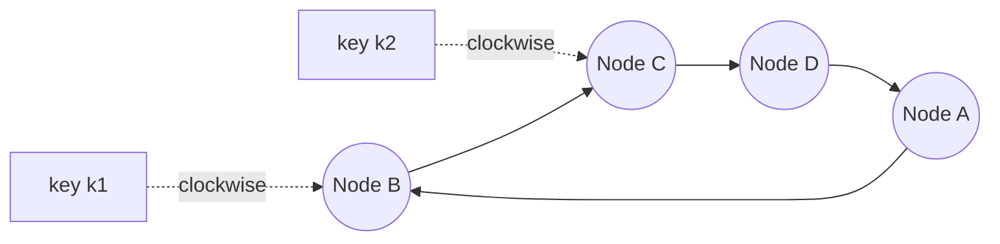
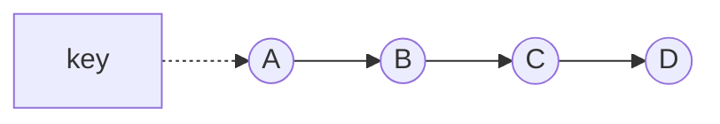
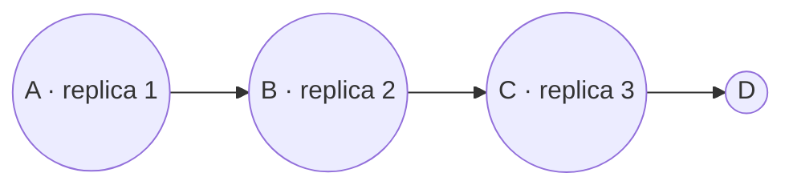
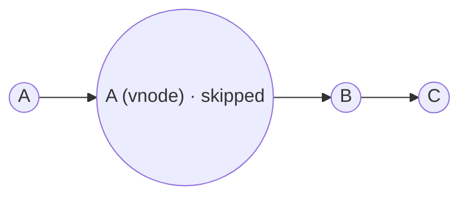

To scale, the key-value store must spread keys across nodes, and it must keep spreading them evenly as nodes join and leave. To stay available and durable, it must store each key on several nodes. This lesson covers both.

## Why simple hashing fails

The naive approach is `node = hash(key) mod N`. It distributes keys evenly — until `N` changes. Adding an eleventh node to a ten-node cluster changes the result for about 90% of keys, forcing a massive and disruptive data migration.

## Consistent hashing

**Consistent hashing** maps both nodes and keys onto the same circular hash space, the **ring**. Each key is stored on the first node found by moving clockwise from the key's position.

When a node joins, it takes over only the keys between its position and its predecessor's. When a node leaves, only its keys move, to its successor. On average only `1/N` of the keys move — a dramatic improvement.

### Virtual nodes

With only a few positions per node, the ring divides unevenly: some nodes get large arcs and more keys. The fix is **virtual nodes** (vnodes): each physical node is placed at many positions on the ring, say 100–256. This:

- Evens out the distribution of keys.
- Spreads a failed node's load across many nodes instead of one successor.
- Supports **heterogeneity**: a more powerful machine gets more vnodes and therefore more data.

## Replication

Each key is replicated to `N` nodes (commonly `N = 3`). The coordinator stores the key and replicates it to the next `N − 1` **distinct physical nodes** clockwise on the ring. The list of nodes responsible for a key is its **preference list**.

<Slides title="Placing replicas on the ring">
<Slide caption="1. The key hashes to a position on the ring; the first node clockwise (A) is its coordinator.">

</Slide>
<Slide caption="2. The next N − 1 distinct physical nodes (B and C) also store replicas.">

</Slide>
<Slide caption="3. Virtual nodes belonging to the same physical machine are skipped, so replicas always land on different machines.">

</Slide>
</Slides>

To survive the loss of an entire data center, the preference list should span **racks, availability zones or regions**. Placement strategies take topology into account so that replicas never share a single failure domain.

## Replication strategy

Replication in this design is typically **asynchronous beyond the write quorum**: the coordinator waits for `W` replicas to acknowledge and lets the remaining replicas catch up in the background. This keeps write latency low while guaranteeing that a write survives the loss of up to `W − 1` of the acknowledging nodes.

<Callout type="tip">
In interviews, “consistent hashing with virtual nodes and a replication factor of three across availability zones” is a compact, precise description of how a distributed store scales and stays available.
</Callout>

<KeyTakeaways>
- Modulo hashing remaps most keys when the cluster changes size; consistent hashing moves only about 1/N.
- Virtual nodes even out key distribution, spread load after failures and support heterogeneous machines.
- Each key is replicated to N distinct physical nodes, forming its preference list.
- Replicas should span racks, zones or regions to avoid correlated failures.
- Acknowledging after W replicas keeps writes fast while background replication completes the rest.
</KeyTakeaways>
