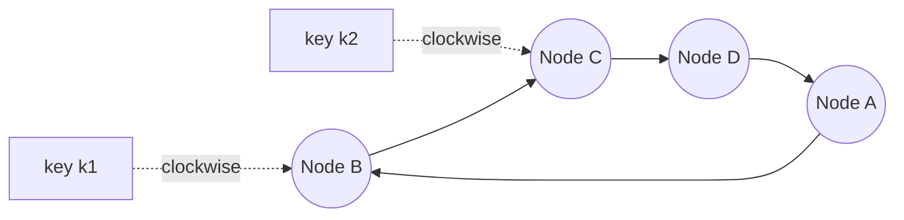
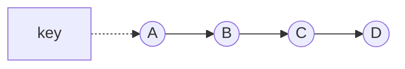
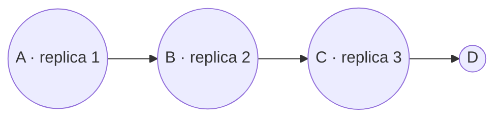
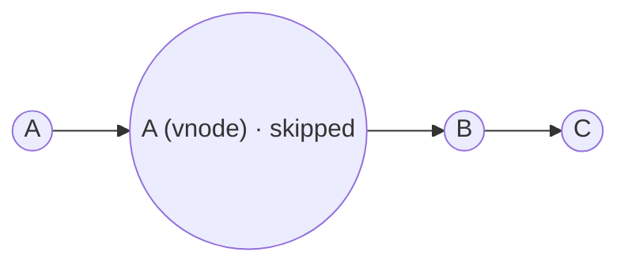
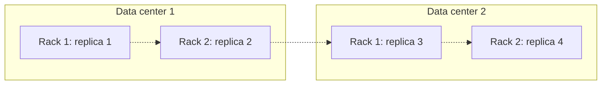

To scale, the key-value store must spread keys across nodes, and it must keep spreading them evenly as nodes join and leave. To stay available and durable, it must store each key on several nodes. This lesson covers both.

## Why simple hashing fails

The naive approach is `node = hash(key) mod N`. It distributes keys evenly — until `N` changes. Adding an eleventh node to a ten-node cluster changes the result for about 90% of keys, forcing a massive and disruptive data migration.

With 100 TB of data, moving 90% means copying about 90 TB across the network while serving traffic — days of degraded performance for every scaling event. We need a scheme in which adding one node moves only that node's fair share.

## Consistent hashing

**Consistent hashing** maps both nodes and keys onto the same circular hash space, the **ring** (for example, the 128-bit output of a hash function, wrapped around). Each key is stored on the first node found by moving clockwise from the key's position.

When a node joins, it takes over only the keys between its position and its predecessor's. When a node leaves, only its keys move, to its successor. On average only `1/N` of the keys move — a dramatic improvement.

### Worked example

A 10-node cluster holds 100 TB, about 10 TB per node. Adding an eleventh node:

| Scheme | Data moved | Nodes involved |
| --- | --- | --- |
| `hash mod N` | ≈ 90 TB | All 11 |
| Consistent hashing, one position per node | ≈ 9 TB, all from one neighbor | 2 |
| Consistent hashing with virtual nodes | ≈ 9 TB, a little from each node | All 11, each sending about 0.9 TB |

The last row is the best: the same small amount of data moves, but the work is spread across the cluster, so no single node is overwhelmed and the new node fills up many times faster.

### Virtual nodes

With only a few positions per node, the ring divides unevenly: some nodes get large arcs and more keys. The fix is **virtual nodes** (vnodes): each physical node is placed at many positions on the ring, say 100–256. This:

- Evens out the distribution of keys.
- Spreads a failed node's load across many nodes instead of one successor.
- Supports **heterogeneity**: a more powerful machine gets more vnodes and therefore more data.

The trade-off is metadata and repair cost: more vnodes means a larger ring to gossip about and more, smaller ranges to compare during anti-entropy. Some systems instead split the ring into a fixed number of equal partitions (say 4,096) and assign whole partitions to nodes, which keeps the benefits while making ownership easy to reason about.

## Replication

Each key is replicated to `N` nodes (commonly `N = 3`). The coordinator stores the key and replicates it to the next `N − 1` **distinct physical nodes** clockwise on the ring. The list of nodes responsible for a key is its **preference list**. In practice the preference list contains a few more than `N` nodes, so that when a replica is down, the next node in the list can stand in.

<Slides title="Placing replicas on the ring">
<Slide caption="1. The key hashes to a position on the ring; the first node clockwise (A) is its coordinator.">

</Slide>
<Slide caption="2. The next N − 1 distinct physical nodes (B and C) also store replicas.">

</Slide>
<Slide caption="3. Virtual nodes belonging to the same physical machine are skipped, so replicas always land on different machines.">

</Slide>
</Slides>

## Topology-aware placement

To survive the loss of an entire rack or data center, the preference list should span **racks, availability zones or regions**. Placement strategies walk the ring clockwise but skip nodes in a failure domain that already holds a replica.

A common multi-region configuration keeps, say, three replicas in each data center. Clients then choose whether a request must reach a quorum **within their local data center** (fast, survives a remote outage) or in **every** data center (slow, strongest), as the next lesson discusses.

## Joining and leaving the cluster

1. **Bootstrap.** A new node contacts a few **seed** nodes, learns the ring through gossip, and picks its virtual-node positions (or is assigned partitions).
2. **Streaming.** For each range it now owns, it streams the data from the current owners while they continue serving traffic. Writes arriving meanwhile are sent to both old and new owners.
3. **Cut-over.** When streaming completes, the ring is updated and the old owners delete (or eventually compact away) the moved ranges.

Decommissioning runs the same steps in reverse. Because only a fraction of data moves and the work is spread across nodes, the cluster can grow or shrink during normal operation.

## Replication strategy

Replication in this design is typically **asynchronous beyond the write quorum**: the coordinator waits for `W` replicas to acknowledge and lets the remaining replicas catch up in the background. This keeps write latency low while guaranteeing that a write survives the loss of up to `W − 1` of the acknowledging nodes.

<Callout type="tip">
In interviews, "consistent hashing with virtual nodes and a replication factor of three across availability zones" is a compact, precise description of how a distributed store scales and stays available.
</Callout>

<Ponder question="A cluster has two kinds of machines: 50 with 4 TB of disk and 50 with 8 TB. How do you make the larger machines hold twice as much data?">
Give each 8 TB machine twice as many virtual nodes (for example 256 instead of 128), or assign it twice as many fixed partitions. Its share of the ring — and therefore of keys and requests — doubles. Check that its CPU and network can also handle twice the requests; if not, weight by the scarcest resource rather than by disk alone.
</Ponder>

<KeyTakeaways>
- Modulo hashing remaps most keys when the cluster changes size; consistent hashing moves only about 1/N.
- Virtual nodes even out key distribution, spread rebalancing and failure load across many nodes, and support heterogeneous machines.
- Each key is replicated to N distinct physical nodes, forming its preference list, with extra nodes available as stand-ins.
- Replicas should span racks, zones or regions; multi-region setups keep several replicas per data center.
- New nodes bootstrap from seeds, stream their ranges while the cluster serves traffic, then take ownership.
- Acknowledging after W replicas keeps writes fast while background replication completes the rest.
</KeyTakeaways>
