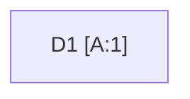
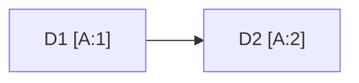
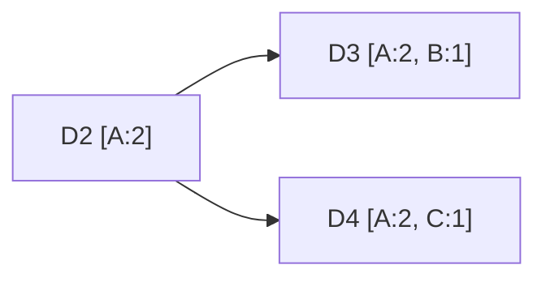
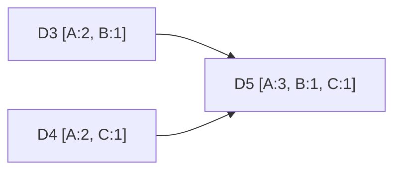

Because our store stays writable during failures, two clients may update the same key on different replicas at nearly the same time. The replicas then hold **different versions**. The store needs a way to tell whether one version supersedes another or whether they conflict — and it should let applications choose how strongly consistent each read and write must be.

## Why timestamps are not enough

A simple rule is **last write wins (LWW)**: keep the version with the latest timestamp. It is easy but dangerous. Clocks on different machines drift, so the “latest” write may not be the most recent in reality, and concurrent updates are silently discarded. LWW is acceptable only when losing a concurrent update is harmless.

## Vector clocks

A **vector clock** is a list of `(node, counter)` pairs attached to each version. Each time a node coordinates a write, it increments its own counter. Comparing two clocks tells us their relationship:

- If every counter in clock X is less than or equal to the corresponding counter in Y, then **X happened before Y** and Y supersedes X.
- If neither dominates the other, the versions are **concurrent** — a genuine conflict.

<Slides title="Tracking versions with vector clocks">
<Slide caption="1. A write coordinated by node A creates version D1 with clock [A:1].">

</Slide>
<Slide caption="2. Another write through A produces D2 [A:2], which supersedes D1.">

</Slide>
<Slide caption="3. Two clients update D2 concurrently via nodes B and C, creating D3 [A:2, B:1] and D4 [A:2, C:1].">

</Slide>
<Slide caption="4. Neither D3 nor D4 dominates, so a read returns both. The client merges them and writes D5 [A:3, B:1, C:1].">

</Slide>
</Slides>

The application decides how to merge. A shopping cart might take the **union** of items from both versions — occasionally reviving a deleted item, which is better than losing an added one. To stop clocks from growing forever, old entries can be truncated when the list exceeds a threshold, at a small risk of misidentifying some conflicts.

<Callout type="note">
Conflict-free replicated data types (CRDTs), such as counters and sets that merge automatically, are a modern alternative that removes the need for application-level merging in many cases.
</Callout>

## Tunable consistency with quorums

With `N` replicas per key, the store exposes two parameters:

- `W` — how many replicas must acknowledge a write before it succeeds.
- `R` — how many replicas must respond to a read before it returns.

If `R + W > N`, the set of replicas read always overlaps the set written, so reads see the latest successful write (barring concurrent writes and sloppy quorums, discussed next lesson).

| Setting (N = 3) | Behavior |
| --- | --- |
| `W = 3, R = 1` | Slow, fragile writes; fast reads |
| `W = 1, R = 3` | Fast writes; slow reads |
| `W = 2, R = 2` | Balanced; tolerates one failed replica for both |
| `W = 1, R = 1` | Fastest and most available; reads may be stale |

Lower `R` and `W` improve latency and availability; higher values improve consistency. Because they can be set per request or per table, different use cases can make different trade-offs on the same cluster.

## Configurability

Beyond `N`, `R` and `W`, operators can configure the storage engine, conflict-resolution policy (vector clocks with client merge, or last-write-wins), and replica placement. This configurability is what lets one key-value store serve workloads from shopping carts to session caches.

<KeyTakeaways>
- Last-write-wins is simple but can silently lose concurrent updates because of clock drift.
- Vector clocks capture causality: they reveal whether one version supersedes another or they are concurrent.
- Concurrent versions are returned to the client, which merges them — for example, by union.
- Quorum parameters R and W, with R + W > N, provide tunable consistency.
- Per-request configuration lets one cluster serve workloads with different consistency needs.
</KeyTakeaways>
