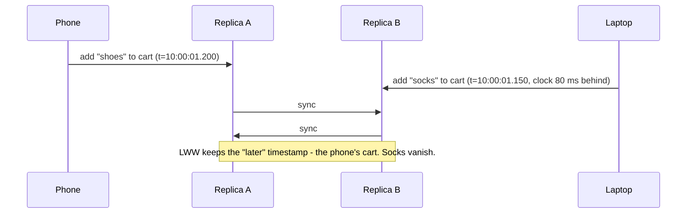
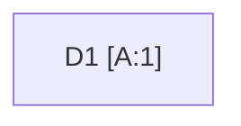
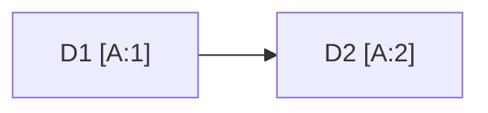
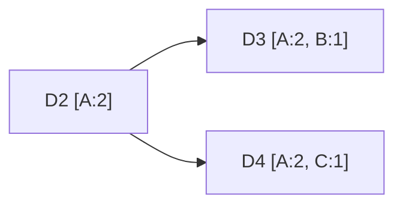
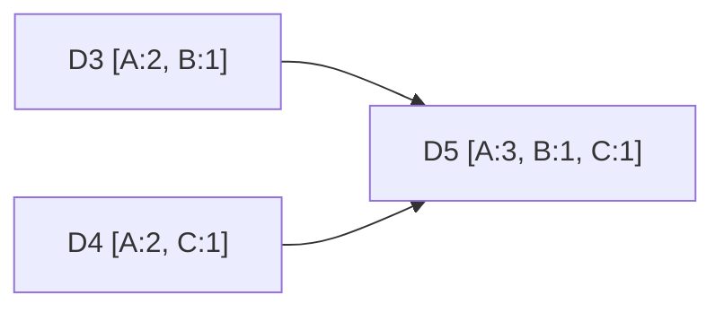
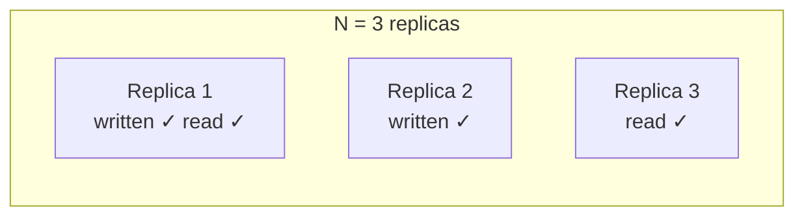

Because our store stays writable during failures, two clients may update the same key on different replicas at nearly the same time. The replicas then hold **different versions**. The store needs a way to tell whether one version supersedes another or whether they conflict — and it should let applications choose how strongly consistent each read and write must be.

## Why timestamps are not enough

A simple rule is **last write wins (LWW)**: keep the version with the latest timestamp. It is easy but dangerous. Clocks on different machines drift, so the "latest" write may not be the most recent in reality, and concurrent updates are silently discarded. LWW is acceptable only when losing a concurrent update is harmless — for example, a cache entry or a "last seen online" timestamp.

The laptop actually wrote later, but its clock was behind, so its update lost. Worse, even with perfect clocks, LWW would still drop one of the two concurrent additions.

## Vector clocks

A **vector clock** is a list of `(node, counter)` pairs attached to each version. Each time a node coordinates a write, it increments its own counter. Comparing two clocks tells us their relationship:

- If every counter in clock X is less than or equal to the corresponding counter in Y, then **X happened before Y** and Y supersedes X.
- If neither dominates the other, the versions are **concurrent** — a genuine conflict.

<Slides title="Tracking versions with vector clocks">
<Slide caption="1. A write coordinated by node A creates version D1 with clock [A:1].">

</Slide>
<Slide caption="2. Another write through A produces D2 [A:2], which supersedes D1.">

</Slide>
<Slide caption="3. Two clients update D2 concurrently via nodes B and C, creating D3 [A:2, B:1] and D4 [A:2, C:1].">

</Slide>
<Slide caption="4. Neither D3 nor D4 dominates, so a read returns both. The client merges them and writes D5 [A:3, B:1, C:1].">

</Slide>
</Slides>

### Comparing clocks: quick practice

| Version X | Version Y | Relationship |
| --- | --- | --- |
| `[A:1]` | `[A:2]` | X happened before Y — keep Y |
| `[A:2, B:1]` | `[A:2, B:1, C:1]` | X happened before Y — keep Y |
| `[A:2, B:1]` | `[A:2, C:1]` | Concurrent — keep both as siblings |
| `[A:3, B:1]` | `[A:2, B:2]` | Concurrent — keep both as siblings |

The application decides how to merge **siblings**. A shopping cart might take the **union** of items from both versions — occasionally reviving a deleted item, which is better than losing an added one. To stop clocks from growing forever, old entries can be truncated when the list exceeds a threshold, at a small risk of misidentifying some conflicts.

<Callout type="note">
Conflict-free replicated data types (CRDTs), such as counters and sets that merge automatically, are a modern alternative that removes the need for application-level merging in many cases. An "observed-remove set", for example, handles concurrent add and remove of the same item without reviving deleted items.
</Callout>

## Tunable consistency with quorums

With `N` replicas per key, the store exposes two parameters:

- `W` — how many replicas must acknowledge a write before it succeeds.
- `R` — how many replicas must respond to a read before it returns.

If `R + W > N`, the set of replicas read always overlaps the set written, so reads see the latest successful write (barring concurrent writes and sloppy quorums, discussed next lesson).

With `W = 2` and `R = 2`, the write reached replicas 1 and 2 and the read asked replicas 1 and 3. They overlap on replica 1, so the read sees the new value.

| Setting (N = 3) | Behavior | Failures tolerated (writes / reads) |
| --- | --- | --- |
| `W = 3, R = 1` | Slow, fragile writes; fast reads | 0 / 2 |
| `W = 1, R = 3` | Fast writes; slow reads | 2 / 0 |
| `W = 2, R = 2` | Balanced | 1 / 1 |
| `W = 1, R = 1` | Fastest and most available; reads may be stale | 2 / 2 |

Lower `R` and `W` improve latency and availability; higher values improve consistency. Because they can be set per request or per table, different use cases can make different trade-offs on the same cluster.

### Consistency across data centers

With replicas in several data centers, "quorum" needs a scope:

| Level | Waits for | Latency | Survives losing a whole data center? |
| --- | --- | --- | --- |
| ONE | Any single replica | Lowest | Yes |
| LOCAL_QUORUM | Majority in the client's data center | Low (no cross-DC trip) | Yes, for clients in surviving DCs |
| QUORUM | Majority of all replicas globally | Cross-DC round trip | Depends on how replicas are spread |
| EACH_QUORUM | Majority in every data center | Highest | No — any DC outage blocks writes |

Most applications use LOCAL_QUORUM for both reads and writes, giving strong consistency within a region and eventual consistency between regions.

### Quorums are not linearizability

Even with `R + W > N`, edge cases remain: a write that fails after reaching only some replicas may still be seen by later reads; concurrent writes produce siblings; and sloppy quorums (next lesson) can put writes outside the usual replica set. If an application needs true linearizability — unique usernames, locks — it should use a consensus-based store for that data.

## Configurability

Beyond `N`, `R` and `W`, operators can configure the storage engine, conflict-resolution policy (vector clocks with client merge, or last-write-wins), and replica placement. This configurability is what lets one key-value store serve workloads from shopping carts to session caches.

<Ponder question="A team sets N = 3, W = 1, R = 1 for a user-profile table to get the lowest latency. Users occasionally see their old profile right after editing it. What would you change?">
With `W = 1, R = 1`, a read can hit a replica the write has not reached yet. Options: raise to `W = 2, R = 2` (still tolerates one failed replica, costs a little latency); keep `W = 1` but make reads of a user's *own* profile use `R = 2` or read from the coordinator that took the write; or keep the fast setting for other users' views of the profile, where brief staleness is harmless.
</Ponder>

<KeyTakeaways>
- Last-write-wins is simple but can silently lose concurrent updates because of clock drift and genuine concurrency.
- Vector clocks capture causality: they reveal whether one version supersedes another or they are concurrent siblings.
- Concurrent versions are returned to the client, which merges them — for example, by union — or CRDTs merge them automatically.
- Quorum parameters R and W, with R + W > N, provide tunable consistency; multi-DC stores add local and global quorum scopes.
- Quorums are not full linearizability; use consensus-based storage where that is required.
- Per-request configuration lets one cluster serve workloads with different consistency needs.
</KeyTakeaways>
