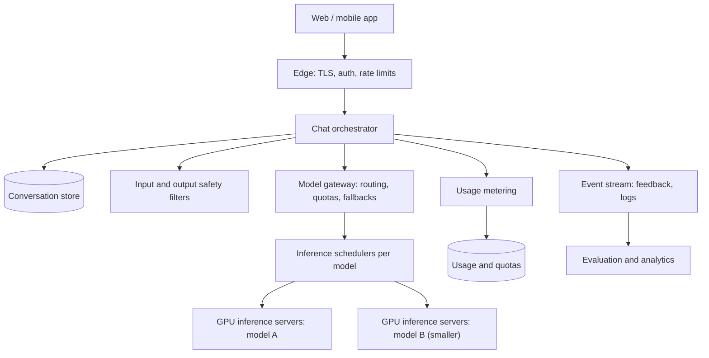
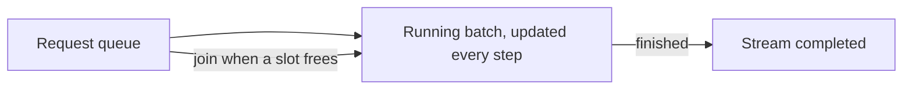
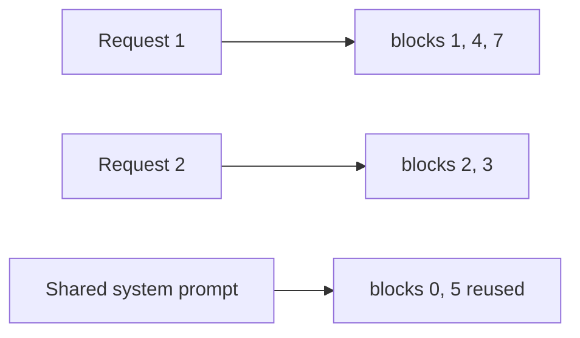
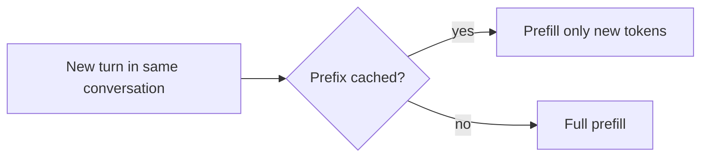

This lesson designs the chat service: the request path from the app to the GPUs, streaming, conversation storage, efficient inference and the safety and cost controls around it.

## API

```http
POST /v1/conversations                          -> { conversationId }
GET  /v1/conversations?cursor=...
GET  /v1/conversations/{id}/messages
POST /v1/conversations/{id}/messages            { content, attachments?, model? }
     -> text/event-stream of { delta } events, then { done, messageId, usage }
POST /v1/messages/{id}/feedback                 { rating, comment? }
POST /v1/generations/{id}/cancel
```

The send endpoint responds with a **server-sent events** stream: small events carrying new text fragments, followed by a final event with token usage. Server-sent events work over plain HTTP, pass through proxies easily and suit one-directional streaming.

## Architecture



- **Edge** terminates TLS, authenticates users and applies per-user request and token rate limits.
- **Chat orchestrator** loads conversation history, builds the prompt, calls safety filters, sends the request to the model gateway, relays streamed tokens to the client and saves the final message.
- **Conversation store** keeps conversations and messages, partitioned by user ID, so listing and loading a user's conversations stay on one shard.
- **Model gateway** chooses a model based on the user's plan and request, enforces quotas, and falls back to another model or region if one is overloaded.
- **Inference schedulers** queue requests for each model and form batches for the GPU servers.
- **Usage metering** records tokens used per user for quotas and billing.

## Building the prompt

The orchestrator assembles the system prompt, relevant conversation history and the new message. When history exceeds the context budget, it keeps the most recent turns and replaces older ones with a **running summary**. Keeping the system prompt and earlier turns byte-identical across requests lets the inference servers reuse cached attention state for that prefix.

## Efficient inference

<Slides title="How GPU servers serve many conversations">
<Slide caption="1. Continuous batching: instead of waiting for a whole batch to finish, the server adds new requests and removes finished ones at every decoding step.">



</Slide>
<Slide caption="2. Paged KV cache: attention state is stored in fixed-size blocks, so memory is not wasted and more requests fit on the GPU at once.">



</Slide>
<Slide caption="3. Prefix caching: requests that share a prefix reuse its cached state, skipping most of the prefill work.">



</Slide>
</Slides>

Other techniques include quantizing model weights to lower precision to fit more on each GPU, splitting very large models across several GPUs (tensor parallelism), separating prefill and decode onto different servers, and speculative decoding, where a small draft model proposes tokens that the large model verifies in bulk. Routing a conversation's turns to the same server improves prefix-cache hit rates.

## Streaming and cancellation

Tokens flow from the GPU server through the scheduler and orchestrator to the client as they are generated. If the user presses stop or disconnects, the orchestrator cancels the generation so the GPU slot is freed immediately; this matters, because abandoned generations waste expensive capacity.

## Safety, cost and reliability

- **Safety filters** classify inputs before generation and outputs during streaming, stopping or rewriting unsafe content.
- **Token budgets** cap output length and context length per plan.
- **Model routing** sends simple requests to smaller, cheaper models when quality allows.
- **Load shedding:** when queues grow, free-tier requests are delayed or routed to smaller models first; paid requests keep priority.
- **Multi-region capacity:** the gateway fails over across regions when a GPU cluster degrades.
- **Quality canaries:** new model versions receive a slice of traffic and are compared on evaluation sets and user feedback before full rollout.

<KeyTakeaways>
- Responses stream over server-sent events; conversations are stored per user.
- An orchestrator builds prompts, applies safety filters, calls a model gateway and saves results.
- Continuous batching, paged KV caches and prefix caching maximize GPU throughput.
- Stable prompt prefixes, summarization of long history and conversation-affine routing improve cache reuse.
- Cancellation, token budgets, model routing, load shedding and quality canaries control cost and reliability.
</KeyTakeaways>
