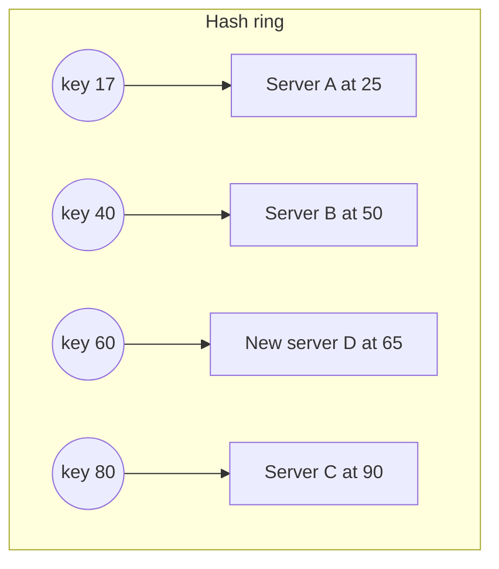
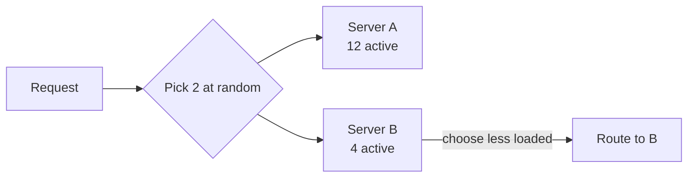
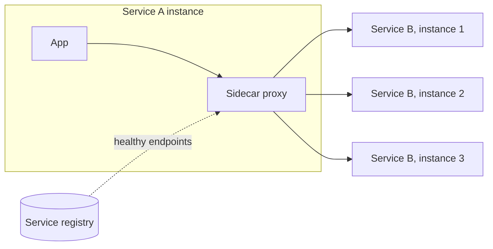

Once a load balancer knows which servers are healthy, it must decide which one gets the next request. The choice of **algorithm** affects latency, fairness and how well the system handles uneven workloads.

## Static algorithms

Static algorithms do not consider the current state of servers.

- **Round robin** — send requests to servers in turn: 1, 2, 3, 1, 2, 3… Simple and fair when servers and requests are uniform.
- **Weighted round robin** — servers with more capacity receive proportionally more requests, useful when mixing machine sizes. A server with weight 3 receives three requests for every one sent to a server with weight 1.
- **Random** — pick a server at random; statistically similar to round robin at scale, and needs no shared state between LB instances.
- **IP or key hashing** — hash the client IP or a request key to choose a server. The same client consistently reaches the same server, which helps with caching or session affinity. Using **consistent hashing** limits how many keys move when servers are added or removed.

### Why plain hashing breaks when servers change

With `server = hash(key) mod N`, changing N from 4 to 5 remaps about 80% of keys, destroying every server's warm cache at once. **Consistent hashing** places servers and keys on a ring; each key belongs to the next server clockwise. Adding a server only takes over keys from its neighbor — about `1/N` of all keys.

Before server D joined, key 60 belonged to C. After D is added between B and C, only keys between 50 and 65 move — every other key stays put. Servers are usually placed at many points on the ring (**virtual nodes**) so load stays even. A related technique, **rendezvous (highest random weight) hashing**, scores every server for each key and picks the highest; it also moves only `1/N` of keys and needs no ring.

## Dynamic algorithms

Dynamic algorithms use live information about server load.

- **Least connections** — choose the server with the fewest active connections. Good when requests vary greatly in duration, such as long-lived WebSocket connections.
- **Least response time** — prefer servers that are responding fastest, often using an exponentially weighted moving average of recent latencies.
- **Power of two random choices** — pick two servers at random and send the request to the less loaded one. It performs nearly as well as checking every server while being cheap and avoiding the "herding" problem where every balancer sends traffic to the same least-loaded server.

### Why "two choices" works so well

Suppose 20 load balancers each track server load but only refresh their view every second. With "always pick the least loaded", all 20 pick the same idle server during that second and flood it — then all move to the next one. With two random choices, each balancer considers a different pair, so the traffic spreads out, yet each decision still avoids the busiest servers. Mathematically, the maximum load imbalance drops dramatically compared with purely random choice, which is why this technique is common in modern proxies.

## Comparing algorithms

| Algorithm | State needed | Handles uneven request cost? | Keeps key affinity? | Good default for |
| --- | --- | --- | --- | --- |
| Round robin | Counter | No | No | Uniform, short requests |
| Weighted round robin | Weights | No | No | Mixed server sizes |
| Consistent hashing | Ring of servers | No | Yes | Caches, sharded state |
| Least connections | Connection counts | Yes | No | Long-lived connections |
| Least response time | Latency averages | Yes | No | Heterogeneous backends |
| Power of two choices | Load of two servers | Yes | No | Large fleets with many LBs |

<Callout type="tip">
In interviews, "round robin" is fine for a default. Mention least connections for long-lived connections, and consistent hashing when you want requests for the same key to reach the same server (for example, to exploit a local cache).
</Callout>

## Stateful versus stateless load balancers

A load balancer itself can keep state:

- A **stateful** LB remembers which server each client or session maps to. This supports sticky sessions but the state must be shared or replicated among LB instances, complicating failover.
- A **stateless** LB derives the destination from the request itself, typically by hashing. Any LB instance makes the same decision, so LBs can be added or removed easily.

Sticky sessions are usually implemented with a cookie: the LB sets `lb=server-7` on the first response and routes later requests carrying that cookie to server 7, as long as it is healthy.

## Connection handling details

- **Connection draining.** Before removing a server for maintenance, the LB stops sending new requests but lets existing ones finish, up to a deadline.
- **Slow start.** A newly added server receives gradually increasing traffic — for example, ramping its weight from 10% to 100% over a minute — so it can warm its caches and JIT compiler instead of being flooded.
- **Timeouts and retries.** LBs can retry idempotent requests on another server when one fails, but must avoid retry storms that amplify overload. A **retry budget** (for example, retries may add at most 20% to traffic) caps the damage.
- **Direct server return.** For very high-throughput layer-4 balancing, responses can bypass the LB and go straight to the client, since responses are usually much larger than requests.

## Balancing long-lived connections

WebSockets, gRPC streams and database connection pools stay open for minutes or hours. Balancing only when a connection opens causes problems:

- After a deployment, the servers restarted last receive few connections while older servers keep theirs, so load stays uneven for hours.
- A single HTTP/2 connection can carry thousands of requests, so balancing per connection is too coarse.

Remedies include limiting connection lifetime (servers politely close connections after, say, 30 minutes so clients reconnect and rebalance), balancing individual requests at layer 7, and using least-connections for new connections.

## Client-side load balancing

In service-to-service communication, clients can balance load themselves. Each client fetches the list of healthy instances from a **service registry** and chooses among them using one of the algorithms above. This removes a network hop and a potential bottleneck but pushes logic into every client — often via a shared library or a **service mesh sidecar** proxy running next to each service.

## Load balancer failure modes

- **Uneven load** from long requests or hot keys even when request counts are balanced.
- **Thundering herd** when a recovered server is suddenly assigned a flood of requests.
- **Health-check flapping** when a borderline server repeatedly enters and leaves rotation. Requiring several consecutive passes before re-adding a server damps it.
- **Cascading failure** when removing overloaded servers pushes their load onto the rest, overloading them too. Load shedding and capacity headroom mitigate this; some LBs stop ejecting servers once too many are unhealthy ("panic mode") and spread traffic across all of them rather than crushing the few left.

<Ponder question="A cache tier of 10 servers sits behind a load balancer using round robin. The hit ratio is only 20%, even though the working set would fit in the combined memory. What is wrong, and how would you fix it?">
With round robin, every key is requested from every server over time, so each server caches roughly the same popular keys and the tier's effective capacity is one server's memory. Route by **consistent hashing on the cache key** instead, so each key lives on exactly one server: the combined memory then holds ten times more distinct keys, and adding or removing a server moves only about a tenth of them.
</Ponder>

<KeyTakeaways>
- Static algorithms (round robin, weighted, hashing) ignore live load; dynamic ones (least connections, least response time, power of two choices) adapt to it.
- Consistent and rendezvous hashing keep keys on the same server while moving only about 1/N of keys during scaling.
- Power of two random choices avoids herding when many balancers act on stale information.
- Stateless LBs scale and fail over easily; stateful LBs support stickiness at the cost of shared state.
- Connection draining, slow start, retry budgets and connection lifetime limits make changes safe and keep load even.
- Client-side balancing via a registry or service mesh removes a hop for internal traffic.
</KeyTakeaways>
