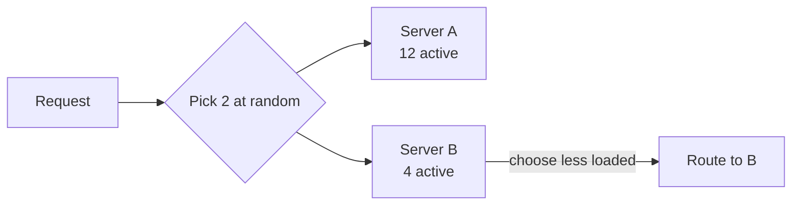

Once a load balancer knows which servers are healthy, it must decide which one gets the next request. The choice of **algorithm** affects latency, fairness and how well the system handles uneven workloads.

## Static algorithms

Static algorithms do not consider the current state of servers.

- **Round robin** — send requests to servers in turn: 1, 2, 3, 1, 2, 3… Simple and fair when servers and requests are uniform.
- **Weighted round robin** — servers with more capacity receive proportionally more requests, useful when mixing machine sizes.
- **Random** — pick a server at random; statistically similar to round robin at scale.
- **IP or key hashing** — hash the client IP or a request key to choose a server. The same client consistently reaches the same server, which helps with caching or session affinity. Using **consistent hashing** limits how many keys move when servers are added or removed.

## Dynamic algorithms

Dynamic algorithms use live information about server load.

- **Least connections** — choose the server with the fewest active connections. Good when requests vary greatly in duration, such as long-lived WebSocket connections.
- **Least response time** — prefer servers that are responding fastest.
- **Power of two random choices** — pick two servers at random and send the request to the less loaded one. It performs nearly as well as checking every server while being cheap and avoiding the “herding” problem where every balancer sends traffic to the same least-loaded server.

<Callout type="tip">
In interviews, “round robin” is fine for a default. Mention least connections for long-lived connections, and consistent hashing when you want requests for the same key to reach the same server (for example, to exploit a local cache).
</Callout>

## Stateful versus stateless load balancers

A load balancer itself can keep state:

- A **stateful** LB remembers which server each client or session maps to. This supports sticky sessions but the state must be shared or replicated among LB instances, complicating failover.
- A **stateless** LB derives the destination from the request itself, typically by hashing. Any LB instance makes the same decision, so LBs can be added or removed easily.

## Connection handling details

- **Connection draining.** Before removing a server for maintenance, the LB stops sending new requests but lets existing ones finish.
- **Slow start.** A newly added server receives gradually increasing traffic so it can warm its caches instead of being flooded.
- **Timeouts and retries.** LBs can retry idempotent requests on another server when one fails, but must avoid retry storms that amplify overload.
- **Direct server return.** For very high-throughput layer-4 balancing, responses can bypass the LB and go straight to the client, since responses are usually much larger than requests.

## Client-side load balancing

In service-to-service communication, clients can balance load themselves. Each client fetches the list of healthy instances from a **service registry** and chooses among them using one of the algorithms above. This removes a network hop and a potential bottleneck but pushes logic into every client — often via a shared library or a **service mesh sidecar** proxy running next to each service.

## Load balancer failure modes

- **Uneven load** from long requests or hot keys even when request counts are balanced.
- **Thundering herd** when a recovered server is suddenly assigned a flood of requests.
- **Health-check flapping** when a borderline server repeatedly enters and leaves rotation.
- **Cascading failure** when removing overloaded servers pushes their load onto the rest, overloading them too. Load shedding and capacity headroom mitigate this.

<KeyTakeaways>
- Static algorithms (round robin, weighted, hashing) ignore live load; dynamic ones (least connections, power of two choices) adapt to it.
- Consistent hashing keeps keys on the same server while minimizing movement during scaling.
- Stateless LBs scale and fail over easily; stateful LBs support stickiness at the cost of shared state.
- Connection draining, slow start and careful retries make changes safe.
- Client-side balancing via a registry or service mesh removes a hop for internal traffic.
</KeyTakeaways>
