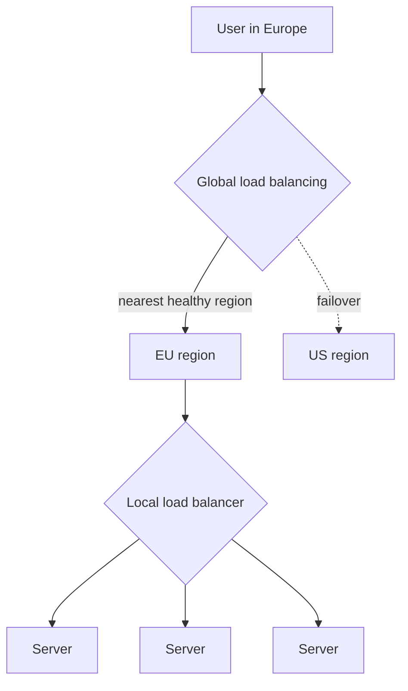

Large services run in several data centers or cloud regions to be close to users and to survive the loss of an entire site. This introduces two distinct load-balancing problems: choosing **which data center** should serve a user (global load balancing) and choosing **which server** in that data center should handle the request (local load balancing).

## Global server load balancing (GSLB)

Global load balancing steers users to a region based on factors such as:

- **Proximity** — lower network latency to a nearby region.
- **Health** — avoiding regions that are down or degraded.
- **Capacity** — shifting load away from regions near their limits.
- **Policy** — data residency rules requiring certain users' data to stay in specific countries.

### DNS-based GSLB

The most common approach uses DNS. When a resolver asks for `api.example.com`, the authoritative DNS server returns the IP address of the most suitable region, often based on the resolver's location. DNS-based GSLB is simple and widely supported, but has limitations:

- **Caching delays failover.** Resolvers and clients cache answers for the TTL, and some ignore short TTLs.
- **Resolver location is a proxy.** The DNS server sees the resolver's location, not the user's. A user using a distant public resolver may be sent to the wrong region (extensions such as EDNS Client Subnet help).
- **Coarse control.** DNS decides once per TTL, not per request.

### Anycast-based GSLB

With **anycast**, many sites announce the **same IP address**, and Internet routing delivers each packet to the topologically nearest site. Failover happens at the routing layer when a site withdraws its announcement, which is typically faster than waiting for DNS caches to expire. CDNs and public DNS resolvers rely heavily on anycast.

## Local load balancing

Inside a region, local load balancers distribute requests across servers. They operate at two main network layers:

| | Layer 4 (transport) | Layer 7 (application) |
| --- | --- | --- |
| **Sees** | IP addresses and ports | Full HTTP requests: paths, headers, cookies |
| **Routing** | Per connection | Per request, content-aware |
| **Speed** | Very fast, low overhead | More CPU per request |
| **Features** | Simple distribution | Path-based routing, header rewriting, auth, caching |

A common pattern combines both: a fast layer-4 tier spreads connections across a fleet of layer-7 proxies, which then route individual requests by path — for example, `/api/*` to API servers and `/static/*` to a static content service.

## Putting it together

A request to a multi-region service typically flows like this:

1. **DNS or anycast** routes the user to the nearest healthy region.
2. A **layer-4 load balancer** at the region's edge distributes connections.
3. **Layer-7 proxies** terminate TLS and route requests to the right service.
4. **Internal load balancing** (a proxy or client-side library) spreads calls between services.

<Callout type="interview">
For designs with global users, mention both levels: “GeoDNS sends users to the nearest region; within the region, an L7 load balancer routes by path to stateless services.” Then note the failover story — what happens if a whole region goes down.
</Callout>

<KeyTakeaways>
- Global load balancing chooses a region; local load balancing chooses a server within it.
- DNS-based GSLB is simple but limited by caching and resolver location.
- Anycast routes users to the nearest site at the network layer and fails over quickly.
- Layer-4 balancers are fast and connection-based; layer-7 balancers are content-aware and feature-rich.
- Real systems layer these: DNS or anycast, then L4, then L7, then internal balancing.
</KeyTakeaways>
