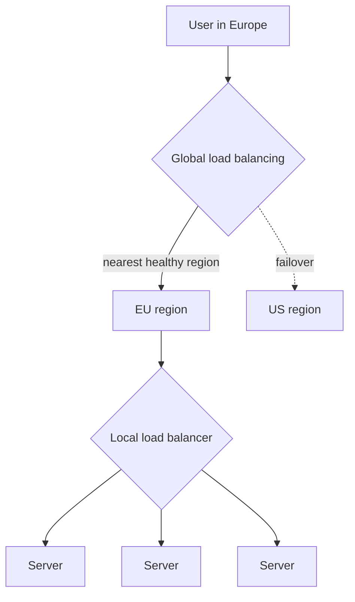
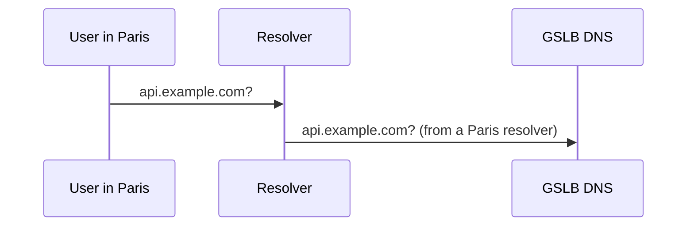
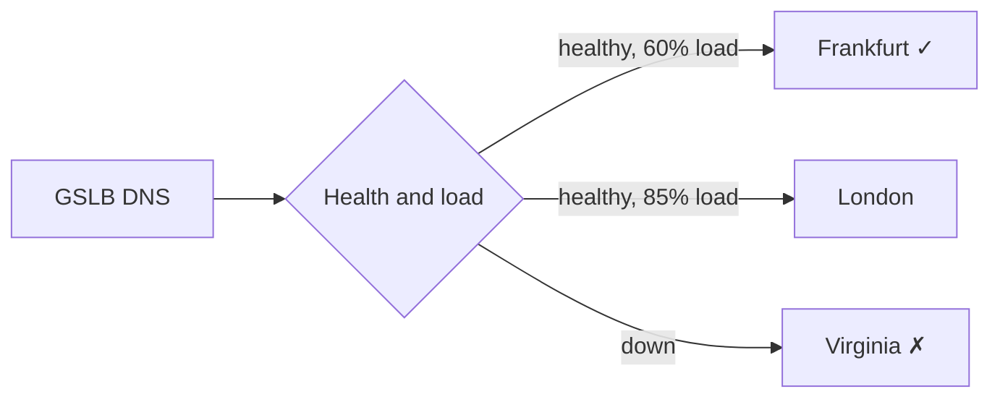
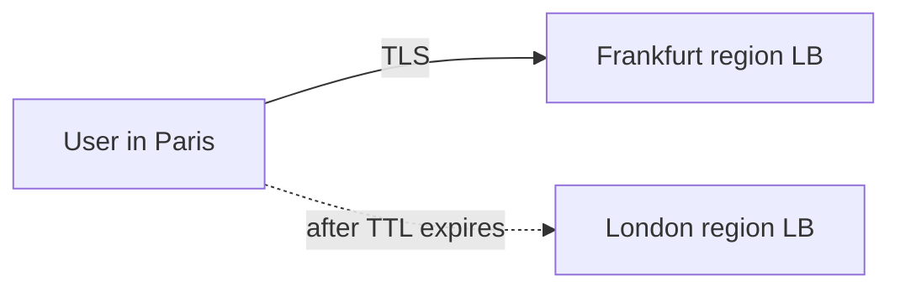
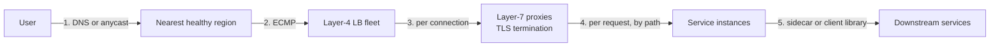

Large services run in several data centers or cloud regions to be close to users and to survive the loss of an entire site. This introduces two distinct load-balancing problems: choosing **which data center** should serve a user (global load balancing) and choosing **which server** in that data center should handle the request (local load balancing).

## Global server load balancing (GSLB)

Global load balancing steers users to a region based on factors such as:

- **Proximity** — lower network latency to a nearby region.
- **Health** — avoiding regions that are down or degraded.
- **Capacity** — shifting load away from regions near their limits.
- **Cost** — preferring regions where compute or bandwidth is cheaper when latency allows.
- **Policy** — data residency rules requiring certain users' data to stay in specific countries.

### DNS-based GSLB

The most common approach uses DNS. When a resolver asks for `api.example.com`, the authoritative DNS server returns the IP address of the most suitable region, often based on the resolver's location.

<Slides title="DNS-based global load balancing">
<Slide caption="1. A user in Paris resolves api.example.com through their resolver.">

</Slide>
<Slide caption="2. The GSLB checks region health and load, then answers with the Frankfurt region's address and a short TTL.">

</Slide>
<Slide caption="3. The client connects directly to Frankfurt. If Frankfurt later fails its health checks, new lookups get London instead.">

</Slide>
</Slides>

DNS-based GSLB is simple and widely supported, but has limitations:

- **Caching delays failover.** Resolvers and clients cache answers for the TTL, and some ignore short TTLs.
- **Resolver location is a proxy.** The DNS server sees the resolver's location, not the user's. A user using a distant public resolver may be sent to the wrong region (extensions such as EDNS Client Subnet help).
- **Coarse control.** DNS decides once per TTL, not per request, and one resolver may represent thousands of users.

### Anycast-based GSLB

With **anycast**, many sites announce the **same IP address**, and Internet routing delivers each packet to the topologically nearest site. Failover happens at the routing layer when a site withdraws its announcement, which is typically faster than waiting for DNS caches to expire. CDNs and public DNS resolvers rely heavily on anycast.

Anycast has its own caveats. "Nearest" means fewest network hops by routing policy, not lowest latency, and a routing change in the middle of a long TCP connection can send packets to a different site that knows nothing about the connection. Anycast is therefore most natural for short exchanges such as DNS queries, or for edge sites that terminate connections and then forward requests over the provider's own backbone.

| | DNS-based GSLB | Anycast |
| --- | --- | --- |
| Granularity | Per resolver, per TTL | Per packet flow, by routing |
| Failover speed | Seconds to hours (TTL, misbehaving caches) | Seconds (route withdrawal) |
| Fine-grained control | Good: weights, geography, health | Limited: depends on routing policies |
| Typical users | Most multi-region web services | CDNs, DNS providers, DDoS protection |

## Local load balancing

Inside a region, local load balancers distribute requests across servers. They operate at two main network layers:

| | Layer 4 (transport) | Layer 7 (application) |
| --- | --- | --- |
| **Sees** | IP addresses and ports | Full HTTP requests: paths, headers, cookies |
| **Routing** | Per connection | Per request, content-aware |
| **Speed** | Very fast, low overhead | More CPU per request |
| **Features** | Simple distribution | Path-based routing, header rewriting, auth, caching |

### How a layer-4 balancer forwards packets

A layer-4 LB never looks inside the request. It picks a backend when the connection starts (usually by hashing the connection's source and destination addresses and ports), remembers the choice in a connection table, and forwards every later packet of that connection to the same backend. Forwarding modes include:

- **NAT** — rewriting the destination address; responses come back through the LB.
- **Tunneling or direct server return** — the backend replies straight to the client, so the LB only handles the small inbound traffic. Since responses are usually far larger than requests, this multiplies the LB's capacity.

### What a layer-7 balancer can do

Because it parses HTTP, a layer-7 LB can:

- Route `/api/*` to API servers and `/images/*` to an image service.
- Send 1% of traffic with a canary header or cookie to a new version.
- Route by tenant or user ID to a specific cell.
- Retry an idempotent request on another backend when one fails.
- Balance individual requests within a single HTTP/2 or gRPC connection, which a layer-4 LB cannot do because it only sees the connection.

## Putting it together

A request to a multi-region service typically flows like this:

1. **DNS or anycast** routes the user to the nearest healthy region.
2. Routers use **ECMP** to spread packets across a fleet of layer-4 load balancers.
3. The **layer-4 tier** distributes connections across layer-7 proxies, consistently hashing so any L4 instance picks the same proxy for a connection.
4. **Layer-7 proxies** terminate TLS and route requests to the right service.
5. **Internal load balancing** (a proxy or client-side library) spreads calls between services.

<Callout type="interview">
For designs with global users, mention both levels: "GeoDNS sends users to the nearest region; within the region, an L7 load balancer routes by path to stateless services." Then note the failover story — what happens if a whole region goes down.
</Callout>

## Region failover needs more than routing

Redirecting traffic away from a failed region is the easy part. The surviving regions must also have **capacity** for the extra load (a common rule is to run each of N regions below `(N − 1)/N` of capacity) and **data**: if user data was written only in the failed region, redirected users may find it missing or stale. Global load balancing is therefore always paired with a data replication strategy, which later chapters cover.

<Ponder question="A service runs in three regions, each at 80% utilization. One region fails and global load balancing shifts its traffic to the other two. What happens?">
The failed region's 80% of one region's capacity is split between two regions, adding 40% to each — pushing them to 120% of capacity. They overload and may fail too, turning a one-region outage into a global one. To survive losing one of three regions, each region should run at no more than about two-thirds of capacity, or the system must shed low-priority load during failover.
</Ponder>

<KeyTakeaways>
- Global load balancing chooses a region; local load balancing chooses a server within it.
- DNS-based GSLB is simple and flexible but limited by caching and resolver location.
- Anycast routes users to the nearest site at the network layer and fails over quickly, but suits short exchanges or edge termination.
- Layer-4 balancers are fast and connection-based; layer-7 balancers are content-aware and can balance individual requests.
- Real systems layer these: DNS or anycast, ECMP, L4, L7, then internal balancing.
- Region failover also requires spare capacity and replicated data in surviving regions.
</KeyTakeaways>
