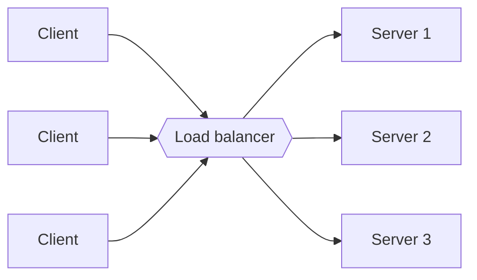
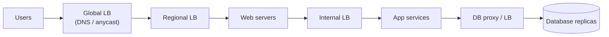

A single server can only handle so many requests. To serve millions of users we run many servers — and then we need something that decides which server handles each request. That component is the **load balancer (LB)**. It sits between clients and a pool of servers, spreading traffic so that no server is overwhelmed and routing around servers that fail.

## What load balancers provide

- **Scalability.** Add servers behind the LB to increase capacity; clients keep using the same address.
- **Availability.** Health checks detect failed servers, and the LB stops sending them traffic.
- **Performance.** Requests go to servers with spare capacity, keeping latency low.
- **Flexibility.** Servers can be drained, upgraded and returned to service without clients noticing, enabling zero-downtime deployments.

Load balancers can also take on cross-cutting responsibilities:

- **TLS termination** — decrypting HTTPS once at the LB so servers deal with plain HTTP.
- **Session persistence** — keeping a client on the same server when needed.
- **Request filtering and rate limiting** — dropping malicious or excessive traffic early.
- **Compression and caching** of responses.
- **Observability** — a single place to measure request rates, errors and latency.

## Where load balancers sit

Load balancers appear at several tiers of a typical architecture:

Between users and data centers, **global** load balancing picks a region. Within a data center, **local** load balancers distribute traffic across web servers, and further internal load balancers distribute calls between services and to database replicas.

## Health checks

LBs continuously probe servers — for example, requesting `/healthz` every few seconds. A server that fails several consecutive checks is removed from the pool; after it passes again, it is added back. Health checks should verify that a server can genuinely do useful work (for example, that it can reach its database), but should not be so strict that a single slow dependency takes every server out of rotation at once.

## Stateless versus stateful servers

Load balancing is simplest when application servers are **stateless**: any server can handle any request because session data lives in a shared store such as a cache or database. If servers keep state in memory, the LB must use **sticky sessions** to send each client back to the same server. Stickiness makes scaling and failover harder, since a failed server takes its sessions with it.

<Callout type="interview">
Almost every high-level design needs load balancers in front of stateless service tiers. Draw them, but spend your time on what makes the problem unique — interviewers rarely want a deep dive into load balancers unless you are asked about them specifically.
</Callout>

## Avoiding a single point of failure

The LB itself must not become a single point of failure. Common approaches are an **active–passive pair** sharing a virtual IP address, where the standby takes over if the active LB fails, or an **active–active** cluster of LBs behind DNS or anycast. Managed cloud load balancers handle this redundancy for you.

<KeyTakeaways>
- A load balancer distributes requests across a pool of servers for scalability, availability and performance.
- LBs often handle TLS termination, health checks, session persistence and rate limiting.
- Load balancing happens at multiple tiers: global, regional and between internal services.
- Stateless servers make load balancing and failover simple; sticky sessions add complexity.
- Deploy load balancers redundantly so they are not single points of failure.
</KeyTakeaways>
