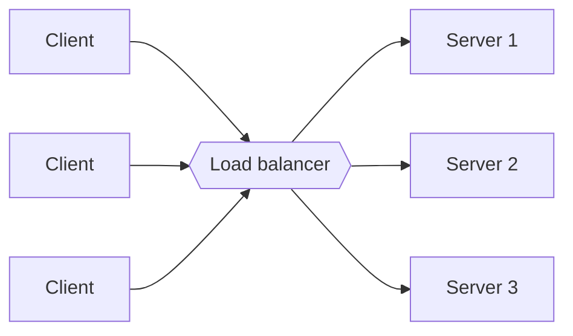
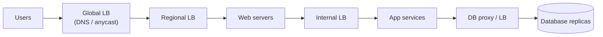
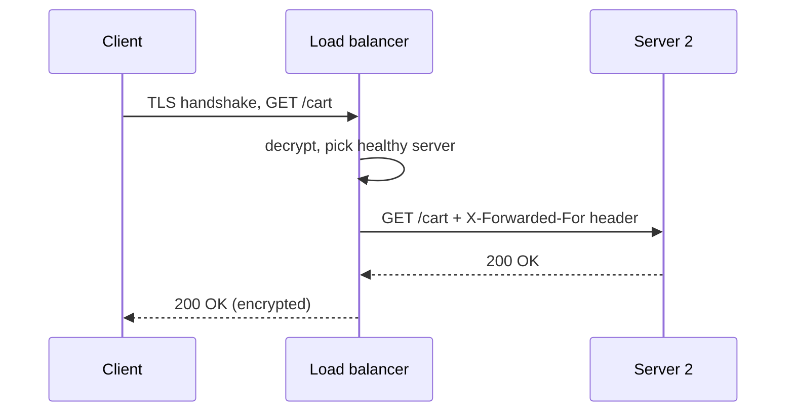
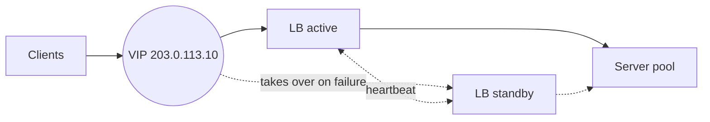

A single server can only handle so many requests. To serve millions of users we run many servers — and then we need something that decides which server handles each request. That component is the **load balancer (LB)**. It sits between clients and a pool of servers, spreading traffic so that no server is overwhelmed and routing around servers that fail.

Clients see one stable address — a **virtual IP (VIP)** or a DNS name — while the pool behind it grows, shrinks and changes constantly. This indirection is what makes horizontal scaling, rolling deployments and automatic recovery possible.

## What load balancers provide

- **Scalability.** Add servers behind the LB to increase capacity; clients keep using the same address.
- **Availability.** Health checks detect failed servers, and the LB stops sending them traffic.
- **Performance.** Requests go to servers with spare capacity, keeping latency low.
- **Flexibility.** Servers can be drained, upgraded and returned to service without clients noticing, enabling zero-downtime deployments.

Load balancers can also take on cross-cutting responsibilities:

- **TLS termination** — decrypting HTTPS once at the LB so servers deal with plain HTTP, and managing certificates in one place.
- **Session persistence** — keeping a client on the same server when needed.
- **Request filtering and rate limiting** — dropping malicious or excessive traffic early.
- **Compression and caching** of responses.
- **Observability** — a single place to measure request rates, errors and latency.

## Where load balancers sit

Load balancers appear at several tiers of a typical architecture:

Between users and data centers, **global** load balancing picks a region. Within a data center, **local** load balancers distribute traffic across web servers, and further internal load balancers distribute calls between services and to database replicas.

## Kinds of load balancers

| Kind | Examples | Strengths | Weaknesses |
| --- | --- | --- | --- |
| Hardware appliance | Dedicated devices from networking vendors | Very high throughput, specialized chips | Expensive, scaled by buying bigger boxes, slower to change |
| Software on commodity servers | HAProxy, NGINX, Envoy | Cheap, flexible, programmable, scaled out by adding servers | You operate and tune them |
| Managed cloud LB | Cloud application and network load balancers | No servers to run, built-in redundancy, autoscaling | Less control; per-request or per-GB pricing |

Large internet companies mostly run software load balancers on commodity servers, often with custom kernels or packet-processing frameworks for speed. In interviews, a generic "load balancer" box is usually enough; mention specific kinds only if they affect the design.

## Health checks

LBs continuously probe servers — for example, requesting `/healthz` every few seconds. A server that fails several consecutive checks is removed from the pool; after it passes again, it is added back.

- **Active checks** send synthetic probes on a schedule.
- **Passive checks** watch real traffic: if a server returns many errors or times out, it is ejected temporarily ("outlier detection").

Health checks should verify that a server can genuinely do useful work (for example, that it can reach its database), but should not be so strict that a single slow dependency takes every server out of rotation at once. Many teams separate **liveness** ("the process is running; restart it if not") from **readiness** ("the server can take traffic right now").

## A request through a load balancer

Because the server sees the LB as the network peer, the LB adds headers such as `X-Forwarded-For` so the application still knows the client's real IP address for logging and rate limiting.

## Stateless versus stateful servers

Load balancing is simplest when application servers are **stateless**: any server can handle any request because session data lives in a shared store such as a cache or database, or in a signed token carried by the client. If servers keep state in memory, the LB must use **sticky sessions** to send each client back to the same server. Stickiness makes scaling and failover harder, since a failed server takes its sessions with it, and it can leave some servers much busier than others.

<Callout type="interview">
Almost every high-level design needs load balancers in front of stateless service tiers. Draw them, but spend your time on what makes the problem unique — interviewers rarely want a deep dive into load balancers unless you are asked about them specifically.
</Callout>

## Avoiding a single point of failure

The LB itself must not become a single point of failure. Common approaches:

- **Active–passive pair.** Two LBs share a virtual IP address. The active one holds the VIP; the standby monitors it with heartbeats (for example, via the VRRP protocol) and claims the VIP if the active one stops responding.
- **Active–active cluster.** Many LB instances serve traffic at once. Routers spread packets among them using equal-cost multi-path routing (ECMP), or DNS and anycast spread clients among them.
- **Managed cloud LBs** handle this redundancy for you, typically across availability zones.

<Ponder question="A load balancer can handle 1 million requests per second, but the service needs 3 million. What can you do?">
Scale the load-balancing tier horizontally. Run several LB instances in active–active mode and spread traffic across them — with ECMP at the routers, with DNS returning several LB addresses, or with anycast. Each LB then balances its share across the servers. Layering a very fast layer-4 tier in front of a fleet of layer-7 proxies is a common way to reach tens of millions of requests per second.
</Ponder>

<KeyTakeaways>
- A load balancer distributes requests across a pool of servers behind a stable virtual address, for scalability, availability and performance.
- LBs often handle TLS termination, health checks, session persistence and rate limiting.
- Load balancing happens at multiple tiers: global, regional and between internal services.
- LBs come as hardware appliances, software on commodity servers or managed cloud services.
- Stateless servers make load balancing and failover simple; sticky sessions add complexity.
- Deploy load balancers redundantly — active–passive with a shared VIP or active–active behind ECMP, DNS or anycast.
</KeyTakeaways>
