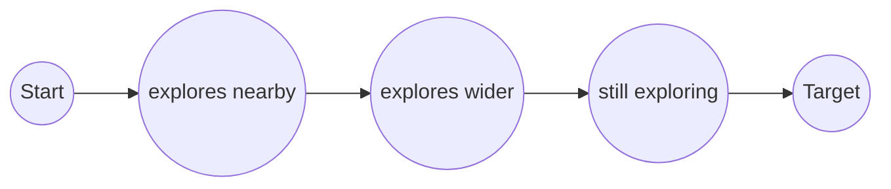

The high-level design hides several hard problems. This lesson examines them before the detailed design addresses each one.

## Challenge 1: shortest paths on a planet-scale graph

**Dijkstra's algorithm** explores nodes in order of their distance from the start until it reaches the destination. On a road graph, the number of nodes it explores grows roughly with the area of a circle whose radius is the trip length. For a cross-country route, that means tens of millions of nodes. Even at tens of millions of node visits per second, a single query would take hundreds of milliseconds to seconds, and we need tens of thousands of queries per second.

**A\* search** speeds this up by using a heuristic, such as straight-line distance divided by the maximum speed, to favor nodes in the direction of the target. It helps, but on road networks the gains are limited, because the fastest route often detours to highways.

Neither approach is fast enough alone. Real systems **preprocess** the graph so that queries explore only a tiny part of it.

## Challenge 2: the graph does not fit on one machine, cleanly

A planet-scale graph with attributes and preprocessing data can exceed the memory of a single server. Splitting it across machines creates a new problem: routes cross partition boundaries, and a search that hops between machines for every edge would be far too slow.

## Challenge 3: edge weights change constantly

Preprocessing makes queries fast by precomputing information based on edge weights. But live traffic changes weights every minute. If every change required hours of preprocessing, the precomputed data would always be stale. We need a preprocessing scheme that can absorb new weights quickly.

## Challenge 4: accurate ETAs

A route's ETA is not just the sum of edge travel times. Delays at intersections, traffic lights, turns and merges add up. Traffic evolves during the trip, so the conditions at a segment when the driver reaches it matter more than conditions now. And the ETA must be calibrated: consistently early or late estimates erode trust.

## Challenge 5: high-volume, noisy location data

Ten million pings per second is a heavy stream on its own. GPS positions are noisy, especially in urban canyons between tall buildings, and devices report at irregular intervals. Before pings can become traffic speeds, they must be map-matched to edges, which itself is a search problem, and aggregated robustly so that one slow delivery truck does not paint a highway red.

## Challenge 6: keeping the map fresh

Roads open and close, and businesses move. Updating the canonical map, regenerating affected tiles and rebuilding graph partitions must happen continuously without disrupting serving.

| Challenge | Approach in the detailed design |
| --- | --- |
| Slow shortest-path queries | Graph partitioning with precomputed shortcuts between boundary nodes |
| Graph too large for one machine | Region-level partitions plus a small overlay graph that every server holds |
| Changing weights | Customizable preprocessing: fast recomputation of shortcut weights only |
| ETA accuracy | Machine-learned model on top of graph travel time, using historical and live features |
| Noisy location data | Hidden Markov model map matching and robust windowed aggregation |
| Map freshness | Incremental pipeline with versioned, region-by-region rollouts |

<Callout type="interview">
Naming the challenges before diving in structures your deep dive. Interviewers often care most about challenges 1 to 3, because they combine algorithms with distributed systems.
</Callout>

<Ponder question="A* uses straight-line distance to the destination as its heuristic. Why does it help less on road networks than on a grid?">
Fast routes often go *away* from the destination first — to reach a highway — and travel time is not proportional to straight-line distance, since highways are several times faster than side streets. A heuristic based on distance divided by the maximum speed must be very conservative to remain admissible, so it guides the search only weakly. Preprocessing-based techniques exploit the road network's structure far more effectively.
</Ponder>

<KeyTakeaways>
- Dijkstra and A* explore too much of a continent-scale graph for interactive, high-throughput routing.
- Splitting the graph across machines requires handling routes that cross partition boundaries.
- Live traffic changes edge weights constantly, so preprocessing must be quick to update.
- ETAs need corrections for intersections and time-dependent traffic, and must be well calibrated.
- Location pings are high-volume and noisy, requiring robust map matching and aggregation.
</KeyTakeaways>
