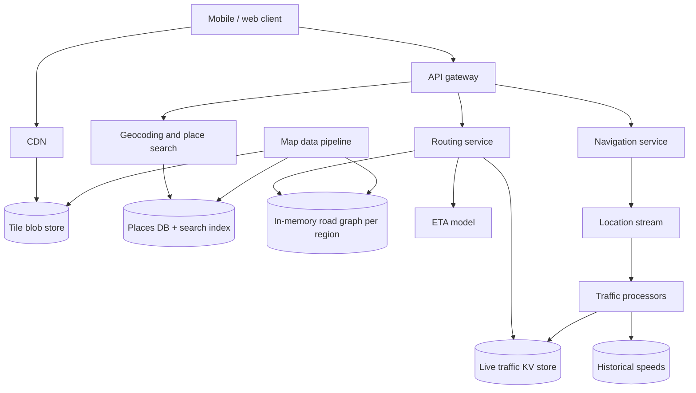
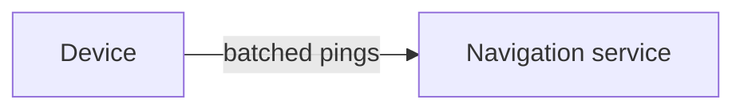
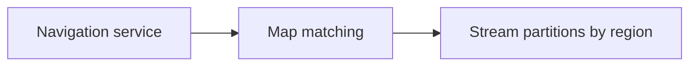
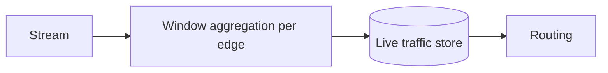
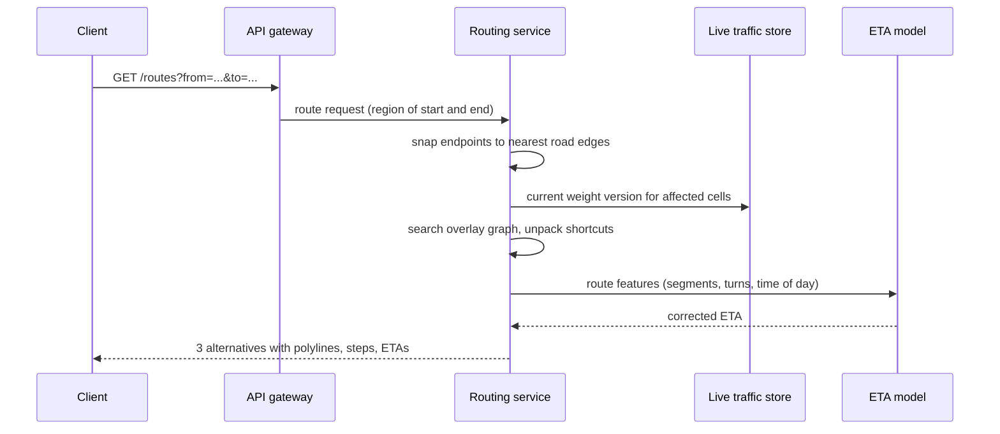

This lesson lays out the API, the data model and the high-level architecture of the maps service. The central idea is to separate the three workloads identified in the estimates: static map content, on-demand routing and streaming location data.

## API

```http
GET  /v1/tiles/{z}/{x}/{y}.pbf                       -> vector tile (served via CDN)
GET  /v1/geocode?q=...                               -> candidate places with coordinates
GET  /v1/reverse-geocode?lat=...&lng=...             -> address
GET  /v1/routes?from=lat,lng&to=lat,lng&mode=drive   -> routes with polyline, steps, distance, ETA
POST /v1/navigation/sessions                         { routeId } -> { sessionId }
POST /v1/navigation/sessions/{id}/pings              [ { lat, lng, speed, heading, ts }, ... ]
       -> { onRoute, updatedEta, newRoute? }
```

Tiles are addressed by zoom level `z` and tile coordinates `x` and `y`. At zoom 0 one tile covers the world; each zoom level splits every tile into four. This scheme gives every tile a stable URL that caches perfectly.

## Data model

- **Road graph:** nodes are intersections, and directed edges are road segments with attributes such as length, road class, speed limit, turn restrictions and toll flags. It is stored as a compact binary file per region and loaded into memory by routing servers.
- **Places:** points of interest with name, category, coordinates and address, stored in a database with a spatial index and a search index.
- **Tiles:** vector tiles, which encode geometry and labels compactly and are styled on the client, stored in a blob store and served through a CDN.
- **Traffic:** current speed per edge in a fast key-value store, and historical speeds by edge, day of week and time of day in a columnar store.

## High-level architecture



### Map data pipeline

An offline pipeline ingests source data, resolves conflicts, validates topology (for example, that roads actually connect) and produces three outputs: tiles, the road graph and the places database. New versions are rolled out gradually, a region at a time, so errors can be caught before they reach every user.

### Routing

The routing service receives two coordinates. It first **snaps** each point to the nearest road edge, then runs a shortest-path search on the road graph using travel times as edge weights. Travel times combine live traffic for the near future with historical speeds for segments the driver will reach later. The ETA model then refines the raw path time using learned corrections, for example for traffic lights and turns.

### Navigation and traffic

During a trip, the client sends batched pings. The navigation service **map-matches** each batch to the road network, determines whether the user is still on route and returns an updated ETA. If the user deviates, the service requests a new route. In parallel, pings flow into a partitioned stream, where traffic processors compute average speeds per edge over sliding windows and write them to the live traffic store.

<Slides title="From location pings to live traffic">
<Slide caption="1. Devices batch pings and send them to the navigation service.">



</Slide>
<Slide caption="2. Pings are map-matched to road edges and published to a stream partitioned by region.">



</Slide>
<Slide caption="3. Stream processors aggregate speeds per edge over a sliding window and update the live traffic store used by routing.">



</Slide>
</Slides>

Pings are anonymized before aggregation: only speeds on edges are kept, not trajectories tied to users.

## A route request, step by step



## Geocoding and reverse geocoding

**Geocoding** turns text into coordinates. The query is normalized ("St" → "Street"), parsed into components (house number, street, city, postcode), and matched against an address index; place names go through the search index. Results are ranked by text match, proximity to the user's current map view and popularity.

**Reverse geocoding** turns coordinates into an address: find the nearest road segment or address point using a spatial index (for example, a geohash or S2-cell index), then interpolate the house number along the segment.

<Ponder question="Why are vector tiles preferred over pre-rendered image tiles for a modern maps app?">
Vector tiles send geometry and labels rather than pixels, so they are much smaller, can be rendered crisply at any screen density, rotated and tilted, and restyled (dark mode, highlighting a route) on the device without new downloads. One set of vector tiles serves every style and language, whereas image tiles would need a separate rendered set for each. The trade-off is more work on the client's GPU.
</Ponder>

<KeyTakeaways>
- Tiles have stable zoom and coordinate URLs, are stored in a blob store and served through a CDN.
- An offline pipeline turns source data into tiles, a road graph and a places database, rolled out region by region.
- Routing snaps endpoints to the graph, searches with time-dependent edge weights and refines results with an ETA model.
- Navigation map-matches pings, checks whether the user is on route and triggers rerouting.
- Streaming processors turn anonymized pings into live speeds per road edge.
- Routing snaps endpoints, searches the overlay graph with the current weight version and refines ETAs with a model.
</KeyTakeaways>
