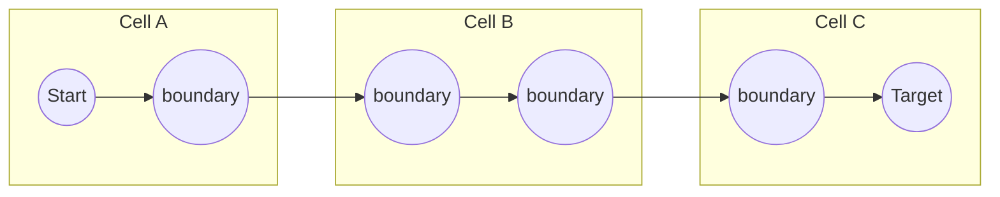
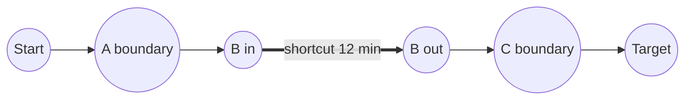
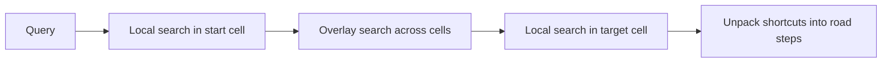

This lesson addresses the challenges from the previous lesson, focusing on fast routing over a partitioned graph with live traffic, accurate ETAs and robust traffic estimation.

## Partitioning the graph

We divide the road network into **cells**, regions of roughly equal size with few roads crossing their borders. Natural boundaries such as rivers, mountains and sparsely connected areas make good cut lines. Nodes where roads cross from one cell to another are **boundary nodes**.

For each cell, we precompute the shortest travel time between every pair of its boundary nodes. These become **shortcut edges** in a much smaller **overlay graph** containing only boundary nodes and shortcuts. Repeating the process in levels (cells of cells) builds a hierarchy.

<Slides title="Routing with a partitioned overlay graph">
<Slide caption="1. The graph is split into cells. Boundary nodes connect neighboring cells.">



</Slide>
<Slide caption="2. Inside each cell, shortcuts summarize the best paths between boundary nodes, so the search never enters Cell B in detail.">



</Slide>
<Slide caption="3. A query searches the full graph only in the start and target cells, and the overlay graph in between. Finally, shortcuts are expanded into real road segments.">



</Slide>
</Slides>

A query now explores thousands of nodes instead of millions, and answers in milliseconds.

## Absorbing live traffic

Critically, the partition itself depends only on the graph's shape, not its weights. When traffic changes, we keep the partition and simply **recompute the shortcut weights** of affected cells, a process called **customization**. Recomputing one cell takes milliseconds, and the whole continent can be refreshed in seconds on a multi-core machine. This makes it practical to apply new traffic data every minute or two.


## Distributing across servers

Every routing server holds the small overlay graph for its continent, plus the detailed cells for a set of regions. A request is routed to a server that holds the start and target cells. For long trips spanning regions, the server uses the overlay for the middle section and fetches the target cell's local search from a peer, or the system routes such queries to servers that hold larger regions. Servers are replicated for availability, and new weight versions are applied atomically so a query never mixes old and new weights.

## Accurate ETAs

The graph gives a base travel time. An ETA model, typically a gradient-boosted tree or neural network, predicts the correction from features such as:

- the route's segments, road classes and number of turns and lights;
- live and historical speeds for the expected time of arrival at each segment;
- time of day, day of week, weather and special events.

The model is trained on millions of completed trips, comparing predicted with actual durations. During navigation, the ETA is refreshed with every ping batch, using the distance remaining and current conditions.

## Robust traffic estimation

- **Map matching** uses a hidden Markov model: candidate edges near each ping are the hidden states, and the most likely sequence is chosen by combining distance to the edge with the plausibility of moving between edges in the elapsed time.
- **Aggregation** computes a robust statistic, such as the median of recent speeds per edge, over a sliding window, discarding outliers such as stopped buses or delivery vans.
- **Sparse edges** with too few recent pings fall back to historical speeds for that time slot.
- **Privacy** is protected by discarding identifiers after matching and by requiring a minimum number of distinct devices before publishing an edge speed.

## Why the overlay graph is so much smaller

Suppose a continent's graph has 100 million nodes split into 10,000 cells of about 10,000 nodes each, with an average of 50 boundary nodes per cell.

```text
Overlay nodes:      10,000 cells × 50 boundary nodes          = 500,000
Shortcuts per cell: 50 × 50                                   = 2,500
Overlay edges:      10,000 × 2,500 + cross-cell road edges    ≈ 25 million
Query work:         local search in 2 cells (~20,000 nodes) + overlay search
                    (a small fraction of 500,000 nodes)       → milliseconds
Customization:      10,000 cells, each a small local computation → seconds on many cores
```

Multi-level partitions shrink the top-level overlay further, so long-distance queries touch only a few thousand overlay nodes.

<Ponder question="A bridge closes suddenly. How quickly can routes avoid it in this design, and what has to be recomputed?">
The closure sets the bridge's edges to an infinite (or very large) weight. Only the cells containing those edges need their shortcut weights recomputed — milliseconds of work — and the new weight version is published to routing servers within the next update cycle, typically a minute or less. No repartitioning is needed because the graph's shape is unchanged; only its weights changed.
</Ponder>

<KeyTakeaways>
- Partitioning the graph into cells with precomputed shortcuts between boundary nodes makes queries explore thousands, not millions, of nodes.
- Because the partition depends only on topology, live traffic is absorbed by quickly recomputing shortcut weights.
- Routing servers share a small overlay graph and hold detailed cells for their regions, with atomic weight updates.
- A machine-learned model corrects graph travel times for accurate ETAs, refreshed during navigation.
- Hidden Markov map matching, robust windowed aggregation and historical fallbacks turn noisy pings into reliable speeds.
- An overlay of a few hundred thousand boundary nodes replaces a graph of a hundred million for most of a long query.
</KeyTakeaways>
