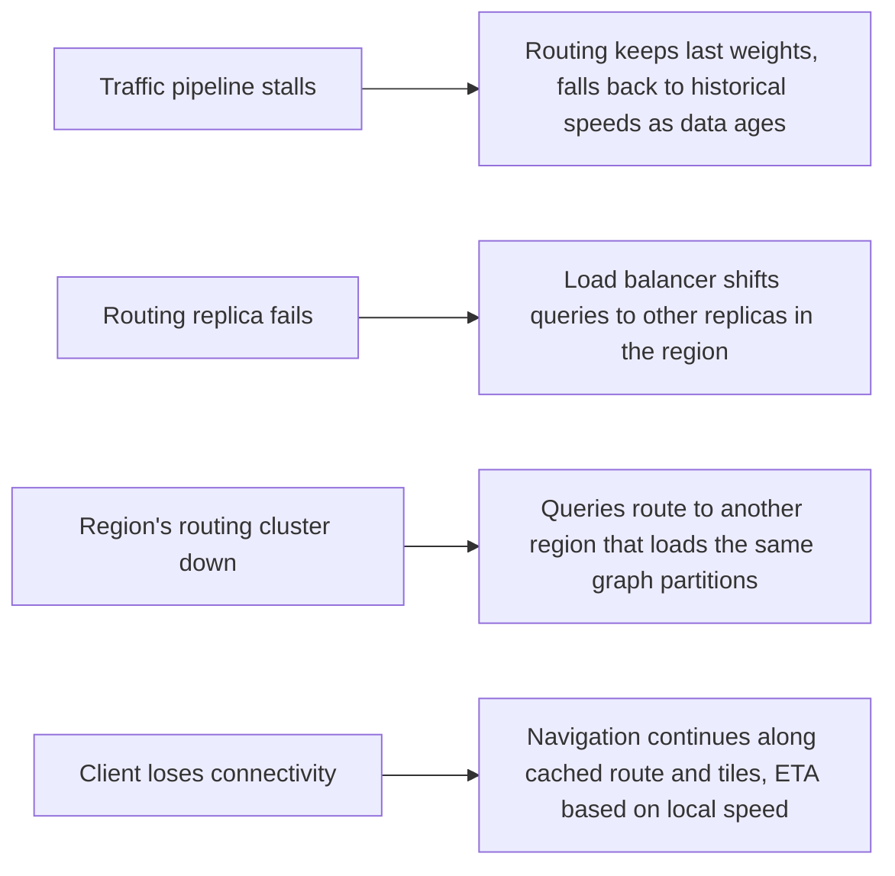

This lesson evaluates the maps design against its requirements, discusses trade-offs and walks through how it behaves under failure.

## Requirements check

| Requirement | How the design meets it |
| --- | --- |
| Low latency for tiles | Vector tiles with stable URLs are served from CDN edges; the client caches recently viewed tiles. |
| Low latency for routes | The partitioned overlay graph lets queries explore a few thousand nodes and answer in milliseconds; servers hold graphs in memory. |
| Accuracy | Time-dependent edge weights, customization with fresh traffic and a learned ETA model trained on completed trips. |
| Availability | Routing servers are replicated per region; tiles are cached widely; the client continues navigation offline along the current route. |
| Scalability | Stateless API tier, region-partitioned routing, partitioned streaming ingestion and horizontally scaled stream processors. |
| Freshness | Traffic is aggregated in sliding windows and pushed to routing servers every minute or two; map updates roll out incrementally. |

## Trade-offs

**Preprocessing versus flexibility.** The overlay graph makes queries fast, but it assumes a fixed set of routing rules. Supporting a new option, such as "avoid tolls" or a truck profile with height restrictions, requires either another customization with modified weights or a separate set of shortcut weights per profile. Storing several weight sets costs memory but keeps each profile fast.

**Freshness versus stability.** Applying new traffic weights every minute keeps routes current, but it can make rerouting jumpy: a driver may be sent onto a side street to save 30 seconds and then back. Navigation typically applies a threshold, only suggesting a new route when the saving is meaningful.

**Privacy versus accuracy.** Requiring many distinct devices before publishing an edge speed protects privacy but reduces coverage on quiet roads, where historical speeds must fill in.

**Consistency across servers.** Different routing replicas may briefly hold different traffic versions. That is acceptable: two users asking at the same moment might get slightly different ETAs, which is invisible in practice.

## Failure scenarios

## Handling peaks

Rush hour creates predictable daily peaks; holidays and big events create less predictable ones. Because routing servers are stateless apart from their in-memory graph, they can scale out ahead of known peaks. Starting a new server requires loading several gigabytes of graph data, so autoscaling should be proactive, driven by schedules and forecasts rather than only by reactive CPU metrics.

## Extensions

- **Public transit** uses a different, time-expanded model of schedules and transfers rather than road edges.
- **Multi-modal routing** combines walking, transit and ride-hailing segments.
- **Offline maps** package tiles and a compact graph for a region on the device.
- **Incident reports** from users feed the traffic pipeline as additional signals.

<Callout type="tip">
A crisp summary for the end of a maps interview: "Tiles are a CDN problem, routing is a precomputation problem and traffic is a streaming problem." It shows you understood that one product hides three very different systems.
</Callout>

## Latency budget for a route

| Step | Budget |
| --- | --- |
| Network from phone to nearest region | 60 ms |
| Gateway and snapping endpoints | 10 ms |
| Overlay search and shortcut unpacking (3 alternatives) | 50 ms |
| ETA model inference | 20 ms |
| Encoding the polyline and steps | 10 ms |
| Network back to the phone | 60 ms |
| **Total** | **~210 ms, well within the one-second target** |

<Ponder question="A driver's phone loses signal for 20 minutes in a rural area. What should the app do, and what did the design include to make it possible?">
Keep navigating: the app already holds the route geometry, turn instructions and the tiles along the route, so it can follow the GPS position locally, announce turns and update the ETA from its own speed. If the driver leaves the route, it can compute a simple local reroute on cached data or wait for connectivity. The design makes this possible by returning the full route up front and caching tiles along it, rather than streaming instructions turn by turn.
</Ponder>

<KeyTakeaways>
- The design meets latency needs with CDN-served tiles and an in-memory partitioned graph for routing.
- Route profiles such as "avoid tolls" need separate weight sets, trading memory for speed.
- Rerouting thresholds balance fresh traffic with stable guidance.
- Failures degrade gracefully: stale traffic falls back to history, and clients continue navigation offline.
- Routing servers load large graphs on start-up, so capacity should be scaled proactively before predictable peaks.
- A route request fits in a few hundred milliseconds; clients carry enough data to navigate through connectivity gaps.
</KeyTakeaways>
