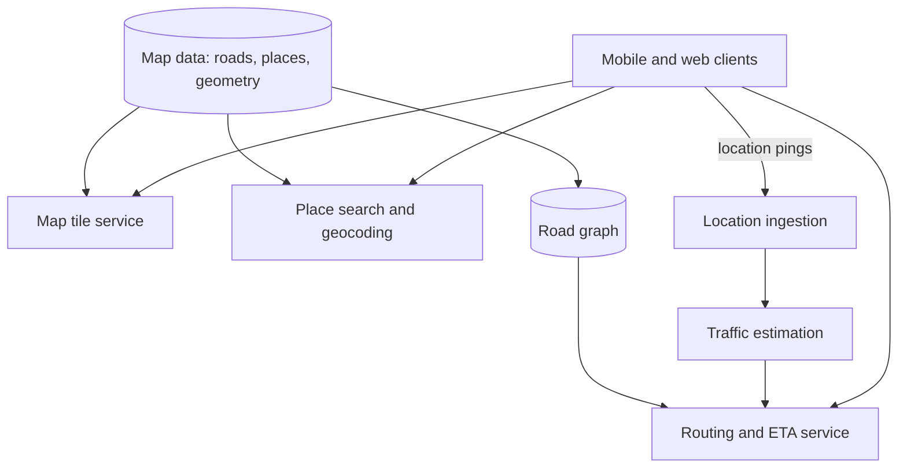

A maps service answers questions people ask constantly: where is this place, what is around me, and how do I get there fastest right now? Behind a smooth, zoomable map and a turn-by-turn route sit several distinct systems: a store of the world's geography, a tile-rendering pipeline, a search engine for places, a routing engine over a graph with hundreds of millions of edges, and a live traffic pipeline fed by millions of moving devices.

## What makes it hard

- **The world is huge.** A road network for the whole planet has hundreds of millions of intersections and road segments. A naive shortest-path search over the entire graph would take far too long for an interactive request.
- **Conditions change constantly.** Travel times depend on live traffic, closures and incidents. A route that is fastest at 8:00 might be terrible at 8:15.
- **Scale of location data.** Navigating devices send position updates every few seconds. Tens of millions of concurrent devices produce millions of updates per second that must become traffic estimates within a minute or two.
- **Low latency on mobile networks.** Panning the map must feel instant, and rerouting after a missed turn must happen within a second or two.
- **Accuracy.** Wrong directions erode trust quickly, and estimated arrival times are only useful if they are reliable.

## The main subsystems

- **Map data** is compiled from many sources, such as satellite imagery, government datasets, street-level imagery and user reports, into a canonical model of roads, buildings and places.
- **Tiles** are pre-rendered or vector-encoded squares of the map at each zoom level, served from a CDN.
- **Place search and geocoding** turn "coffee near me" or a street address into coordinates, and coordinates back into addresses.
- **Routing** finds the best path between two points on the road graph and estimates the arrival time.
- **Traffic** turns anonymous location pings into live speeds on each road segment, which feed routing and ETAs.

## Scope for this chapter

We focus on the parts that make a maps service distinctive: showing the map, finding the best route and estimating the arrival time with live traffic. We treat place search as a use of the distributed search and proximity building blocks, and we leave out street-level imagery, offline maps and public transit, although we mention how they fit.

The lessons follow SCALED: requirements and estimates, a high-level design, the specific challenges of routing at planet scale, a detailed design that addresses them, and an evaluation.

<Callout type="interview">
In a maps interview, the graph problem is the heart of the discussion. Expect to explain why a plain Dijkstra search is too slow for continent-scale graphs, and how partitioning the graph and precomputing shortcuts fix it.
</Callout>

<KeyTakeaways>
- A maps service combines map data, tile serving, place search, routing and live traffic.
- The road graph is enormous, so interactive routing requires more than a plain shortest-path search.
- Location pings from millions of devices feed traffic estimation, which feeds routing and ETAs.
- Tiles are static enough to serve from a CDN, while routes and ETAs must be computed on demand.
- This chapter focuses on map display, routing and ETAs with live traffic.
</KeyTakeaways>
