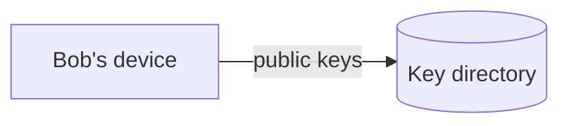
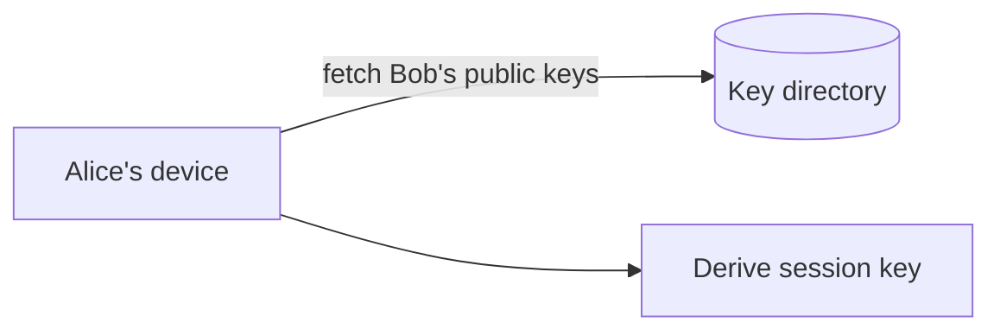
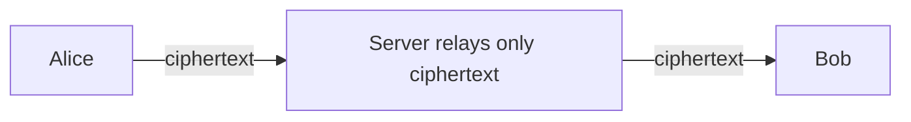

This lesson addresses ordering, delivery guarantees, groups, multiple devices and end-to-end encryption.

## Ordering

Clocks on phones are unreliable, so messages cannot be ordered by the sender's timestamp. Instead, the server assigns each message a **sequence number per conversation** when it stores it. Clients display messages by sequence number, and a gap tells the client that it is missing a message and should sync.

Assigning per-conversation sequence numbers requires a single writer per conversation at any time. Conversations are partitioned by conversation ID across message-service shards, and each partition's leader increments the counter. This is cheap because a conversation's rate of messages is low, even though the total rate is millions per second.

The sender's own messages appear immediately in their app with a "pending" marker. When the server assigns the sequence number, the client moves the message into its final position if another participant's message was sequenced first.

## Delivery guarantees

Mobile networks drop packets and connections at any moment, so every hop uses **acknowledgements and retries**:

- The client retries sending until it receives an acknowledgement. Because retries can duplicate a message, each message carries a **client-generated unique ID**. The server deduplicates by this ID, returning the original sequence number for a duplicate.
- The server delivers from the inbox and retries until the device acknowledges. The device deduplicates by message ID, so a message delivered twice is shown once.
- Acknowledgements carry the highest contiguous sequence number received, so a reconnecting device can resume exactly where it left off.

The result is **at-least-once delivery with idempotent handling**, which users experience as exactly-once.

## Groups

For a group of up to a few hundred members, the message service **fans out on write**: it stores one copy of the encrypted message per recipient device, or a single copy plus per-device pointers, and routes to each online member's gateway. Groups are small enough that fan-out is affordable, and it keeps the per-device inbox model uniform.

Very large groups or broadcast channels would switch to fan-out on read, where members fetch from a shared log, but those are out of scope.

## Multiple devices

Each linked device is a separate endpoint with its own inbox, connection and encryption keys. A message to Bob is delivered to each of Bob's devices, and a message Bob sends from his phone is also delivered to his other devices so they show the full conversation. Read receipts from one device are synced to the others.

## End-to-end encryption

With end-to-end encryption, only the sender and recipient devices hold the keys to decrypt messages. The server relays ciphertext.

<Slides title="End-to-end encryption in brief">
<Slide caption="1. Each device generates identity and pre-keys and uploads only the public halves to a key directory.">

</Slide>
<Slide caption="2. Alice fetches Bob's public keys and establishes a shared secret without Bob being online.">

</Slide>
<Slide caption="3. Messages are encrypted with keys that ratchet forward for every message, so compromising one key does not expose past messages.">

</Slide>
</Slides>

Protocols in this family use a key agreement for session setup and a **double ratchet** that derives a new key for every message, providing forward secrecy. Groups either encrypt separately to each member device or use a shared group key distributed through pairwise encrypted channels.

Encryption shapes the system: the server cannot index or search content, cannot generate link previews (the sender's device does that), and must verify nothing about content beyond size and metadata. Safety features such as spam detection rely on metadata and user reports.

<KeyTakeaways>
- Ordering uses server-assigned sequence numbers per conversation, with one writer per conversation partition.
- Client-generated message IDs make retries idempotent; acknowledgements carry the highest contiguous sequence number.
- At-least-once delivery with deduplication gives users an exactly-once experience.
- Small groups use fan-out on write to each member device; each linked device has its own inbox and keys.
- End-to-end encryption means the server relays ciphertext only, which moves search and previews to devices.
</KeyTakeaways>
