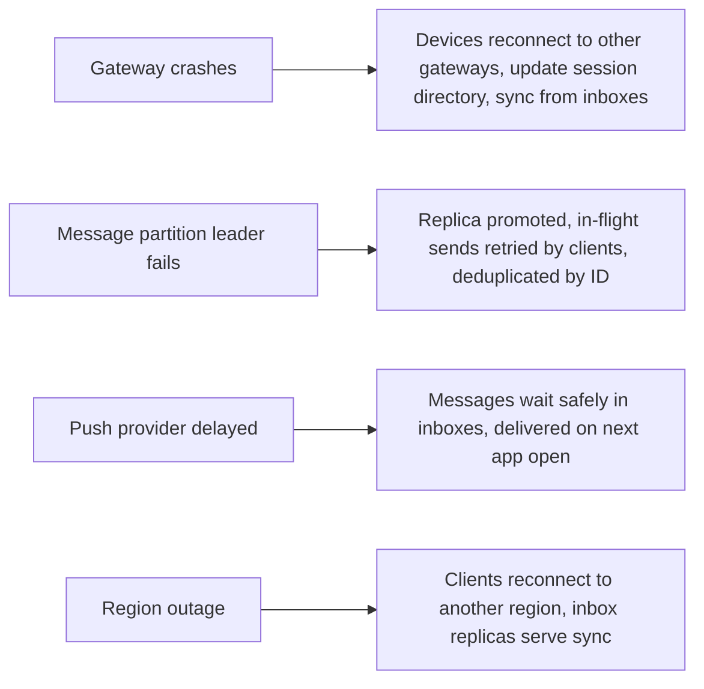

This lesson defends the messaging design: how it meets the requirements, how it handles failures and what trade-offs it makes.

## Requirements check

| Requirement | How the design meets it |
| --- | --- |
| Low latency | Persistent connections and direct routing via the session directory deliver online messages in one hop between gateways. |
| No message loss | Messages are durably stored in replicated inboxes before the sender is acknowledged; deliveries are retried until acknowledged. |
| Exactly-once display | Client-generated IDs and deduplication on both the server and the device. |
| Ordering | Per-conversation sequence numbers assigned by a single writer; clients sync to fill gaps. |
| Availability | Gateways, message-service partitions and inbox stores are replicated; clients reconnect to any gateway. |
| Privacy | End-to-end encryption; inboxes delete messages after delivery; minimal metadata retention. |
| Mobile efficiency | One connection per device, compact binary protocol, batching of receipts and presence throttling. |

## Failure scenarios

**Gateway failure** is the most common event, since there are thousands of gateways and they are restarted during every deployment. A gateway holding 100,000 connections that goes down causes 100,000 reconnects. To avoid a **thundering herd**, clients reconnect with randomized exponential backoff, and deployments drain gateways gradually, asking clients to move before shutdown.

**Stale session directory entries** are possible: the directory may point to a gateway that just lost the connection. The message service treats a failed push as "offline" and relies on the inbox plus push notification, so correctness never depends on the directory being perfectly accurate.

## Trade-offs

**Server-side history versus privacy.** Storing no history after delivery maximizes privacy and minimizes storage, but makes adding a new device harder: it must receive history from an existing device of the same user, or start empty. Apps that store encrypted history on servers make multi-device easy at the cost of more storage and a larger target.

**Fan-out on write for groups.** Storing a copy per member device multiplies storage for group messages but keeps delivery simple and uniform. It works well for groups of hundreds, not for channels with millions of followers.

**Presence accuracy versus cost.** Real-time presence for every contact would generate huge traffic. Limiting presence to contacts actively viewing a conversation, and batching updates, keeps costs manageable at the price of slightly stale "last seen" information.

**Connection protocol.** WebSockets are universal and work through most proxies; MQTT-style protocols are more compact and battery-friendly on mobile. Many apps use a custom binary protocol over TLS for efficiency.

## Scaling further

- **Connection density:** tuning operating systems and using event-driven servers allows a single gateway to hold hundreds of thousands, or even millions, of mostly idle connections, reducing fleet size.
- **Geographic routing:** users connect to the nearest region; messages between regions cross a backbone, while each user's inbox lives in their home region.
- **Spam and abuse** detection uses metadata such as sending rates, new-account behavior and user reports, because content is encrypted.

<Callout type="tip">
When evaluating, walk through one message end to end under failure: "Alice sends, the gateway crashes before acknowledging, Alice's app retries on a new gateway with the same ID, the server deduplicates, and Bob sees the message once."
</Callout>

## Latency budget for an online-to-online message

| Step | Budget |
| --- | --- |
| Alice's phone to her gateway (mobile network) | 50–100 ms |
| Gateway to message service, sequence assignment | 5 ms |
| Durable write to Bob's inbox (replicated) | 10 ms |
| Session directory lookup and push to Bob's gateway | 5 ms |
| Bob's gateway to Bob's phone | 50–100 ms |
| **Total** | **~120–220 ms** |

The mobile network hops on both ends dominate; the server-side path is about 20 ms.

<Ponder question="A deployment restarts 500 gateways at once, disconnecting 50 million devices. What goes wrong, and how should deployments be done instead?">
Fifty million devices reconnect and sync simultaneously — a thundering herd that overloads authentication, the session directory and inbox reads, and may cascade into further failures. Deploy gradually: drain a few gateways at a time, have them tell connected clients to reconnect elsewhere with randomized delays, and let clients use jittered exponential backoff so reconnects spread over minutes rather than seconds.
</Ponder>

<KeyTakeaways>
- Durable inboxes, retries and deduplication give reliable, exactly-once display over unreliable networks.
- Gateway failures cause reconnects that must be spread out with randomized backoff and gradual draining.
- Correctness never relies on the session directory being perfectly accurate; inboxes and push are the fallback.
- Key trade-offs are privacy versus server-side history, fan-out cost for groups and presence accuracy versus cost.
- Metadata-based abuse detection is necessary because content is end-to-end encrypted.
- An online-to-online message spends most of its ~200 ms on mobile network hops; the server path is about 20 ms.
</KeyTakeaways>
