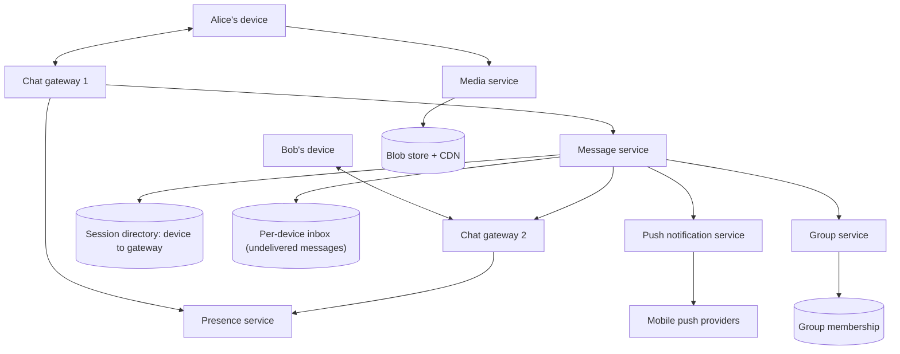
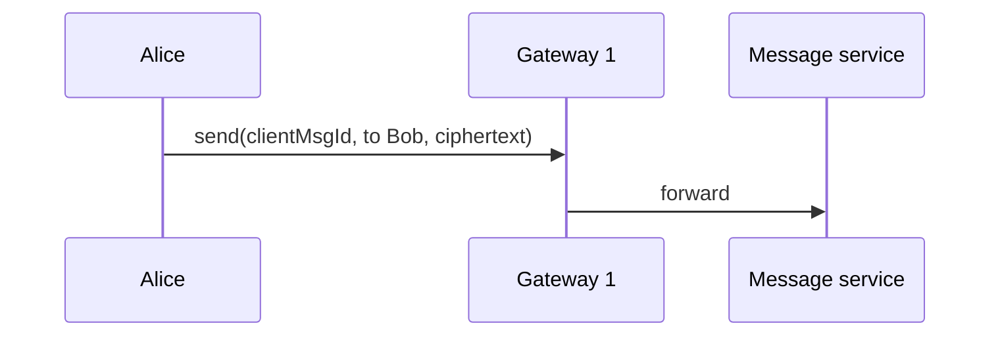
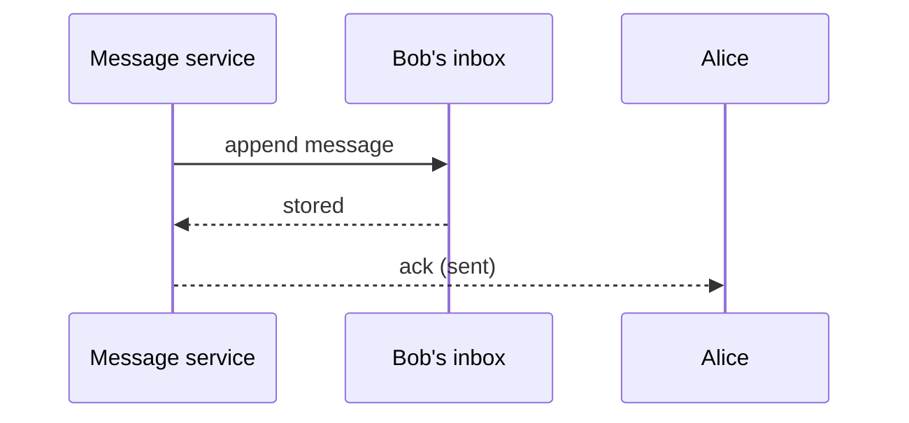
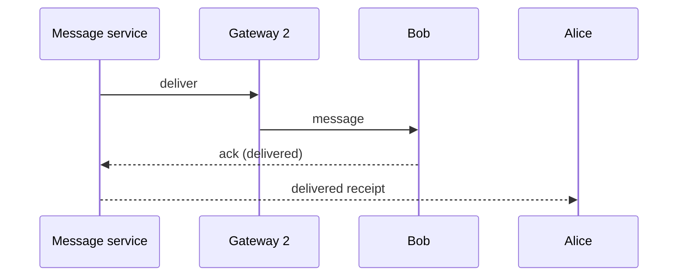

This lesson designs the connection layer, the message flow for online and offline recipients, and the supporting services.

## Connections

Each active device opens a **persistent connection**, typically a WebSocket or a lightweight protocol over TCP such as MQTT, to a **chat gateway** chosen by a load balancer. The connection carries messages in both directions: the client sends messages and acknowledgements, and the server pushes new messages, receipts and presence updates.

Because a message for Bob must reach whichever gateway holds Bob's connection, the system needs a **session directory**: a fast, replicated key-value store mapping each device to the gateway currently serving it. Gateways update it when devices connect and disconnect, and entries expire if a gateway stops refreshing them.

## Architecture

- **Chat gateways** hold connections. They are mostly stateless apart from the open sockets, and they scale horizontally.
- **Message service** assigns message IDs, stores messages durably in recipients' inboxes and routes them to the recipient's gateway.
- **Per-device inbox** holds messages until the device acknowledges them, then deletes them.
- **Group service** stores membership and expands group messages to members.
- **Push notification service** wakes offline devices through the platform push providers.
- **Presence service** tracks online status and last-seen times.
- **Media service** handles uploads and downloads of encrypted media blobs.

## Sending a message

<Slides title="Message flow when the recipient is online">
<Slide caption="1. Alice's app sends the encrypted message with a client-generated ID over its connection.">

</Slide>
<Slide caption="2. The message service stores the message in Bob's device inboxes durably, then acknowledges Alice. Alice sees one check mark.">

</Slide>
<Slide caption="3. The service looks up Bob's gateway and pushes the message. Bob's app acknowledges, the message is removed from the inbox and Alice receives a delivered receipt.">

</Slide>
</Slides>

The key rule is **store before acknowledging**: Alice's message is acknowledged only after it is durably written to Bob's inbox, so a crash afterwards cannot lose it.

## When the recipient is offline

If the session directory shows no connection for Bob's device, the message stays in the inbox and the push service sends a notification through the mobile platform's push service. When Bob's app wakes or reconnects, it connects to a gateway and **syncs**: it asks for all inbox messages after the last one it acknowledged, receives them in order, and acknowledges them. The server then deletes them from the inbox.

## Media messages

Media is too large to send through the chat path. The sender's app encrypts the file with a random key, uploads the ciphertext to the blob store through the media service and sends a normal chat message containing the blob reference and the decryption key (itself protected by end-to-end encryption). Recipients download the blob from the CDN and decrypt it locally.

## Presence

Gateways report connects and disconnects to the presence service, which records "online" or "last seen at" per user. Presence is shared only with contacts who are interested, and typically only while their app is open, because broadcasting every status change to every contact would generate enormous traffic.

<KeyTakeaways>
- Devices keep persistent connections to chat gateways; a session directory maps each device to its gateway.
- The message service stores each message in the recipient's per-device inbox before acknowledging the sender.
- Online recipients get messages pushed through their gateway; offline recipients get a push notification and sync on reconnect.
- Messages are deleted from the inbox once the device acknowledges them.
- Media is encrypted, uploaded to a blob store and referenced from a normal chat message.
</KeyTakeaways>
