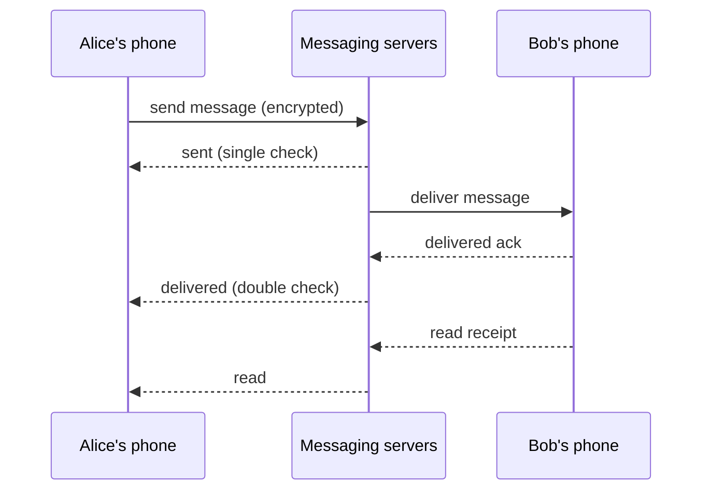

A messaging app lets people exchange text, photos, voice notes and videos in one-to-one and group conversations, in real time, across phones and computers. The largest apps deliver over a hundred billion messages a day to billions of users, many on unreliable mobile networks, with end-to-end encryption so that not even the service can read message content.

## What makes messaging hard

- **Real-time delivery.** Messages should arrive within a fraction of a second when both users are online. That requires persistent connections from every active device to the servers, which means managing hundreds of millions of concurrent connections.
- **Offline users.** Phones lose connectivity, sleep and switch networks constantly. Messages for offline users must be stored and delivered reliably when they reconnect, and notifications must wake the app.
- **Ordering and delivery guarantees.** Messages in a conversation should appear in the same order for all participants, never be lost and never be duplicated on screen, even when networks retry.
- **Receipts and presence.** Users see when a message is sent, delivered and read, and whether a contact is online or typing. These generate many more events than the messages themselves.
- **Groups.** A message to a group of hundreds must be delivered to every member's devices.
- **Multiple devices** per user, each with its own connection and its own encryption keys.
- **End-to-end encryption**, which constrains what the server can do with message content.

## Where this chapter goes

1. **Requirements:** features, non-functional goals and estimates for messages, connections and storage.
2. **High-level design:** connection management, message flow for online and offline recipients, and storage.
3. **Detailed design:** ordering, delivery guarantees, groups, multi-device support, media and end-to-end encryption.
4. **Evaluation:** how the design meets its goals, with failure scenarios and trade-offs.

## A note on the building blocks

This design uses several building blocks from Part II: a **sequencer** for message IDs, a **key-value or wide-column store** for message queues and history, a **blob store** and **CDN** for media, a **messaging queue** for asynchronous work such as push notifications, and **load balancers** for connection routing. What is unique is the connection layer and the delivery protocol built on top of it.

<Callout type="interview">
A messaging interview usually centers on three questions: how do clients stay connected, how does a message reach an offline user, and how do you guarantee ordering without duplicates? Plan your time so you can answer all three.
</Callout>

<KeyTakeaways>
- Messaging requires real-time delivery over persistent connections to hundreds of millions of devices.
- Offline users need reliable store-and-forward delivery plus push notifications.
- Ordering, exactly-once display and receipts must work over unreliable mobile networks.
- Groups, multi-device support and end-to-end encryption add significant complexity.
- The unique parts are the connection layer and delivery protocol; storage and media reuse building blocks.
</KeyTakeaways>
