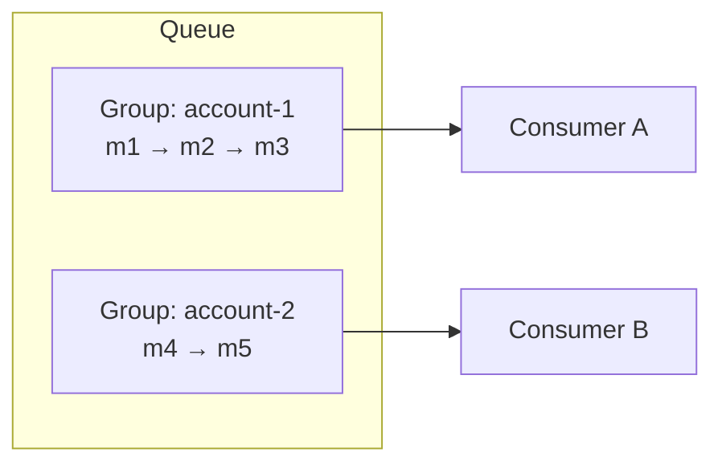

Two properties dominate the design of any messaging system: the **order** in which messages are delivered and **how many times** each message is delivered. Both involve fundamental trade-offs with throughput and availability.

## Ordering

### Best-effort ordering

The queue tries to deliver messages roughly in the order they were sent but does not guarantee it. Messages are spread across many servers and consumers process them in parallel, so throughput can scale almost without limit. Many workloads — sending emails, resizing images — do not care about order.

### Strict FIFO ordering

Messages are delivered in exactly the order they were sent. This matters when messages represent a sequence of state changes: “create account,” then “update email,” then “delete account.” Processing them out of order produces wrong results.

Global FIFO across an entire queue limits throughput to what one ordered sequence can handle. The standard solution is **ordering within a key**: messages carry a **group key** (such as an account ID), and ordering is guaranteed only among messages with the same key. Different keys are processed in parallel.

### How ordering is assigned

- **Arrival order at the server:** simple, but messages sent from different producers may arrive out of their send order because of network delays.
- **Producer sequence numbers:** each producer numbers its messages, and the queue orders messages from that producer accordingly.
- **Monotonic IDs from a sequencer** assigned at the partition leader, giving a total order within the partition.

## Delivery semantics

| Semantics | Meaning | How achieved | Trade-off |
| --- | --- | --- | --- |
| **At most once** | Never duplicated, may be lost | Acknowledge before processing | Data loss possible |
| **At least once** | Never lost, may be duplicated | Acknowledge after processing; redeliver on timeout | Duplicates possible |
| **Exactly once** | Processed exactly once | Idempotency or transactions | Complexity, overhead |

**At-least-once** is the most common default: losing messages is usually worse than processing a few twice. True **exactly-once** delivery across a network is impossible in general, but **exactly-once processing** is achievable by combining at-least-once delivery with **idempotent consumers** — for example, recording processed message IDs in the same database transaction as the side effect, or using natural idempotency keys.

## Concurrency and consumer coordination

With many consumers receiving from the same queue concurrently, the queue must ensure that two consumers do not process the same message at the same time. Options include:

- **Locking or leasing** each message on receive (the visibility timeout approach).
- **Partition assignment:** each partition is consumed by one consumer at a time, which also preserves order within the partition.

<Callout type="tip">
In interviews, state the delivery semantics you rely on and how you handle their consequences: “The queue gives at-least-once delivery, so the payment consumer checks an idempotency key before charging.”
</Callout>

<KeyTakeaways>
- Best-effort ordering maximizes throughput; strict FIFO preserves sequences but limits parallelism.
- Ordering per group key provides FIFO where it matters while allowing parallelism across keys.
- At-most-once may lose messages; at-least-once may duplicate them; exactly-once processing needs idempotency or transactions.
- At-least-once plus idempotent consumers is the most common practical choice.
- Leases or partition assignment prevent concurrent processing of the same message.
</KeyTakeaways>
