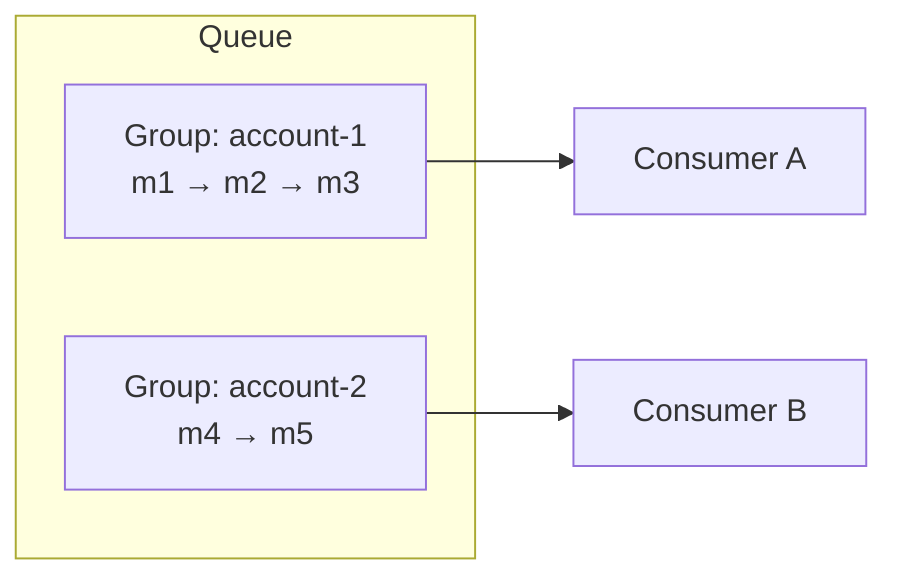
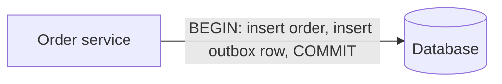
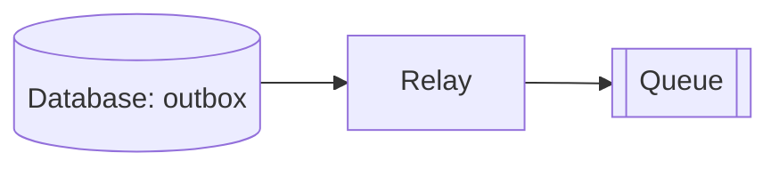
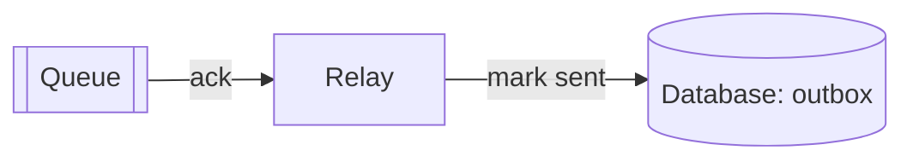

Two properties dominate the design of any messaging system: the **order** in which messages are delivered and **how many times** each message is delivered. Both involve fundamental trade-offs with throughput and availability.

## Ordering

### Best-effort ordering

The queue tries to deliver messages roughly in the order they were sent but does not guarantee it. Messages are spread across many servers and consumers process them in parallel, so throughput can scale almost without limit. Many workloads — sending emails, resizing images — do not care about order.

### Strict FIFO ordering

Messages are delivered in exactly the order they were sent. This matters when messages represent a sequence of state changes: "create account," then "update email," then "delete account." Processing them out of order produces wrong results.

Global FIFO across an entire queue limits throughput to what one ordered sequence can handle. The standard solution is **ordering within a key**: messages carry a **group key** (such as an account ID), and ordering is guaranteed only among messages with the same key. Different keys are processed in parallel.



### How ordering can break

Even if the queue stores messages in order, three things can reorder them:

1. **Multiple producers.** Two services send updates about the same account; network delays mean the later send arrives first.
2. **Producer retries.** A send times out and is retried, while the next message has already been accepted.
3. **Parallel consumers.** Two consumers receive consecutive messages of the same account and finish in the opposite order.

FIFO queues address all three: producers attach sequence numbers per group, the queue refuses to deliver a group's next message until the previous one is acknowledged, and deduplication handles retries.

### How ordering is assigned

- **Arrival order at the server:** simple, but messages sent from different producers may arrive out of their send order because of network delays.
- **Producer sequence numbers:** each producer numbers its messages, and the queue orders messages from that producer accordingly.
- **Monotonic IDs from a sequencer** assigned at the partition leader, giving a total order within the partition.

## Delivery semantics

| Semantics | Meaning | How achieved | Trade-off |
| --- | --- | --- | --- |
| **At most once** | Never duplicated, may be lost | Acknowledge before processing | Data loss possible |
| **At least once** | Never lost, may be duplicated | Acknowledge after processing; redeliver on timeout | Duplicates possible |
| **Exactly once** | Processed exactly once | Idempotency or transactions | Complexity, overhead |

**At-least-once** is the most common default: losing messages is usually worse than processing a few twice. True **exactly-once** delivery across a network is impossible in general, but **exactly-once processing** is achievable by combining at-least-once delivery with **idempotent consumers**.

### An idempotent consumer

```python
def handle(message):
    with db.transaction() as tx:
        # A unique constraint on processed_messages.id makes this fail on a duplicate.
        inserted = tx.execute(
            "INSERT INTO processed_messages (id) VALUES (%s) ON CONFLICT DO NOTHING",
            [message.id],
        ).rowcount
        if inserted == 0:
            return                      # already processed: do nothing
        tx.execute("UPDATE accounts SET balance = balance + %s WHERE id = %s",
                   [message.amount, message.account_id])
    queue.delete(message.receipt_handle)  # ack only after the transaction commits
```

Recording the message ID and applying the side effect in **one transaction** is what makes it safe: if the consumer crashes before commit, neither happened and the redelivered message is processed normally; if it crashes after commit but before the delete, the redelivery is recognized and skipped. Where there is no database transaction to join — calling an external payment API, for example — pass the message ID as the **idempotency key** to the external service instead.

## Producing reliably: the transactional outbox

Consumers are only half the story. A producer that updates its database and then sends a message can crash in between, leaving the two out of sync. The **outbox pattern** makes them atomic:

<Slides title="Transactional outbox">
<Slide caption="1. In one database transaction, the service writes the business change and an outbox row describing the message.">



</Slide>
<Slide caption="2. A relay reads unsent outbox rows (by polling or change data capture) and publishes them to the queue.">



</Slide>
<Slide caption="3. After the queue acknowledges, the relay marks the rows sent. A crash before that just republishes — consumers dedupe by message ID.">



</Slide>
</Slides>

The result is at-least-once publication that never loses a message for a committed change and never publishes one for a rolled-back change.

## Retries and poison messages

When processing fails, a message should be retried — but not immediately and forever:

- **Backoff:** return the message with an increasing delay (for example 10 s, 1 min, 10 min) using delayed visibility, so a struggling dependency is not hammered.
- **Attempt limit:** after, say, five failures, move the message to a **dead-letter queue** where it cannot block others and engineers can inspect it.
- **Redrive:** once the bug is fixed, move dead-lettered messages back to the main queue.

For FIFO queues, a failing message blocks its whole group, so the attempt limit and dead-lettering are essential there.

## Concurrency and consumer coordination

With many consumers receiving from the same queue concurrently, the queue must ensure that two consumers do not process the same message at the same time. Options include:

- **Locking or leasing** each message on receive (the visibility timeout approach).
- **Partition assignment:** each partition is consumed by one consumer at a time, which also preserves order within the partition.

<Callout type="tip">
In interviews, state the delivery semantics you rely on and how you handle their consequences: "The queue gives at-least-once delivery, so the payment consumer checks an idempotency key before charging."
</Callout>

<Ponder question="Why can't the queue itself simply guarantee exactly-once delivery by waiting for the consumer's acknowledgment before marking a message delivered?">
Because the acknowledgment itself can be lost. If the consumer processes the message and its ack never arrives, the queue cannot tell "processed, ack lost" from "consumer crashed before processing". Redelivering risks a duplicate; not redelivering risks a loss. No protocol over an unreliable network removes this ambiguity, so the practical answer is at-least-once delivery plus idempotent processing.
</Ponder>

<KeyTakeaways>
- Best-effort ordering maximizes throughput; strict FIFO preserves sequences but limits parallelism.
- Ordering per group key provides FIFO where it matters; producers, retries and parallel consumers can all reorder messages otherwise.
- At-most-once may lose messages; at-least-once may duplicate them; exactly-once processing needs idempotency recorded in the same transaction as the side effect.
- The transactional outbox makes "update the database and send a message" atomic.
- Retry with backoff, cap attempts and dead-letter poison messages.
- Leases or partition assignment prevent concurrent processing of the same message.
</KeyTakeaways>
