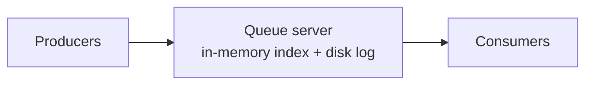
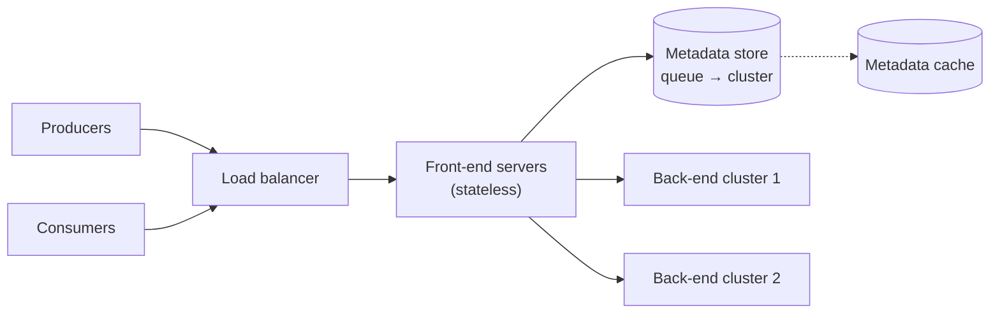
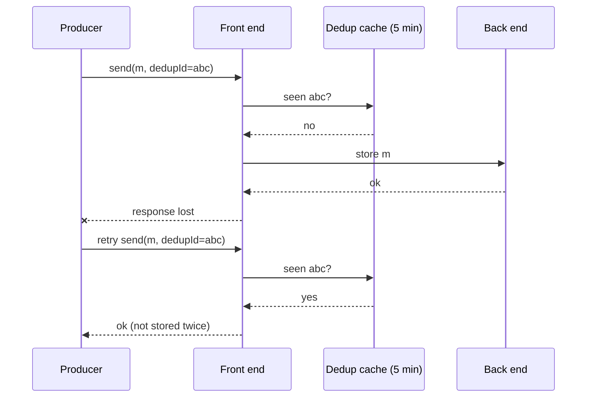

Let's start simple and evolve. First, a single-server queue; then we identify its limitations and begin distributing it.

## A single-server queue

The simplest design is one server holding each queue as an in-memory list, with messages appended at the tail and removed from the head. To make messages durable, the server appends each message to a **log on disk** before acknowledging the producer.



Even this simple server must handle more than a list:

- A **visible** list of messages ready for delivery.
- An **in-flight** set of received-but-unacknowledged messages, each with a deadline.
- A **delayed** set of messages that become visible at a future time.

This works for small workloads but has obvious problems:

- **Single point of failure.** If the server dies, all queues are unavailable, and unflushed data may be lost.
- **Limited capacity.** One machine's disk, memory and network bound the throughput.
- **No isolation.** A noisy queue with heavy traffic slows every other queue on the server.

## Separating concerns

A scalable design splits responsibilities across specialized components:



### Front-end servers

Stateless servers that receive every request. They:

- **Authenticate** and **authorize** clients.
- **Validate** requests (message size, queue existence).
- **Rate limit** noisy clients, enforcing per-tenant quotas so one customer cannot starve others.
- **Deduplicate** retried sends using message IDs.
- **Route** each request to the back-end cluster that owns the queue, using the metadata store.
- **Batch** small messages headed to the same back end, to reduce per-message overhead.

Because they are stateless, front ends scale horizontally behind a load balancer.

### Deduplicating retried sends

If a producer's `send` times out, it retries — but the first attempt may have succeeded. For queues that promise no duplicates, the producer includes a **deduplication ID** (or the queue derives one from a hash of the body). The front end remembers recently seen IDs for a window, say five minutes, and acknowledges a repeated send without storing it again.



### Metadata store

A small, strongly consistent database records each queue's configuration and which back-end cluster hosts it. Front ends read it constantly, so it is fronted by a **cache**.

| Field | Example |
| --- | --- |
| queue_id | `acct-77/orders-fifo` |
| owner | account 77 |
| type | FIFO or standard |
| visibility_timeout | 30 s |
| retention | 4 days |
| max_receive_count, dead_letter_queue | 5, `acct-77/orders-dlq` |
| cluster, partitions | cluster 12, partitions 0–7 |
| created_at | timestamp |

Metadata changes rarely (creating or reconfiguring queues) while being read on every request — an ideal fit for a small consensus-backed store plus aggressive caching.

### Back-end clusters

Back-end servers store the messages themselves. Each queue is assigned to a cluster; very large queues are **partitioned** across several servers. Back ends handle appends, reads, visibility timeouts and deletions.

## Flow of a send request

1. The producer calls `send(queue, message)`; the load balancer routes it to any front end.
2. The front end authenticates, validates and rate limits the request.
3. It looks up the queue's cluster in the metadata cache.
4. It forwards the message to the owning back-end server.
5. The back end persists and replicates the message (next lesson), then acknowledges.

## Flow of a receive request

1. The consumer calls `receive(queue, max=10, wait=20s)`.
2. The front end finds the queue's partitions and asks a back end (or several, for a partitioned standard queue) for visible messages.
3. The back end moves the chosen messages to the in-flight set with a deadline and returns them with **receipt handles** that identify this particular delivery.
4. If no messages are available, the request is held open (**long polling**) until one arrives or the wait expires.

The receipt handle, rather than the message ID, is used to delete: if the message was redelivered to another consumer after a timeout, the old handle is no longer valid, preventing a slow consumer from deleting a message someone else is now processing.

## Sizing the fleet

Using the earlier estimate of 100,000 messages per second, with batching of 10 messages per call:

```text
API calls: (send + receive + delete) ≈ 3 × 100,000 / 10 ≈ 30,000 calls/s, plus long polls
Front ends at ~5,000 calls/s each → 6, or ~12 with redundancy and headroom
Back-end replica groups at ~10,000 msg/s each → 10 groups × 3 replicas = 30 servers
```

<Ponder question="Why keep front ends stateless and put all message state in the back ends, rather than letting front ends cache messages for faster receives?">
Stateless front ends can be added, removed or replaced at any time without losing or duplicating messages, and any front end can serve any request. If front ends held messages, a crash could lose acknowledged data, each consumer would need to reach the particular front end holding its queue's messages, and load balancing and failover would become much harder. Keeping state in replicated back ends concentrates the hard problems — durability and ordering — in one place.
</Ponder>

<KeyTakeaways>
- A single-server queue tracks visible, in-flight and delayed messages, but is a single point of failure with limited capacity and no isolation.
- Stateless front ends handle authentication, validation, per-tenant rate limiting, deduplication, batching and routing.
- Deduplication IDs remembered for a window make producer retries safe.
- A cached, strongly consistent metadata store maps queues to back-end clusters and holds their configuration.
- Receives move messages to an in-flight set and return receipt handles; long polling avoids empty responses.
- Back-end clusters store messages and can partition large queues across servers.
</KeyTakeaways>
