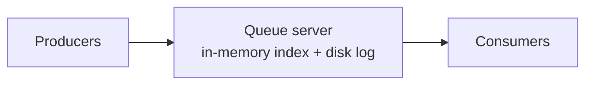
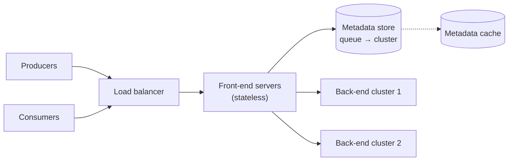

Let's start simple and evolve. First, a single-server queue; then we identify its limitations and begin distributing it.

## A single-server queue

The simplest design is one server holding each queue as an in-memory list, with messages appended at the tail and removed from the head. To make messages durable, the server appends each message to a **log on disk** before acknowledging the producer.

This works for small workloads but has obvious problems:

- **Single point of failure.** If the server dies, all queues are unavailable, and unflushed data may be lost.
- **Limited capacity.** One machine's disk, memory and network bound the throughput.
- **No isolation.** A noisy queue with heavy traffic slows every other queue on the server.

## Separating concerns

A scalable design splits responsibilities across specialized components:

### Front-end servers

Stateless servers that receive every request. They:

- **Authenticate** and **authorize** clients.
- **Validate** requests (message size, queue existence).
- **Rate limit** noisy clients.
- **Deduplicate** retried sends using message IDs.
- **Route** each request to the back-end cluster that owns the queue, using the metadata store.

Because they are stateless, front ends scale horizontally behind a load balancer.

### Metadata store

A small, strongly consistent database records each queue's configuration — owner, retention period, ordering mode, visibility timeout — and which back-end cluster hosts it. Front ends read it constantly, so it is fronted by a **cache**.

### Back-end clusters

Back-end servers store the messages themselves. Each queue is assigned to a cluster; very large queues are **partitioned** across several servers. Back ends handle appends, reads, visibility timeouts and deletions.

## Flow of a send request

1. The producer calls `send(queue, message)`; the load balancer routes it to any front end.
2. The front end authenticates, validates and rate limits the request.
3. It looks up the queue's cluster in the metadata cache.
4. It forwards the message to the owning back-end server.
5. The back end persists and replicates the message (next lesson), then acknowledges.

<KeyTakeaways>
- A single-server queue is a single point of failure with limited capacity and no isolation.
- Stateless front ends handle authentication, validation, rate limiting, deduplication and routing.
- A cached, strongly consistent metadata store maps queues to back-end clusters.
- Back-end clusters store messages and can partition large queues across servers.
</KeyTakeaways>
