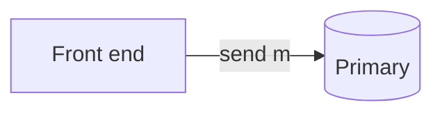
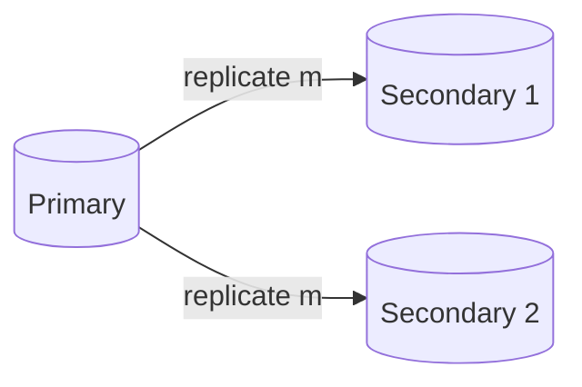
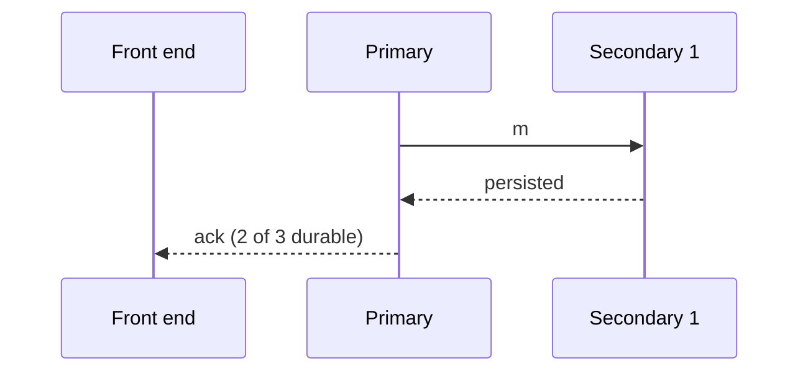
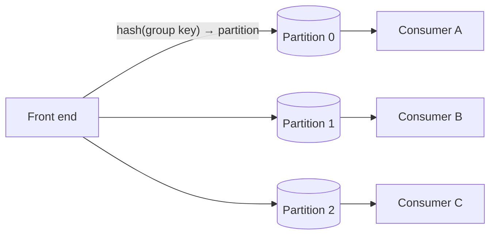

Now let's make the back end durable, available and scalable. The key ideas are **replication** of each queue's data and **partitioning** of large queues.

## Replicating messages

Each queue (or queue partition) is stored on a small replica group, typically three servers in different availability zones. Two replication styles are possible.

### Primary–secondary replication

One server is the **primary** for the queue. It receives all sends and receives, appends messages to its log and replicates them to **secondaries**. It acknowledges the producer once a majority (for example, two of three) has persisted the message.

<Slides title="Durable send with primary–secondary replication">
<Slide caption="1. The front end forwards the message to the queue's primary.">

</Slide>
<Slide caption="2. The primary appends it to its log and replicates it to both secondaries.">

</Slide>
<Slide caption="3. After a majority has persisted the message, the primary acknowledges the producer.">

</Slide>
</Slides>

If the primary fails, a coordination service (using consensus) promotes an up-to-date secondary. Because the primary serializes all operations, **strict ordering** within the queue is easy.

### Leaderless (any-replica) writes

Any replica accepts messages, and replicas synchronize in the background. This offers higher availability but only best-effort ordering, and duplicates must be reconciled. It suits queues that do not need FIFO.

Many systems offer both: FIFO queues use primary-based replication; standard queues use the more available scheme.

## Partitioning large queues

A single replica group cannot handle a queue receiving hundreds of thousands of messages per second. Such queues are split into **partitions**, each with its own replica group:

- Messages with a group key are hashed to a partition, preserving per-key order.
- Messages without keys are spread across partitions for maximum throughput.
- Consumers are assigned partitions; adding consumers (up to the partition count) increases parallelism.

## Receiving and deleting

When a consumer calls `receive`, the back end returns available messages and records an **invisibility deadline** for each. A background process scans for expired deadlines and makes those messages visible again. `delete` marks messages as consumed; storage is reclaimed later by compacting the log.

To avoid busy polling, **long polling** lets a `receive` call wait up to, say, 20 seconds for a message to arrive, reducing empty responses and cost.

## Retention

Unconsumed messages are kept for a configurable retention period (for example, 4–14 days) and then deleted. Retention protects against data loss when consumers are down for extended periods, and bounds storage growth.

<KeyTakeaways>
- Each queue or partition is replicated across servers in different zones.
- Primary–secondary replication with majority acknowledgment gives durability and strict ordering.
- Leaderless replication improves availability for queues that accept best-effort ordering.
- Large queues are partitioned; group keys preserve per-key order across partitions.
- Invisibility deadlines, long polling and retention periods complete the receive path.
</KeyTakeaways>
