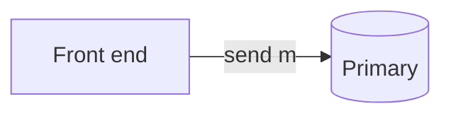
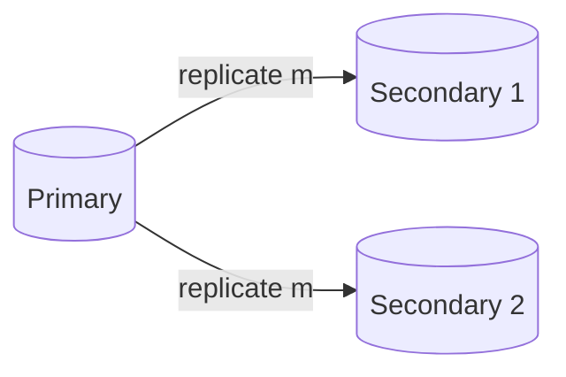
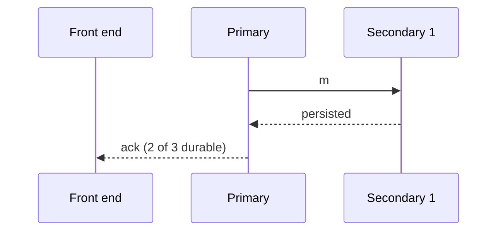
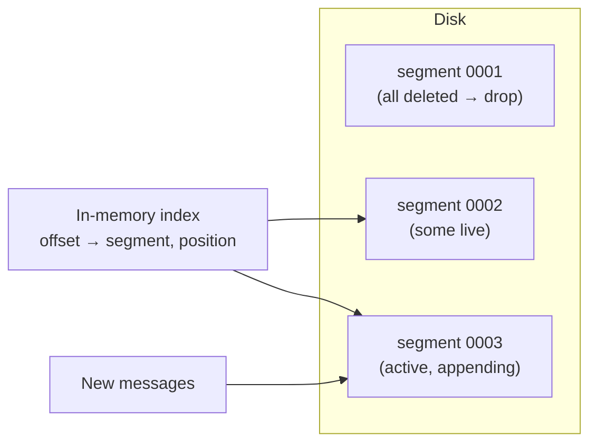
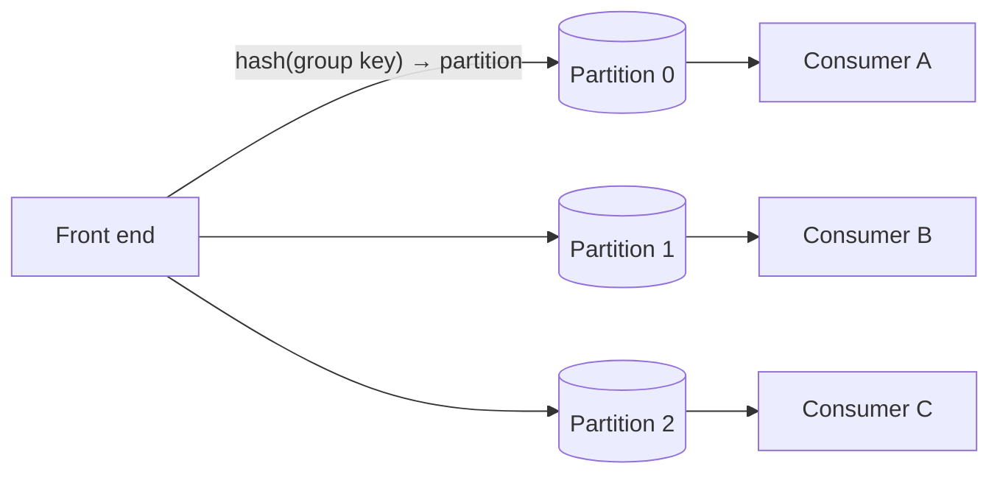

Now let's make the back end durable, available and scalable. The key ideas are **replication** of each queue's data and **partitioning** of large queues.

## Replicating messages

Each queue (or queue partition) is stored on a small replica group, typically three servers in different availability zones. Two replication styles are possible.

### Primary–secondary replication

One server is the **primary** for the queue. It receives all sends and receives, appends messages to its log and replicates them to **secondaries**. It acknowledges the producer once a majority (for example, two of three) has persisted the message.

<Slides title="Durable send with primary–secondary replication">
<Slide caption="1. The front end forwards the message to the queue's primary.">

</Slide>
<Slide caption="2. The primary appends it to its log and replicates it to both secondaries.">

</Slide>
<Slide caption="3. After a majority has persisted the message, the primary acknowledges the producer.">

</Slide>
</Slides>

If the primary fails, a coordination service (using consensus) promotes an up-to-date secondary. Because the primary serializes all operations, **strict ordering** within the queue is easy. Not only sends but also state changes — "message 17 is in flight until 12:00:31", "message 17 deleted" — are replicated, so a new primary knows which messages are visible, in flight or gone.

### Leaderless (any-replica) writes

Any replica accepts messages, and replicas synchronize in the background. This offers higher availability but only best-effort ordering, and duplicates must be reconciled. It suits queues that do not need FIFO.

Many systems offer both: FIFO queues use primary-based replication; standard queues use the more available scheme.

## How a back end stores messages

Messages are appended to a sequence of **segment files** on disk — for example, 1 GB each. An in-memory **index** maps message offsets to positions in segments. Deletes do not rewrite files; they are recorded as small markers, and a background **compaction** job rewrites or drops old segments once all their messages are deleted or expired.

Sequential appends are fast even on spinning disks, and dropping a whole segment is far cheaper than deleting millions of individual messages.

### Tracking visibility timeouts

The back end keeps in-flight messages in a structure ordered by deadline — a min-heap or a timer wheel. A background loop repeatedly takes the earliest deadline; if it has passed and the message was not deleted, the message returns to the visible list and its receive count increases. Messages whose receive count exceeds the limit are moved to the dead-letter queue instead.

## Partitioning large queues

A single replica group cannot handle a queue receiving hundreds of thousands of messages per second. Such queues are split into **partitions**, each with its own replica group:

- Messages with a group key are hashed to a partition, preserving per-key order.
- Messages without keys are spread across partitions for maximum throughput.
- Consumers are assigned partitions; adding consumers (up to the partition count) increases parallelism.

When a partition runs hot, the system can **split** it: new messages for half its key range go to a new partition, while consumers finish draining the old one first, so per-key order is preserved across the split.

## Receiving and deleting

When a consumer calls `receive`, the back end returns available messages and records an **invisibility deadline** for each. `delete` marks messages as consumed; storage is reclaimed later by compacting the log.

To avoid busy polling, **long polling** lets a `receive` call wait up to, say, 20 seconds for a message to arrive, reducing empty responses and cost. For a partitioned standard queue, the front end may query a subset of partitions per receive; long polling and repeated receives ensure every partition is drained.

## Queue model versus log model

It is worth contrasting this design with log-based systems such as Kafka:

| | Queue model (this design) | Log model |
| --- | --- | --- |
| Consumer progress | Per message: in flight, deleted | Per partition: one offset per consumer group |
| Acknowledgment | Delete each message | Commit an offset ("processed up to 5,021") |
| Redelivery | Individual messages after a timeout | Everything after the committed offset |
| Replay | Not possible after deletion | Rewind the offset to any retained point |
| Parallelism | Any number of consumers | Up to one consumer per partition per group |
| Best for | Independent tasks with varying processing time | Ordered event streams, many independent readers |

The queue model shines when tasks are independent and one slow message should not hold up others. The log model shines for high-throughput ordered streams that several systems read at their own pace.

## Retention

Unconsumed messages are kept for a configurable retention period (for example, 4–14 days) and then deleted. Retention protects against data loss when consumers are down for extended periods, and bounds storage growth.

<Ponder question="In the log model, a consumer processing partition 3 hits one message that takes 10 minutes. What happens to the other messages in partition 3, and how does the queue model differ?">
In the log model, the consumer processes a partition sequentially and commits offsets in order, so every later message in partition 3 waits behind the slow one (head-of-line blocking), even if they are unrelated. In the queue model, other consumers keep receiving the remaining messages; only the slow message is in flight. That is why per-message queues suit jobs with highly variable processing times, while logs suit uniform, ordered streams.
</Ponder>

<KeyTakeaways>
- Each queue or partition is replicated across servers in different zones; message state changes are replicated too.
- Primary–secondary replication with majority acknowledgment gives durability and strict ordering; leaderless replication favors availability.
- Back ends append to segment files with an in-memory index, and compact whole segments once their messages are gone.
- Visibility deadlines are tracked in a min-heap or timer wheel; expired messages return to the visible list or the dead-letter queue.
- Large queues are partitioned and can be split; group keys preserve per-key order.
- The queue model tracks each message; the log model tracks offsets and supports replay.
</KeyTakeaways>
