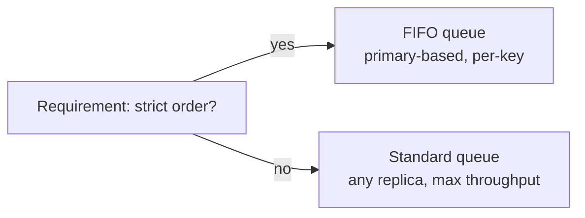

Let's check the design against the requirements and summarize the trade-offs.

## Durability

Messages are acknowledged only after being persisted by a **majority** of replicas in different availability zones. Losing a single server — or even a whole zone — does not lose acknowledged messages. Retention periods protect data while consumers are offline.

## Availability

- **Stateless front ends** behind a load balancer can be replaced freely.
- **Replica groups** fail over automatically: a coordination service promotes a new primary within seconds.
- **Standard queues** with any-replica writes remain writable even during some failures, trading strict ordering for availability.
- The **metadata store** is replicated with a consensus protocol and cached heavily, so brief metadata outages do not block the message path.

## Scalability

- Queues are distributed across many back-end clusters, so the number of queues grows with the fleet.
- High-throughput queues are **partitioned**, and throughput scales roughly with the number of partitions.
- Consumers scale horizontally up to the partition count (for ordered queues) or without limit (for standard queues).

## Performance

- Sends require a round trip to the primary plus majority replication within a region: typically a few milliseconds.
- **Batching** sends and receives amortizes overhead; **long polling** reduces empty responses.
- Sequential log appends make disk writes efficient.

## Ordering and delivery

| Queue type | Ordering | Delivery | Throughput |
| --- | --- | --- | --- |
| Standard | Best effort | At least once | Very high |
| FIFO | Strict per group key | Exactly once processing within a deduplication window | Limited per group |

The FIFO variant achieves duplicate-free processing within a time window by deduplicating on message IDs at the front end and delivering each group's messages to one consumer at a time.

## Operational features

- **Dead-letter queues** capture poison messages after a configured number of failed attempts.
- **Metrics** such as queue depth and age of the oldest message reveal consumers falling behind — typically the first sign of trouble.
- **Autoscaling** of consumers based on queue depth keeps latency in check during spikes.

<Callout type="interview">
Mention **queue depth** and **oldest message age** as the key health signals when your design uses queues. A growing backlog means consumers cannot keep up — and your design should say what happens then: autoscaling, back-pressure or shedding low-priority work.
</Callout>

<KeyTakeaways>
- Majority replication across zones provides durability; retention protects against slow consumers.
- Stateless front ends, automated failover and replicated metadata provide availability.
- Distribution across clusters and partitioning provide scalability.
- Standard queues maximize throughput; FIFO queues provide per-key ordering and deduplication.
- Monitor queue depth and oldest message age, and autoscale consumers accordingly.
</KeyTakeaways>
