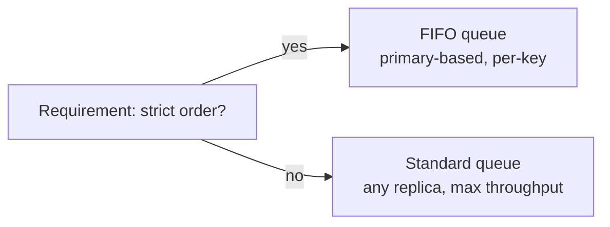

Let's check the design against the requirements and summarize the trade-offs.

## Durability

Messages are acknowledged only after being persisted by a **majority** of replicas in different availability zones. Losing a single server — or even a whole zone — does not lose acknowledged messages. Retention periods protect data while consumers are offline.

## Availability

- **Stateless front ends** behind a load balancer can be replaced freely.
- **Replica groups** fail over automatically: a coordination service promotes a new primary within seconds.
- **Standard queues** with any-replica writes remain writable even during some failures, trading strict ordering for availability.
- The **metadata store** is replicated with a consensus protocol and cached heavily, so brief metadata outages do not block the message path.

### Failure scenarios

| Failure | What happens | Recovery |
| --- | --- | --- |
| Front end crashes | In-flight API calls fail; clients retry with the same dedup ID | Load balancer routes to other front ends |
| Back-end primary crashes | Sends and receives for its partitions pause briefly | Coordination service promotes a secondary with the replicated log |
| Consumer crashes mid-task | Its messages stay in flight | Visibility timeout returns them for another consumer |
| Consumers fall far behind | Backlog grows; oldest message age rises | Alert, autoscale consumers, apply back-pressure or shed work |
| Poison message | Fails every attempt | Moved to the dead-letter queue after N attempts |
| Whole zone lost | One replica of each group gone | Remaining majority keeps serving; replicas rebuilt elsewhere |

## Scalability

- Queues are distributed across many back-end clusters, so the number of queues grows with the fleet.
- High-throughput queues are **partitioned**, and throughput scales roughly with the number of partitions.
- Consumers scale horizontally up to the partition count (for ordered queues) or without limit (for standard queues).

## Performance

- Sends require a round trip to the primary plus majority replication within a region: typically a few milliseconds.
- **Batching** sends and receives amortizes overhead; **long polling** reduces empty responses.
- Sequential log appends make disk writes efficient.

## Ordering and delivery

| Queue type | Ordering | Delivery | Throughput |
| --- | --- | --- | --- |
| Standard | Best effort | At least once | Very high |
| FIFO | Strict per group key | Exactly once processing within a deduplication window | Limited per group |

The FIFO variant achieves duplicate-free processing within a time window by deduplicating on message IDs at the front end and delivering each group's messages to one consumer at a time.



## Operational features

- **Dead-letter queues** capture poison messages after a configured number of failed attempts.
- **Metrics** such as queue depth and age of the oldest message reveal consumers falling behind — typically the first sign of trouble.
- **Autoscaling** of consumers based on queue depth keeps latency in check during spikes.

### Autoscaling consumers from the backlog

A simple rule sizes the consumer fleet from the backlog and a target drain time:

```text
consumers needed = (backlog / target drain seconds + arrival rate) / rate per consumer
backlog 60,000, target 60 s, arrivals 500/s, each consumer handles 50/s
→ (1,000 + 500) / 50 = 30 consumers
```

## Requirements summary

| Requirement | How the design meets it |
| --- | --- |
| Durability | Majority replication across zones before acknowledging; retention |
| Availability | Stateless front ends, automatic primary failover, cached metadata |
| Scalability | Queues spread across clusters; partitions for hot queues; horizontal consumers |
| Performance | Batching, long polling, sequential appends |
| Ordering | FIFO per group key via primary-based partitions |
| Isolation | Per-tenant quotas and rate limits at the front end |

## Choosing a real system

| System style | Model | Strengths | Typical use |
| --- | --- | --- | --- |
| Managed cloud queue | Per-message queue | No servers to run, elastic, visibility timeouts, DLQs | Background jobs, decoupling services |
| Traditional message broker (for example, RabbitMQ) | Queues with flexible routing (exchanges) | Rich routing, priorities, per-message acks | Enterprise integration, task routing |
| Distributed log (for example, Kafka) | Partitioned, retained log with offsets | Very high throughput, ordering per partition, replay, many consumer groups | Event streaming, analytics pipelines, change data capture |

<Callout type="interview">
Mention **queue depth** and **oldest message age** as the key health signals when your design uses queues. A growing backlog means consumers cannot keep up — and your design should say what happens then: autoscaling, back-pressure or shedding low-priority work.
</Callout>

<Ponder question="Queue depth is stable at 1,000 messages, but the age of the oldest message keeps rising. What does that suggest?">
Most messages are processed quickly, but some are not being processed at all — perhaps they belong to a FIFO group blocked by a failing message, sit in a partition with no assigned consumer, or are repeatedly failing and being retried without reaching the dead-letter threshold. Depth alone hides this; oldest-message age exposes stuck work. Investigate per-partition and per-group lag and the receive counts of the oldest messages.
</Ponder>

<KeyTakeaways>
- Majority replication across zones provides durability; retention protects against slow consumers.
- Stateless front ends, automated failover and replicated metadata provide availability across the listed failure scenarios.
- Distribution across clusters and partitioning provide scalability; batching and long polling provide performance.
- Standard queues maximize throughput; FIFO queues provide per-key ordering and deduplication.
- Monitor queue depth and oldest message age, and autoscale consumers from the backlog and target drain time.
- Managed queues, brokers and distributed logs suit different needs.
</KeyTakeaways>
