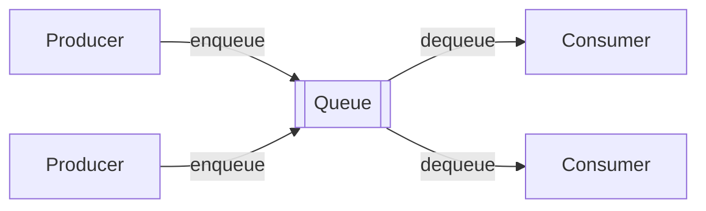

When a user uploads a video, the service must transcode it into several resolutions — work that takes minutes. Making the user wait on the upload request would be terrible, and a burst of uploads could overwhelm the transcoding servers. The solution is to put a **messaging queue** between the two: the upload service **produces** a message describing the job and returns immediately; transcoding workers **consume** messages at their own pace.

## What queues provide

- **Asynchronous processing.** Producers do not wait for work to finish, improving response times.
- **Decoupling.** Producers and consumers do not need to know about each other, run at the same time or scale together.
- **Load leveling.** Queues absorb bursts; consumers process at a steady rate, so traffic spikes do not overwhelm downstream services.
- **Reliability.** If a consumer crashes mid-task, the message is redelivered to another consumer.
- **Scalability.** Add consumers to increase throughput.

## Typical use cases

- Background jobs: sending emails and notifications, resizing images, transcoding media.
- Order processing pipelines, where each stage consumes from the previous stage's queue.
- Buffering writes to a database or analytics system.
- Distributing work across a pool of workers, such as a web crawler's frontier of URLs.

## Queues versus pub-sub

In a **point-to-point** queue, each message is processed by **one** consumer — perfect for distributing work. In **publish-subscribe**, each message is delivered to **every** subscriber — perfect for broadcasting events. Some systems support both. This chapter designs a point-to-point queue; the next chapter covers pub-sub.

## Chapter roadmap

1. **Requirements** — what a distributed queue must guarantee.
2. **Design considerations** — ordering, delivery semantics and concurrency.
3. **Design, part 1** — a single-server queue and why it is not enough.
4. **Design, part 2** — a distributed, replicated architecture.
5. **Evaluation** — how the design meets its requirements.

<Callout type="interview">
Whenever a design includes slow, bursty or failure-prone work that the user does not need to wait for, reach for a queue and state the benefit in one sentence: “A queue decouples upload from transcoding and absorbs bursts.”
</Callout>

<KeyTakeaways>
- A messaging queue lets producers hand off work to consumers asynchronously.
- Queues decouple services, level load, improve reliability and allow independent scaling.
- Point-to-point queues deliver each message to one consumer; pub-sub delivers to every subscriber.
- Common uses include background jobs, pipelines, write buffering and work distribution.
</KeyTakeaways>
