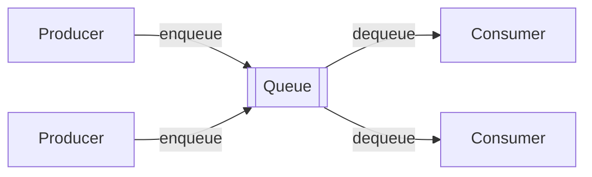
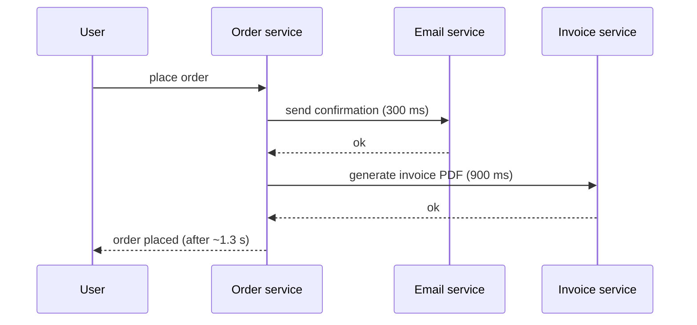
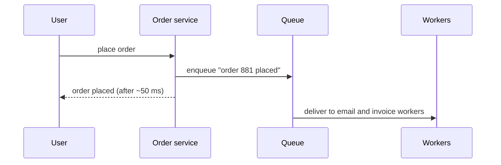

When a user uploads a video, the service must transcode it into several resolutions — work that takes minutes. Making the user wait on the upload request would be terrible, and a burst of uploads could overwhelm the transcoding servers. The solution is to put a **messaging queue** between the two: the upload service **produces** a message describing the job and returns immediately; transcoding workers **consume** messages at their own pace.

## Synchronous versus asynchronous

<TabGroup>
<Tab label="Synchronous">

The user waits for every step, and if the invoice service is down, the order fails even though the order itself was fine.

</Tab>
<Tab label="Asynchronous">

The user gets an answer in milliseconds. If the invoice service is down, messages wait in the queue and are processed when it recovers.

</Tab>
</TabGroup>

## What queues provide

- **Asynchronous processing.** Producers do not wait for work to finish, improving response times.
- **Decoupling.** Producers and consumers do not need to know about each other, run at the same time or scale together.
- **Load leveling.** Queues absorb bursts; consumers process at a steady rate, so traffic spikes do not overwhelm downstream services.
- **Reliability.** If a consumer crashes mid-task, the message is redelivered to another consumer.
- **Scalability.** Add consumers to increase throughput.

### Load leveling in numbers

A flash sale produces 50,000 orders in the first minute, while the fulfillment service can handle 5,000 per minute. Without a queue, 90% of requests would fail or time out. With a queue, all 50,000 are accepted immediately and fulfilled over about ten minutes. The queue converts a spike the system cannot handle into a delay it can.

## Typical use cases

- Background jobs: sending emails and notifications, resizing images, transcoding media.
- Order processing pipelines, where each stage consumes from the previous stage's queue.
- Buffering writes to a database or analytics system.
- Distributing work across a pool of workers, such as a web crawler's frontier of URLs.
- Scheduling delayed work: "send a reminder in 24 hours" via delayed delivery.

## When not to use a queue

- When the caller **needs the result** to respond, such as checking a password or fetching a product page.
- When strict, low-latency request/response behavior is required end to end.
- When the added operational complexity outweighs the benefit — a small internal tool with a few requests per minute rarely needs one.

## Queues versus pub-sub versus logs

| | Point-to-point queue | Pub-sub | Distributed log |
| --- | --- | --- | --- |
| Each message goes to | One consumer | Every subscriber | Every consumer group, each reading at its own offset |
| After consumption | Deleted | Deleted per subscriber | Retained until retention expires; can be replayed |
| Typical use | Distributing work | Broadcasting events | Event streaming, replay, multiple independent readers |

In a **point-to-point** queue, each message is processed by **one** consumer — perfect for distributing work. In **publish-subscribe**, each message is delivered to **every** subscriber — perfect for broadcasting events. A **log-based** system such as Kafka stores messages in an ordered, retained log that many consumer groups can read independently, combining both models. This chapter designs a point-to-point queue; the next chapter covers pub-sub.

## Back-pressure

A queue does not make capacity infinite. If consumers are permanently slower than producers, the backlog grows until retention limits or storage run out. A complete design says what happens then: add consumers, slow producers down (**back-pressure**, for example by rejecting sends when the queue is too deep), or shed low-priority work.

<Ponder question="An order service writes the order to its database and then enqueues an 'order placed' message. The service crashes between the two steps. What happens, and how can it be prevented?">
The order exists but no message was sent, so no confirmation email, invoice or fulfillment ever happens — a silent inconsistency. The **transactional outbox** pattern fixes it: write the message into an "outbox" table in the same database transaction as the order, and have a separate relay process read the outbox and publish to the queue, marking rows as sent. Either both the order and its message are committed, or neither is. (We return to this in the considerations lesson.)
</Ponder>

## Chapter roadmap

1. **Requirements** — what a distributed queue must guarantee.
2. **Design considerations** — ordering, delivery semantics and concurrency.
3. **Design, part 1** — a single-server queue and why it is not enough.
4. **Design, part 2** — a distributed, replicated architecture.
5. **Evaluation** — how the design meets its requirements.

<Callout type="interview">
Whenever a design includes slow, bursty or failure-prone work that the user does not need to wait for, reach for a queue and state the benefit in one sentence: "A queue decouples upload from transcoding and absorbs bursts."
</Callout>

<KeyTakeaways>
- A messaging queue lets producers hand off work to consumers asynchronously, cutting response times and isolating failures.
- Queues decouple services, level load, improve reliability and allow independent scaling.
- Point-to-point queues deliver each message to one consumer; pub-sub delivers to every subscriber; logs retain messages for replay by many groups.
- Do not use a queue when the caller needs the result immediately.
- Queues need a back-pressure story for when consumers cannot keep up.
</KeyTakeaways>
